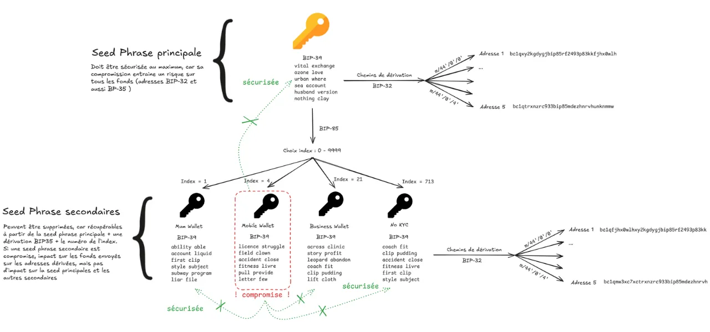
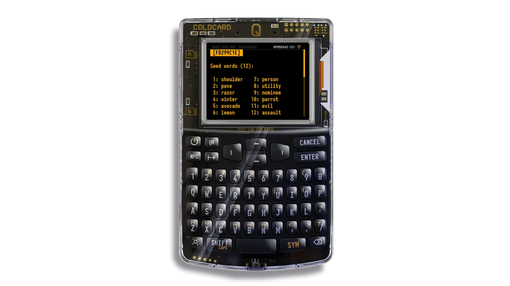
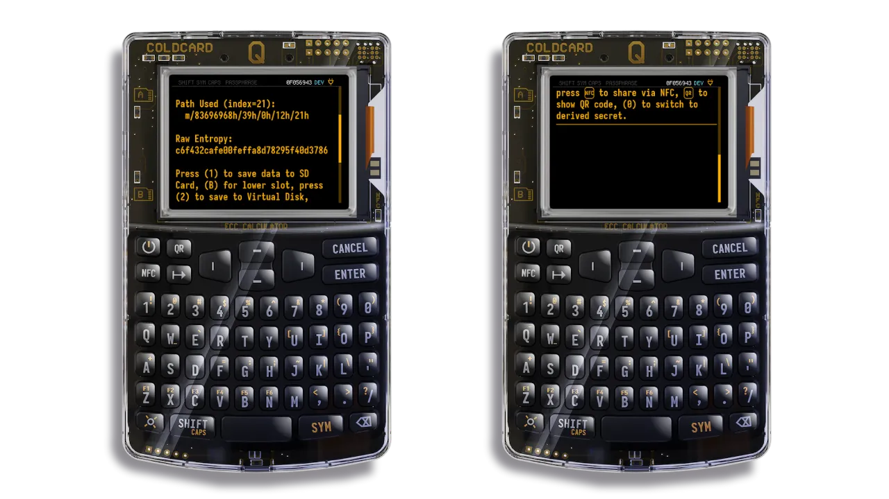

## 1. Memahami BIP-85

### 1.1 Apa itu BIP-85?

BIP-85 adalah fitur lanjutan yang memungkinkan kamu membuat beberapa **seedphrase sekunder** dari satu **seedphrase utama.**

Setiap seedphrase sekunder bisa digunakan untuk membuat dompet Bitcoin yang sepenuhnya independen. Dompet ini bisa dipakai untuk berbagai tujuan: hot wallet di ponsel, dompet untuk keluarga, dompet tabungan terpisah, dan sebagainya.

Semua seedphrase turunan ini dihasilkan secara matematis, tapi tidak mungkin untuk melacak balik ke seedphrase utama dari seedphrase sekunder. Ini memastikan setiap dompet benar-benar terpisah satu sama lain.

Selama kamu masih punya akses ke seedphrase utama (dan passphrase terkait jika kamu memakainya), kamu bisa membuat ulang seedphrase sekunder **dengan hasil yang sama persis,** tanpa perlu menyimpannya secara terpisah.

### 1.2 Mengapa menggunakan BIP-85?

BIP-85 berguna kalau kamu ingin :

- Buat beberapa portofolio Bitcoin independen tanpa banyak cadangan
- Kelola dana kamu sesuai dengan penggunaan yang berbeda (tabungan, pengeluaran, keluarga, proyek)
- Menjamin perlindungan bagi keluarga (fitur "Uncle Jim")
- Menghapus portofolio tanpa kehilangan akses ke dana kamu
- Sederhanakan keamanan kamu: hanya satu frasa kunci seed untuk melindungi

### 1.3 Keunggulan dibandingkan BIP-32

Dengan BIP-32, satu seedphrase dapat digunakan untuk menghasilkan hirarki lengkap akun dan alamat Bitcoin, menggunakan jalur derivasi (misalnya: m/44'/0'/0'/0/0). Setiap jalur bisa mewakili akun yang terpisah, **tetapi semuanya tetap terhubung ke seedphrase yang sama. Jadi, jika seedphrase ini bocor, semua akun turunan dapat diakses.**

Dengan BIP-85, sebuah seedphrase utama dapat digunakan untuk menghasilkan beberapa seedphrase sekunder yang benar-benar independen. **Jika salah satu seedphrase sekunder ini disusupi, penyerang tidak akan pernah bisa kembali ke seedphrase utama atau mengakses portofolio lainnya.**

Hal ini memungkinkan untuk mengkotak-kotakkan risiko:

- Kamu bisa menggunakan seed sekunder untuk Hot Wallet atau penggunaan sementara, dengan menerima pencahayaan yang lebih tinggi.
- Bahkan jika Hot Wallet ini terganggu, dana kamu yang lain, yang dilindungi oleh benih sekunder lainnya atau disimpan secara offline, **tetap aman**.

Di sisi lain, untuk BIP-32 dan BIP-85, jika seed utama disusupi, **semua dana menjadi rentan**. Oleh karena itu, sangat penting untuk melindunginya dengan tingkat keamanan tertinggi.

## 2. Contoh penggunaan praktis untuk BIP-85

BIP-85 memungkinkan kamu membuat beberapa dompet Bitcoin dari satu seedphrase utama, masing-masing dengan seedphrase sekunder sendiri. Berikut lima contoh penggunaan praktis untuk mengatur dan mengamankan dana Bitcoin kamu. Setiap contoh menjelaskan kenapa menggunakan BIP-85 lebih praktis daripada mengelola beberapa akun dengan satu seedphrase lewat BIP-32.

### 2.1 Membatasi risiko portofolio yang kurang aman

- **Skenario**: Kamu menggunakan "Hot Wallet" Wallet (dipasang pada perangkat yang terhubung ke Internet), untuk transaksi harian.
- **Solusi BIP-85**: Kamu membuat frasa sekunder seed yang didedikasikan untuk portofolio ini.
- **Keunggulan dibandingkan BIP-32**: Kamu tidak perlu mengimpor frasa primer seed ke ponsel milikmu, sehingga mengurangi risiko peretasan. Hanya frasa sekunder seed yang dikompromikan, melindungi dompet milikmu yang lain. Dengan BIP-32, kamu harus menggunakan frasa utama seed dan jalur bypass, mengekspos semua dana milikmu.

### 2.2 Membuat portofolio untuk anggota keluarga

- **Skenario**: Kamu menyiapkan Bitcoin Wallet untuk seseorang yang dekat dengan kamu (misalnya ibumu), sekaligus dapat memulihkannya jika hilang.
- **Solusi BIP-85**: kamu membuat kalimat sekunder seed khusus dan hanya membagikan kalimat ini.
- **Keunggulan dibandingkan BIP-32**: Dengan BIP-32, membuat akun untuk orang yang kamu cintai mengharuskanmu untuk berbagi frasa seed utama, mempertaruhkan semua danamu dan manajemen yang rumit untuk orang yang kamu cintai (mengelola jalur percabangan), atau membuat frasa seed baru untuk disimpan di samping frasa seed utama kamu.

### 2.3 Memfasilitasi pengelolaan portofolio terpisah

- **Skenario**: Kamu memisahkan bitcoin milikmu untuk tujuan yang berbeda (mis. tabungan jangka panjang, dana non-KYC).
- **Solusi BIP-85**: Kamu membuat frasa sekunder seed yang didedikasikan untuk setiap tujuan.
- **Keunggulan dibandingkan BIP-32**: Dengan BIP-32, semua akun memiliki frasa seed yang sama, yang mempersulit pengelolaan dalam portofolio pihak ketiga karena memerlukan jalur turunan seperti `m/44'/0'/0'` untuk dikelola. Selain itu, tidak memungkinkan untuk menetapkan akun terpisah per perangkat (mis. "tabungan di Coldcard", "harian di ponsel", "liburan di Trezor"). BIP-85 menetapkan frasa sekunder seed yang unik per tujuan, yang mudah diidentifikasi dan diimpor secara terpisah pada setiap perangkat.

### 2.4 Menggunakan Wallet sementara untuk transaksi

- **Skenario**: Kamu memerlukan portofolio sementara untuk transaksi satu kali atau untuk menjaga kerahasiaan (misal: pencampuran dana, interaksi dengan KYC Exchange, dll.).
- **Solusi BIP-85**: Kamu membuat kalimat sekunder seed, menggunakannya untuk transaksi, kemudian menghancurkannya jika perlu, karena mengetahui bahwa kalimat tersebut dapat dibuat ulang.
- **Keuntungan dibandingkan BIP-32**: Dengan BIP-32, akun sementara bergantung pada kalimat utama seed, yang mengekspos semua dana kamu jika disusupi.

## 3. Sebelum kamu mulai

- **Perangkat keras** (opsional)
 - Coldcard Mk4 atau Q1
 - Kartu microSD
 - 
- **Pengetahuan dasar**
 - Memahami frasa Mnemonic (BIP-39): daftar 12 hingga 24 kata untuk menyimpan portofolio.
 - Ketahui apa itu Bitcoin Wallet: perangkat lunak atau perangkat untuk mengelola bitcoin milikmu, dan cara mengembalikannya dengan frasa Mnemonic.
 - Lebih banyak sumber daya di Lampiran.

- **Perangkat lunak** yang kompatibel
 - Sparrow wallet (komputer, untuk manajemen khusus jam tangan atau manajemen tingkat lanjut)
 - Nunchuck (seluler, untuk tanda tangan banyak)
 - BlueWallet (seluler)
 - ...

- 3.4 **Konfigurasi Coldcard**
 - Inisialisasi kalimat seed yang terdiri dari 24 kata pada Coldcard.
 - Opsional: Tambahkan passphrase untuk mengamankan akses ke cabang BIP-85.
 - Mengaktifkan opsi yang berguna: NFC (untuk ekspor), nonaktifkan USB pada baterai (keamanan).

## 4. Tutorial langkah demi langkah

Ikuti langkah-langkah berikut untuk membuat, menggunakan, dan mengambil Mnemonic sekunder dengan BIP-85 pada Coldcard milikmu.

### 4.1 Generate sebuah kalimat sekunder seed

Kamu akan membuat frasa sekunder seed dari frasa utama seed milikmu.
Nyalakan Coldcard milikmu, masukkan kode PIN.

- 1. Kalau kamu telah menerapkan passphrase ke seed utama:
 - Dari layar Beranda, buka `passphrase`.
    - Pilih `Tambah Kata` dan masukkan kata sandi.
    - Tekan `Terapkan`.
    - Periksa identitas Wallet: Buka `Advanced > View Identity` untuk mencatat sidik jari Wallet.

- 2. Buka menu **BIP-85**
 - Dari layar Beranda, buka `Advanced > Derive seed B85`
 - Baca peringatan dan konfirmasikan.

ColdCard memberi tahu kamu bahwa seed yang dihasilkan secara matematis berasal dari seedphrase utama kamu, tapi secara kriptografis benar-benar independen.

- 3. Pilih format

Pilih format frasa seed: 12, 18 atau 24 kata. Periksa jumlah kata yang diterima oleh Wallet yang ingin kamu impor frasa seed.

- 4. Pilih indeks
 - Masukkan indeks antara 0 dan 9999.
 - Indeks ini sangat penting untuk meregenerasi seed sekunder di kemudian hari. Simpanlah dengan hati-hati dengan label seperti: "Indeks 1 = Wallet mobile", "Indeks 2 = proyek keluarga", "Indeks 4 = campuran uji", ...
 - Kalau kamu kehilangannya, kamu tidak akan kehilangan akses ke uangmu, tetapi kamu harus menguji kombinasi dari 0 hingga 9999 untuk menemukannya.

- 5. Catat atau ekspor kalimat sekunder seed****

ColdCard sekarang menampilkan kalimat sekunder seed yang baru. Kamu bisa:

 - Catatan **catatan secara manual**.
 - Tekan :
     - 1` untuk menyimpannya di kartu SD
     - `2` untuk **memasukkan mode "gunakan seed ini "** pada ColdCard (berguna untuk mengekspor atau menandatangani transaksi)
     - 3` untuk menampilkan **kode QR** (untuk dipindai dengan aplikasi seluler seperti BlueWallet atau Nunchuck)
     - 4` untuk mengirimnya dengan **NFC**

💡 Pada titik ini, kamu memiliki frasa seed yang independen, dapat digunakan dalam Wallet BIP39 (Trezor, Ledger, BlueWallet, Nunchuck...).

### 4.2 Menggunakan seed sekunder

Kamu sekarang dapat menggunakan turunan seed ini untuk membuat portofolio baru dalam format :

- aplikasi seluler
- gW-68 lainnya
- portofolio Multisig

### 4.3 Memulihkan frasa sekunder seed yang hilang

Untuk mengambil seed sekunder kapan saja, ulangi prosesnya:

1. Mulai ulang ColdCard 
2. Masukkan PIN 
3. Masukkan passphrase, jika sudah ditentukan
4. Pergi ke `Advanced > Derive seed B85`
5. Pilih format (12/18/24 kata)
6. Masukkan indeks yang sama (misalnya `1`)
7. Kamu akan mendapatkan seed sekunder yang sama persis

## 5. Batasan, risiko, dan praktik terbaik

### 5.1 Ketergantungan pada kalimat utama seed + passphrase

Penggunaan BIP85 sepenuhnya bergantung pada kalimat utama seed 24 kata, serta passphrase jika kamu telah menerapkannya.

- Dari kedua Elements ini, semua frasa sekunder seed dapat dibuat ulang.
- Tanpa salah satu dari 2 Elements ini, kamu akan kehilangan akses ke semua portofolio derivatif.

### 5.2 Risiko dalam konfigurasi multi-tanda tangan

Aku sangat menyarankan agar kamu tidak menggunakan seedphrase sekunder yang dihasilkan dari seedphrase primer yang sama dalam konfigurasi multi-sig. Jika perangkat atau seedphrase primer disusupi, semua kunci multi-sig bisa dibuat ulang oleh penyerang.

### 5.3 Kompatibilitas perangkat lunak

Tidak semua aplikasi secara langsung mendukung derivasi BIP85. Namun, seed yang dihasilkan melalui BIP85 adalah seed BIP39 standar (12, 18 atau 24 kata), dan oleh karena itu dapat digunakan dalam portofolio yang kompatibel dengan BIP39.

### 5.4 Daftar akun BIP85

Dianjurkan untuk menyimpan daftar pribadi seedphrase sekunder yang selalu diperbarui.

- Ini memungkinkan kamu mengetahui dengan cepat indeks BIP85 mana yang cocok untuk setiap dompet, tanpa perlu menyimpan seedphrase sekunder itu sendiri.
- Daftar ini harus tetap minimalis, tidak menyebutkan Bitcoin secara eksplisit, dan disimpan terpisah dari seedphrase utama. Ingat untuk mencantumkannya dalam rencana warisan kamu.

Register dapat berisi :

- indeks bIP85 yang digunakan (angka dari 0 hingga 9999)
- nama penggunaan atau referensi (mis. Hot Wallet, tabungan pribadi, Wallet dari Ibu)
- jika perlu, sidik jari Wallet untuk verifikasi di ColdCard

### 5.5 Pencadangan

Cadangan harus menyertakan file :

- gW-91 utama
- gW-76 (jika digunakan)

Jangan pernah menyimpan bersama:

- gW-93 dan passphrase utama
- gW-94 utama dan daftar akun BIP85

Lebih banyak sumber daya di Lampiran.

## LAMPIRAN

## A.1 Daftar Istilah

- [BUNYI] (https://planb.academy/resources/glossary/bip)
- [BIP-32] (https://planb.academy/resources/glossary/bip0032)
- [BIP-39] (https://planb.academy/resources/glossary/bip0039)
- [BIP-85] (https://planb.academy/resources/glossary/bip0085)
- [Frasa seed] (https://planb.academy/resources/glossary/recovery-phrase)
- [passphrase] (https://planb.academy/resources/glossary/passphrase-bip39)
- [Multisig] (https://planb.academy/resources/glossary/multisig)

### A.2 Simpan frasa pemulihanmu

https://planb.academy/tutorials/wallet/backup/backup-mnemonic-22c0ddfa-fb9f-4e3a-96f9-46e2a7954270

### A.3 Memahami passphrase BIP39

https://planb.academy/tutorials/wallet/backup/passphrase-a26a0220-806c-44b4-af14-bafdeb1adce7

### A.4 Cara kerja portofolio Bitcoin

https://planb.academy/courses/46b0ced2-9028-4a61-8fbc-3b005ee8d70f
