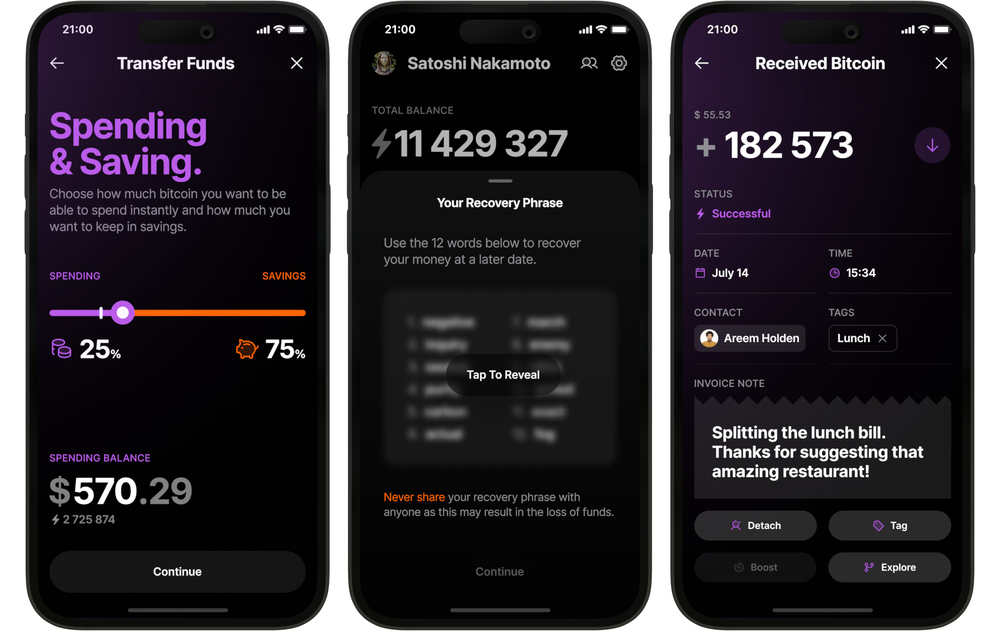

Bitkit (https://www.bitkit.to) adalah Wallet kustodian mandiri yang sederhana namun kuat. Bayar siapa saja, di mana saja, kapan saja.

Bitkit adalah wallet seluler non-kustodial yang memberi kamu kendali penuh atas Bitcoin kamu, jadi kamu bisa membelanjakan uang sesukamu. Dilengkapi dengan berbagai fitur keren dan desain yang elegan, Bitkit memungkinkan pembayaran instan ke siapa pun, kapan pun, dan di mana pun. Semuanya bersifat open-source, jadi siapa pun bisa memeriksa dan memverifikasinya.

Video tutorial di atas adalah panduan komprehensif berdurasi 20 menit untuk Dompet Bitkit

## Panduan

Bitkit sangat mudah digunakan. Sebagai wallet Bitcoin yang lengkap, Bitkit punya semua fitur yang kamu butuhkan:

- Pembayaran Instan: Kamu nggak perlu lagi gonta-ganti dompet buat transaksi on-chain dan Lightning. Bitkit menggabungkan keduanya dengan mulus.
- Manajemen Saldo: Pindahkan dana dengan mudah antara akun tabungan dan akun pengeluaran supaya kamu selalu punya cukup saldo buat pembayaran instan.
- Seedphrase: Pulihkan saldo tabungan kamu di wallet apa pun yang mendukung BIP39.
- Pencadangan Otomatis: Data non-sensitif dari wallet kamu dicadangkan otomatis, jadi kamu selalu bisa memulihkan saldo pengeluaranmu kapan saja.
- Riwayat Transaksi Terperinci: Tambahkan kontak dan beri tanda pada transaksi kamu supaya semuanya tetap rapi dan mudah dilacak.

Bitkit juga menawarkan kemampuan unik yang membedakannya:

- Kontak Terutang: Nggak perlu lagi repot minta alamat atau invoice. Cukup tambahkan teman ke daftar kontak kamu dan langsung kirim pembayaran ke mereka.
- Widget Langsung: Bikin tampilan layar utama wallet kamu lebih seru dan fungsional dengan widget interaktif yang keren.
- Profil Sosial: Atur profil publik dan tautan kamu supaya teman-teman bisa dengan mudah menghubungi atau mengirim pembayaran kapan saja.
- Akun Tanpa Kata Sandi: Masuk ke situs web yang mendukung autentikasi Slashtag atau Lightning tanpa perlu repot pakai kata sandi.
- QuickPay: Atur batas khusus untuk pembayaran Lightning di bawah $50, dan invoice di bawah nominal itu akan langsung dibayar tanpa gesek, tanpa tunggu. Cocok banget buat beli kopi atau patungan bayar makanan.
- Berbelanja: Bayar Netflix, Airbnb, belanja bahan makanan, paket data, dan masih banyak lagi pakai Bitcoin langsung dari Bitkit.

Tidak ada bank. Tidak ada gesekan.

## Panduan Pemula untuk BitKit: Tutorial Langkah-demi-Langkah

### 1. Instal BitKit

Buka App Store (iOS) atau Google Play (Android).
Cari “Bitkit” dan pastikan kamu melihat ikon resmi berwarna oranye.
Ketuk Dapatkan atau Instal, lalu Buka setelah unduhan selesai.

Tip: Kalau kamu menemukan aplikasi yang mencurigakan, pastikan dulu penerbitnya. Bitkit yang asli diterbitkan oleh Synonym Software Ltd.

### 2. Peluncuran dan Ketentuan Pertama

Luncurkan BitKit, setujui Ketentuan Penggunaan, dan ketuk Lanjutkan.
Ketuk Mulai untuk memulai alur orientasi.
Abaikan Restore Wallet untuk saat ini; kita akan membuat Wallet baru.

### 3. Cadangkan Wallet Seed 

Bitkit bersifat self-custodial, jadi seedphrase yang terdiri dari dua belas kata adalah satu-satunya cara buat memulihkan wallet kamu. Ketuk Back Up Now (Cadangkan Sekarang) saat diminta. Tulis kedua belas kata itu di atas kertas dan simpan secara offline di tempat yang aman. Setelah itu, konfirmasikan kata-katanya saat diminta, lalu ketuk Simpan.

Peringatan: Kehilangan seed, kehilangan koin KAMU. Tidak ada tombol reset.

### 4. Rekening Tabungan vs. Rekening Pengeluaran

BitKit secara otomatis membuat dua akun:

Tabungan: Bitcoin dasar Layer
Transfer yang lebih besar, lebih lambat, dan lebih aman

Pengeluaran: Lightning Network
Pembayaran harian yang kecil dan instan
Beralih di antara keduanya dengan tab di bagian atas layar beranda.

### 5. Menerima Bitcoin on chain (Tabungan)

Pilih Tabungan.

Ketuk Terima ke generate Bitcoin Address yang baru. Bagikan kode QR atau salin Address ke pengirim. Dana akan muncul setelah satu kali konfirmasi. Confetti akan merayakan kedatangannya.

### 6. Menerima Lebih dari Lightning (Pengeluaran)

- Pilih Pengeluaran dan ketuk Terima. 
- Masukkan jumlah (misalnya, 10.000 Sats) dan ketuk Lanjutkan. 
- BitKit akan memperkirakan biaya untuk membuka saluran (persyaratan likuiditas). 
- Ketuk Lanjutkan ke generate a Lightning Invoice. 
- Biarkan pengirim memindai atau menempelkan Invoice. Dana masuk dalam hitungan detik.

### 7. Kirim Pembayaran Lightning

- Ketuk ikon Pindai, pindai Lightning Invoice, atau tempelkan.
- Masukkan jumlah jika diperlukan, lalu ketuk Lanjutkan.
- Tinjau biaya dan tambahkan label opsional untuk pembukuan.
- Geser ke Bayar, masukkan PIN dan selesai.
- Rincian transaksi, termasuk biaya dan Timestamp, muncul di feed Aktivitas.

### 8. Buat Profil dan Kontak 

- Ketuk avatar di kiri atas.
- Masukkan nama tampilan dan pilih gambar profil.
- BitKit menunjukkan kode QR pribadi. Teman-teman dapat memindainya untuk menambahkan kontak kamu.
- Menerima atau menolak permintaan untuk mengizinkan invoice.
- Setelah kontak ditambahkan, cukup ketuk namanya di Kontak untuk mengirim atau meminta Sats.

### 9. Jelajahi Widget

- Dari layar beranda, usap ke bagian Widget. Ketuk ikon roda gigi untuk menambah atau mengedit:
- Bitcoin Price Ticker - pilih hingga empat mata uang fiat dan tentukan kerangka waktu (hari, minggu, bulan, tahun).
- Umpan Berita - berita utama dari sumber-sumber terkemuka Bitcoin.
- Fakta Bitcoin - trivia seukuran gigitan untuk pemula.
- Kalkulator - mengonversi antara Sats dan fiat secara instan.

Widget Cuaca - menunjukkan "cuaca" biaya jaringan, yang mengindikasikan waktu yang baik untuk transaksi On-Chain (cerah berarti kemacetan rendah).

### 10. Berbelanja dengan Bitcoin

- BitKit terintegrasi dengan Bitrefill untuk kartu hadiah, isi ulang ponsel, dan banyak lagi.
- Ketuk Toko di navigasi bawah.
- Pilih Kartu Hadiah dan pilih pedagang (misalnya, Bitrefill).
- Pilih jumlah (serendah 1 USD), tambahkan email untuk pengiriman, lalu Checkout.
- Gesek untuk membayar. Kode kartu hadiah akan diterima melalui email dalam hitungan detik.

### 11. Pembayaran Cepat

- Quick Pay mengonfirmasi secara otomatis faktur Lightning di bawah batas khusus (standar 50 USD).
- Buka Pengaturan → Umum → Bayar Cepat.
- Tetapkan ambang batas dan aktifkan sakelar.
- Pembelian kecil seperti kopi tidak lagi memerlukan gesekan.

### 12. Keamanan dan Privasi

- Kode PIN - aktifkan di Pengaturan → Keamanan & Privasi dan tetapkan kode enam digit.
- Biometrik - aktifkan ID Wajah atau buka kunci sidik jari.
- Kunci Otomatis - pilih batas waktu (misalnya 90 detik tidak aktif).
- Memerlukan PIN untuk Pembayaran - ketenangan ekstra.

### 13. Mengelola Saluran Petir

Apa yang dimaksud dengan Saluran?
Saluran adalah terowongan dua pihak yang menampung likuiditas, dibagi menjadi:

Keluar - Bitcoin milikmu yang digunakan untuk mengirim.
Masuk - rekanan Bitcoin, wajib diterima.

Transfer dari Tabungan ke Pembelanjaan

Buka Tabungan, ketuk Transfer ke Pembelanjaan.
Masukkan jumlah (misalnya, 25.000 ₿) dan ketuk Lanjutkan.
Setujui biaya dan tunggu konfirmasi transaksi On-Chain.
Setelah terbuka, saldo pengeluaran dan kapasitas penerimaan akan diperbarui.

Melihat atau Menutup Saluran
Pengaturan → Tingkat Lanjut → Koneksi Petir
Ketuk koneksi untuk melihat status, saldo, dan biaya.
Gulir ke Tutup Koneksi jika kamu ingin menutupnya dan mengembalikan dana ke Tabungan.
Catatan: Untuk alasan regulasi, total likuiditas di BitKit dibatasi sekitar sembilan ratus sembilan puluh euro senilai Bitcoin.

### 14. Fitur Lanjutan

Pemilihan Coin - pilih input UTXO tertentu untuk kontrol privasi atau biaya (Pengaturan → Lanjutan → Pemilihan Coin).

Kecepatan Transaksi - pilih target biaya On-Chain Lambat, Normal, atau Cepat.
Mata Uang Lokal - beralih dari USD ke mata uang fiat utama lainnya di Pengaturan → Umum.

## Selamat

Kamu sudah menginstal Bitkit, mengamankan seedphrase kamu, menguasai pembayaran Lightning, dan bahkan membeli gift card pertamamu. Desain Bitkit membuat alat Bitcoin yang canggih terasa mudah dan intuitif, tapi kendali sepenuhnya tetap ada di tangan kamu. Unduh Bitkit sekarang dan rasakan pengalaman Bitcoin ownership yang sesungguhnya. Punya pertanyaan atau masukan? Hubungi tim Bitkit lewat media sosial atau melalui tautan dukungan di dalam aplikasi.

**Catatan tentang membeli atau menjual Bitcoin**: Bitkit tidak mendukung pembelian dan penjualan Bitcoin. Untuk membeli atau menjual, gunakan bursa seperti Bitfinex, lalu kirim ke atau dari Bitkit.
