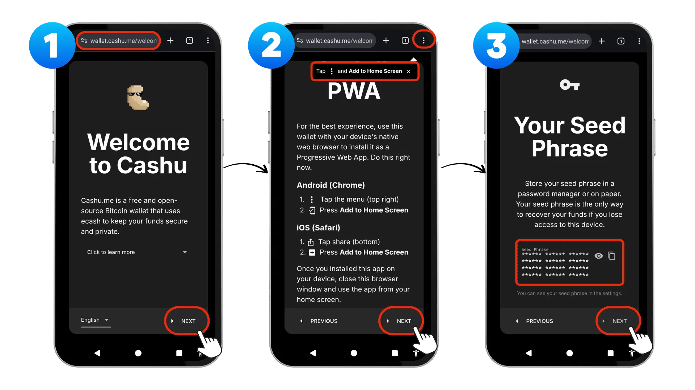
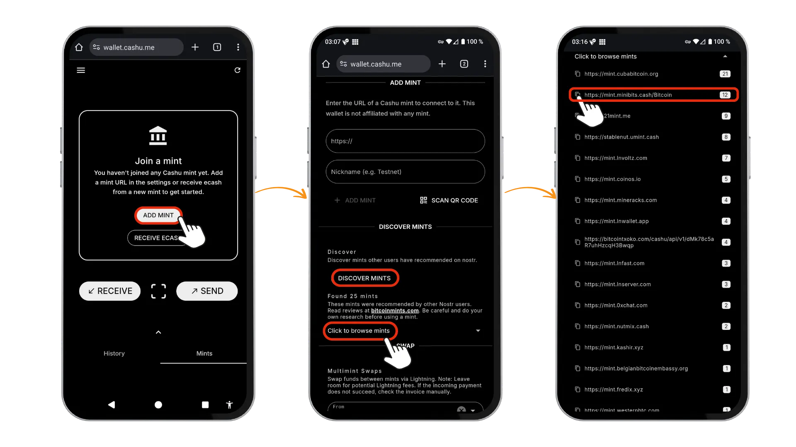
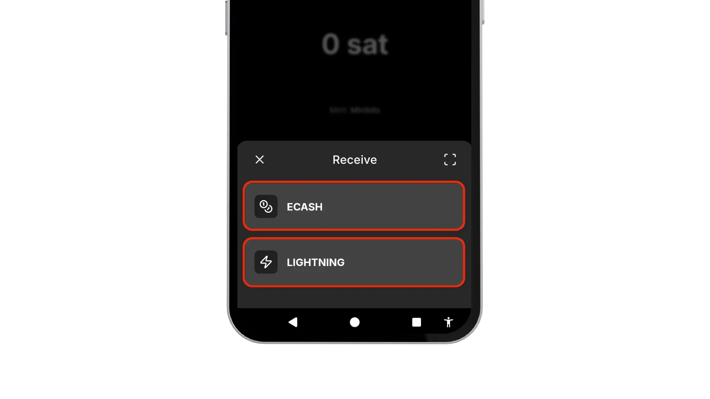
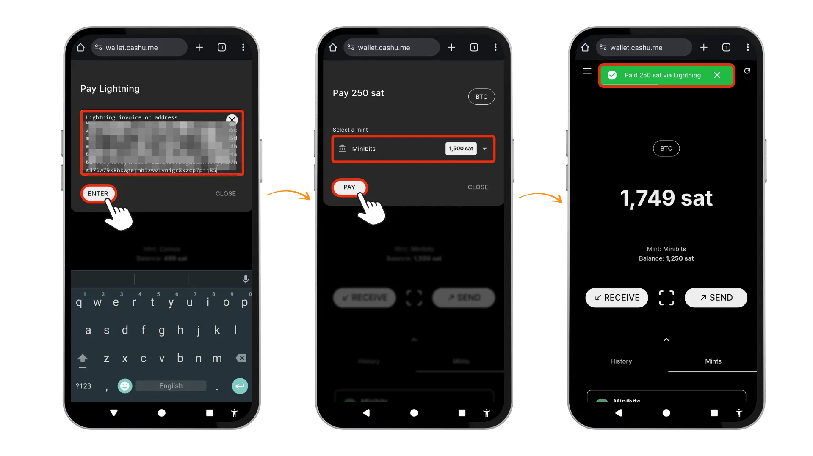
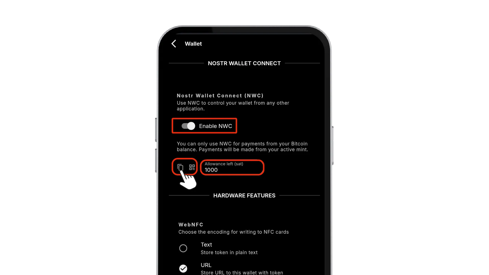

Berikut ini adalah video tutorial dari BTC Sessions, panduan yang menunjukkan cara mengatur dan menggunakan Cashu.me Bitcoin Wallet, yang memberi kamu akses ke transaksi Bitcoin yang simpel, murah, dan privat, tanpa perlu toko aplikasi!

Di tutorial ini, kita bakal menjelajahi Cashu.me. Sebuah wallet berbasis browser untuk pembayaran Bitcoin privat yang menggunakan ecash Chaumian. Sebelum kita masuk lebih dalam, yuk lihat dulu pengenalan singkat tentang apa itu ecash dan bagaimana cara kerjanya.

## Pengantar tentang ecash

Bayangkan punya uang tunai digital yang bekerja persis seperti uang kertas di saku kamu — privat, instan, dan bisa digunakan secara peer-to-peer tanpa perantara. Itulah yang dimungkinkan oleh ecash: cara pembayaran digital yang membawa kembali privasi uang fisik ke dunia digital. Berbeda dengan Bitcoin on-chain yang mencatat setiap transaksi di ledger publik yang bisa dilihat siapa saja, ecash menciptakan token privat yang mewakili nilai Bitcoin sesungguhnya sambil menjaga kerahasiaan kebiasaan belanja kamu.

Bayangkan ecash sebagai uang pembawa digital yang disimpan di perangkat kamu — kalau kamu memegangnya, berarti kamu memilikinya, sama seperti uang tunai. Token ini diterbitkan oleh layanan tepercaya yang disebut Mint, yang menyimpan cadangan Bitcoin di baliknya. Saat kamu menggunakan ecash, kamu tidak menyiarkan transaksi ke seluruh jaringan. Sebaliknya, kamu menukarkan token privat secara langsung dengan orang lain, menciptakan pengalaman pembayaran yang lebih mirip dengan menyerahkan uang tunai dibanding melakukan pembayaran digital biasa.

Cashu adalah protokol ecash Chaumian yang gratis dan open-source, dibuat khusus untuk Bitcoin. Teknologi ini dibangun dari riset kriptografi perintis David Chaum di tahun 1980-an, menggunakan blind signature untuk menjaga privasi. Saat kamu menerima token ecash, mint akan menandatanganinya tanpa tahu ke mana token itu akan dibelanjakan, fitur penting yang mencegah pelacakan transaksi. Yang terpenting, ecash bukan pengganti Bitcoin; ecash justru melengkapinya dengan mengatasi beberapa keterbatasan arsitektur Bitcoin. Ecash memberikan tingkat privasi seperti uang tunai fisik (yang tidak dimiliki oleh ledger transparan) dan memungkinkan transaksi mikro instan tanpa biaya blockchain atau waktu konfirmasi.

Ecash terintegrasi dengan mulus ke Lightning Network. Kamu menggunakan Lightning untuk menyetor Bitcoin ke dalam mint (mengubah Bitcoin kamu menjadi token ecash) dan untuk menariknya kembali (mengubah token tersebut jadi saldo Lightning yang bisa kamu belanjakan). Keduanya membentuk kombinasi yang kuat: Bitcoin menyediakan layer penyelesaian yang aman, Lightning memungkinkan transaksi cepat dan interoperabilitas jaringan, dan ecash menambahkan layer privasi yang membuat pembayaran digital terasa jauh lebih privat.

## Cashu.me

Cashu.me adalah Progressive Web App (PWA) yang mengimplementasikan protokol Cashu — sebuah versi spesifik dari Chaumian ecash yang dirancang untuk Bitcoin. Sebagai PWA, aplikasi ini bisa langsung digunakan di browser kamu tanpa perlu diinstal dari toko aplikasi, meskipun kamu tetap bisa “menginstalnya” ke perangkatmu untuk akses yang lebih cepat dan praktis. Pendekatan berbasis web ini memastikan kompatibilitas luas di berbagai sistem operasi, sambil tetap menjaga keamanan lewat protokol kriptografi, bukan pembatasan platform.

## 🎉 Fitur Utama

Mari selami fitur-fiturnya dan jelajahi apa yang ditawarkan Cashu.me:

- Ecash Chaumian di Lightning**: Aplikasi ini menggunakan blind signature (tanda tangan buta), sehingga mint tidak dapat melacak saldo kamu atau riwayat transaksimu.
- Penyimpanan token secara mandiri**: Kamu mengontrol token ecash secara lokal dengan seedphrase kamu.
- Cadangan Seedphrase**: frasa pemulihan 12 kata untuk pemulihan Wallet
- Kemandirian mint**: Dapat digunakan dengan beberapa mint independen-tidak terkunci pada satu penyedia saja
- Transaksi instan dan gratis**: Dalam mint yang sama, pembayaran diselesaikan dalam hitungan detik tanpa biaya
- Arsitektur yang menjaga privasi**: Mint tidak dapat melihat siapa yang bertransaksi dengan siapa
- Pembayaran non-tunai secara offline**: Mengirim/menerima token melalui protokol transmisi lokal, seperti NFC, kode QR, Bluetooth, dll. tanpa koneksi internet
- Temukan mint ecash melalui Nostr**: Temukan dan verifikasi mint tepercaya melalui protokol Nostr
- Tukar uang elektronik antar mint**: Semua uang logam menggunakan Lightning yang berarti bisa mentransfer nilai di antara keduanya.
- Kendalikan Wallet dari jarak jauh dengan Nostr Wallet Connect (NWC)**: Hubungkan ke aplikasi lain seperti Nostr Client dan mulai melakukan zapping melalui NWC

Pengorbanan yang sangat penting adalah `kepercayaan`: meskipun kamu mengontrol token itu sendiri, kamu harus mempercayai mint untuk menyimpan cadangan Bitcoin yang mendasarinya. Seperti yang dinyatakan dalam dokumentasi Cashu:

> ... Mint menjalankan infrastruktur Lightning dan menyimpan satoshi untuk para pengguna ecash-nya. Kamu perlu mempercayai mint untuk menebus ecash kamu ketika ingin menukarkannya kembali ke Lightning.
> 
- Dokumentasi Cashu, [Pertanyaan Umum tentang Keamanan dan Privasi](https://docs.cashu.space/faq#general-safety-and-privacy-questions)

Hal ini membuat ecash menjadi solusi kustodian untuk Bitcoin itu sendiri, meskipun kamu tetap memegang kendali penuh atas tokennya.

## 1️⃣ Pengaturan Awal

① Kamu bisa mengunjungi [Wallet.cashu.me](https://Wallet.cashu.me) di browser. Karena Cashu.me adalah PWA, kamu tidak perlu mengunduhnya dari toko aplikasi — cukup buka situsnya langsung di browser kamu. Untuk akses yang lebih mudah, kamu juga bisa memasangnya secara opsional ke layar beranda perangkatmu.

② Untuk memasang PWA, ketuk tombol menu ⋮ di browser kamu lalu pilih Tambahkan ke Layar Utama. Setelah terpasang, tutup tab browser dan buka Cashu.me dari layar beranda perangkatmu. Di layar pembuka, ketuk Next untuk melanjutkan.

③ Keamanan itu penting. Simpan seedphrase kamu dengan aman di pengelola kata sandi atau, lebih baik lagi, tulis di atas kertas. Frasa pemulihan 12 kata ini adalah satu-satunya cara untuk memulihkan dana kalau kamu kehilangan akses ke perangkat ini. Ketuk ikon 👁️ untuk menampilkan seedphrase kamu, tulis semua 12 kata secara berurutan, lalu centang kotak bertuliskan Saya telah menuliskannya. Ketuk Selanjutnya untuk melanjutkan, lalu centang kotak untuk mengonfirmasi bahwa kamu menerima syarat di layar berikutnya.

Setelah penyiapan selesai, kamu perlu terhubung ke Mint. Ketuk TAMBAH MINT, lalu pilih TEMUKAN MINT untuk melihat daftar mint yang direkomendasikan oleh komunitas Nostr. Untuk verifikasi tambahan, kamu dapat meninjau peringkat mint di [bitcoinmints.com] (bitcoinmints.com).

Selanjutnya, ketuk Klik untuk menelusuri mint untuk melihat daftar lengkapnya. Pilih mint dengan menyalin URL-nya, lalu tempelkan ke kolom URL dan beri nama yang mudah kamu kenali. Untuk contoh ini, kita akan menggunakan:

URL: `https://mint.minibits.cash/Bitcoin`

Nama: `Minibits`

Ketuk TAMBAH MINT untuk menyelesaikan prosesnya. Di layar konfirmasi, pastikan kamu mempercayai operator mint tersebut, lalu ketuk TAMBAH MINT sekali lagi. Mint Minibits sekarang akan muncul di layar utama kamu. Setelah wallet siap, kamu perlu mengisinya dulu sebelum bisa melakukan transaksi.

## 2️⃣ Mendanai Wallet Anda

Cashu.me menyediakan dua cara untuk mendanai wallet kamu. Saat kamu mengetuk Terima di layar utama, kamu akan melihat dua opsi untuk menerima dana: lewat TUNAI atau KILAT. Yuk, kita bahas keduanya.

### Pendanaan melalui LIGHTNING

Opsi pertama untuk mendanai wallet adalah melalui Lightning Invoice. Pilih mint (jika kamu sudah menambahkan lebih dari satu), lalu tentukan jumlah (sats) yang ingin kamu terima. Setelah itu, ketuk BUAT Invoice. Kamu akan mendapatkan kode QR yang bisa dipindai dengan Lightning wallet, atau kamu bisa menyalin invoice tersebut dan menempelkannya ke wallet lain untuk membayar dan mendanai wallet Cashu.me kamu.

### Menerima uang tunai

Metode ecash memungkinkan kamu menerima token secara langsung dari wallet ecash lain. Mulailah dengan mengetuk tombol Terima, lalu pilih opsi ECASH. Kamu bisa menempelkan (paste), memindai (scan), atau menggunakan NFC untuk mengirim token Cashu dari wallet lain.

Kalau kamu memilih untuk menempelkan, masukkan string token yang sudah kamu salin dari wallet lain, jumlah dan mint akan otomatis ditampilkan. Tekan TERIMA untuk menyelesaikan transaksi, dan sats akan langsung muncul di wallet kamu.

Perhatikan bahwa saldo kamu sekarang bisa tersebar di beberapa mint. Misalnya, kamu mungkin punya 1.000 sats di Mint Minibits dan 1.000 sats lagi di Mint Coinos. Pemisahan di berbagai mint ini adalah bagian penting dari arsitektur Cashu.

### Bertukar Antar Mint

Kalau kamu sudah tidak mempercayai mint tertentu yang pernah kamu tambahkan, Cashu.me punya fitur untuk Swap dana dari satu mint ke mint lainnya. Buka tab Mint, lalu gulir ke bawah sampai kamu menemukan bagian Multimint Swaps. Pilih mint DARI dan KEPADA dari menu tarik-turun, lalu masukkan jumlah yang ingin kamu transfer. Tekan SWAP untuk memindahkan token antar mint. Proses ini dilakukan melalui transaksi Lightning, jadi pastikan kamu menyisakan sedikit saldo untuk biaya Lightning, dalam contoh ini, 1 sat sudah cukup.

## 3️⃣ Mengirim dana

Untuk mengirim Sats, Cashu.me menyediakan dua opsi. Untuk mengirim melalui `tunai` atau melalui `kilat`. Mari kita lihat kedua opsi tersebut.

### Mengirim melalui Lightning

Untuk mengirim melalui Lightning, ikuti langkah-langkah berikut:

1. Ketuk `KIRIM` pada Layar Utama dan pilih `Lightning`

2. Aplikasi akan meminta kamu untuk memasukkan Lightning Invoice atau Lightning Address. Kamu bisa menempelkannya langsung, atau menggunakan opsi pemindaian kode QR untuk menangkapnya secara visual, lalu konfirmasi dengan menekan ENTER.

3. Pilih mint yang ingin kamu gunakan untuk membayar lewat menu dropdown, lalu ketuk PAY untuk mengonfirmasi. Catatan: ada juga opsi Multimint di bawah Pengaturan → Pengujian, yang memungkinkan kamu membayar invoice dari beberapa mint sekaligus.

4. Setelah berhasil, kamu akan melihat konfirmasi pembayaran dan jumlah yang dipotong dari saldo.

### Mengirim melalui ecash

Mengirim uang elektronik juga sangat mudah.

1. Ketuk `KIRIM` dan kali ini pilih opsi `TUNAI`.

2. `Pilih mint` dan masukkan `Jumlah` yang ingin kamu kirimkan di Sats dan ketuk `KIRIM` untuk mengonfirmasi

3. Hal ini akan menghasilkan kode QR animasi yang bisa kamu sesuaikan dengan mengatur parameter kecepatan dan ukuran. Siapa pun bisa memindai kode QR ini untuk langsung menebus atau menerima sats, atau kamu bisa mengetuk COPY untuk mengirim string token ke orang lain lewat saluran lain seperti Bluetooth, NFC, atau pesan biasa.

4. Aku membuka Wallet yang lain. Rekatkan dari clipboard dan pilih `Receive ecash` di Wallet lainnya.

## 4️⃣ Fitur Tambahan

Selain fungsi utama untuk mengirim dan menerima, Cashu.me juga menawarkan berbagai fitur tambahan yang keren untuk meningkatkan pengalaman kamu dengan Bitcoin di ekosistem Nostr.

### Nostr Wallet Connect

Nostr Wallet Connect (`NWC`) mengubah cara kamu berinteraksi dengan aplikasi Nostr dengan menciptakan koneksi tanpa batas antara Wallet dan aplikasi sosial. Protokol ini memungkinkan aplikasi seperti [Damus] (https://damus.io/) atau [Primal] (https://primal.net/home) untuk meminta pembayaran secara langsung melalui relay Nostr tanpa harus meninggalkan aplikasi.

Untuk mengatur `NWC` di Cashu.me:

1. Buka `Pengaturan` di menu Hamburger kiri atas

2. Gulir ke Bagian `NOSTR Wallet CONNECT` dan ketuk Tombol `Enable`

3. Kemudian kamu akan menetapkan tunjangan untuk menetapkan jumlah maksimum yang dapat dibelanjakan oleh aplikasi dari Wallet.

4. Setelah dikonfigurasi, kamu bisa menyalin string koneksi dan menempelkannya ke klien Nostr mana pun yang mendukung NWC, sehingga kamu bisa melakukan zapping dan tipping secara instan.

### Lightning Address via npub.cash

Cashu.me terintegrasi dengan [npub.cash] (https://npub.cash/) untuk menyediakan kamu dengan Lightning Address yang bekerja secara mulus dengan protokol Nostr. Di sini kamu bisa mendaftar dan mengklaim nama pengguna kamu dengan memberikan `nsec` Nostr milikmu, biayanya 5.000 Sats dan mendukung proyek npub.cash, atau Anda dapat menggunakan kunci publik Nostr apa pun (`npub`) tanpa registrasi.

Pertama, buka `Pengaturan`, lalu ketuk Aktifkan Lightning Address dengan `npub.cash`. Ini akan membuat npub.cash Address secara otomatis menggunakan string npub yang dihasilkan dari seedphrase wallet kamu secara default.

Atau, kunjungi [halaman web ini] (https://npub.cash/username) untuk mengklaim nama pengguna khusus menggunakan Nostr `nsec` milikmu sendiri, yang memberi kamu Lightning Address yang dipersonalisasi seperti username@npub.cash.

## 🎯 Kesimpulan

Cashu.me memberikan pengalaman pembayaran Bitcoin yang privat, bekerja layaknya uang tunai fisik — instan dan peer-to-peer tanpa mengekspos riwayat transaksimu. Aku pribadi suka arsitektur PWA-nya karena bisa berjalan tanpa batasan dari toko aplikasi. Dengan menggabungkan keamanan Bitcoin, kecepatan Lightning, dan privasi ecash, wallet ini menawarkan penggunaan nyata yang bisa mendorong adopsi Bitcoin dalam kehidupan sehari-hari.

Meskipun kamu punya kendali penuh atas token ecash kamu lewat penyimpanan mandiri, ingat bahwa mint tetap bertindak sebagai pihak ketiga tepercaya yang memegang cadangan Bitcoin di baliknya. Kemampuan untuk memakai beberapa mint sekaligus dan menukar antar mint memberi fleksibilitas tambahan sambil tetap menjaga privasi.

Berkat fitur seperti NWC dan npub.cash, Cashu.me jadi salah satu opsi wallet menarik bagi pengguna sosial yang menghargai privasi dan kedaulatan dari batasan kebijakan teknologi besar.

## 📚 Sumber Referensi

[https://github.com/cashubtc/cashu.me](https://github.com/cashubtc/cashu.me)

[https://github.com/cashubtc](https://github.com/cashubtc)

[https://github.com/cashubtc/awesome-cashu](https://github.com/cashubtc/awesome-cashu)

[https://cashu.space/](https://cashu.space/)
