## Video Tutorial


Blockstream Jade - Mobile Bitcoin Hardware Wallet FULL TUTORIAL oleh BTCsession

## Panduan Penulisan Lengkap


### Prasyarat

1. Unduh versi terbaru dari Blockstream Green.

2. Pasang driver ini untuk memastikan Jade dikenali oleh komputer milikmu.

### Pengaturan Desktop


Buka Blockstream Green, kemudian klik logo Blockstream di bawah Devices.

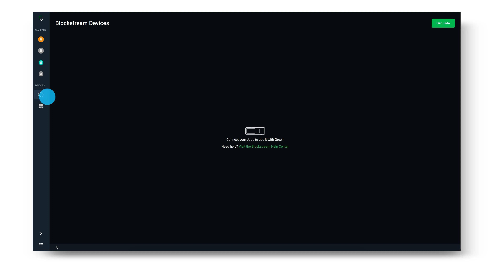

Hubungkan Jade ke desktop Anda menggunakan kabel USB yang disediakan.

> Catatan: Jika Jade tidak dikenali oleh komputer milikmu, pastikan untuk mengunduh driver yang ditemukan dalam panduan di sini.

Setelah Jade kamu muncul di Green, perbarui Jade dengan mengklik **Check for updates** dan pilih versi firmware terbaru. Gunakan roda gulir atau toggle di Jade untuk mengonfirmasi dan melanjutkan pembaruan. Pastikan Jade kamu masih menampilkan tombol **Initialize;** kalau tidak, kamu harus menunggu sampai setelah proses penyiapan Jade untuk memperbaruinya. Gunakan tombol kembali untuk kembali ke layar ini jika perlu.


Setelah kamu memperbarui firmware Jade, pilih Setup Jade pada jaringan dan kebijakan keamanan yang ingin kamu gunakan.

> Tip: Kebijakan keamanan ditampilkan di bawah Type pada layar login yang terlihat di bawah ini. Kalau kamu belum yakin mau pilih Singlesig atau Multisig Shield, kamu bisa cek panduan kami di sini. (https://help.blockstream.com/hc/en-us/articles/4403642609433)


Selanjutnya, pilih untuk membuat dompet Baru dan pilih 12 kata untuk membuat seedphrase kamu. Mengklik Advanced akan memberimu opsi untuk memilih seedphrase 12 atau 24 kata.

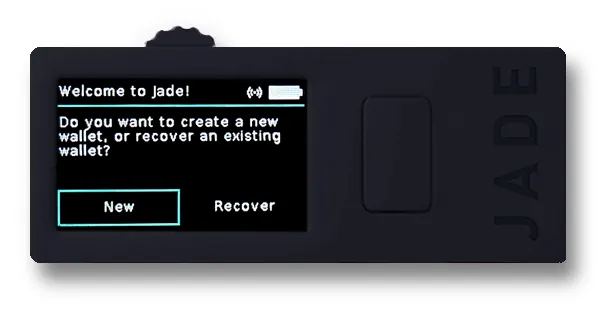

Catat seedphrase kamu secara offline di atas kertas (atau gunakan perangkat khusus untuk mencadangkan seedphrase demi keamanan ekstra). Setelah itu, gunakan roda atau toggle di bagian atas Jade untuk memverifikasi seedphrase kamu. Langkah ini memastikan kamu sudah menuliskannya dengan benar.

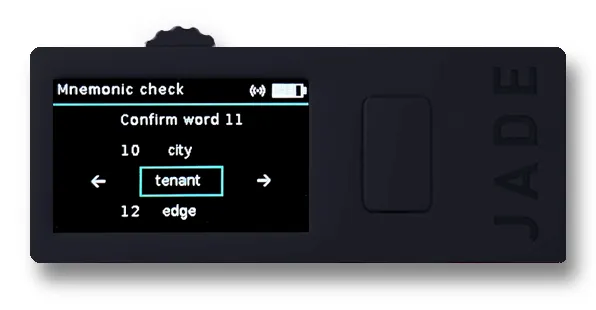

Tetapkan dan konfirmasi PIN enam digit kamu. PIN ini digunakan untuk membuka kunci Blockstream Jade setiap kali kamu login ke dompetmu.

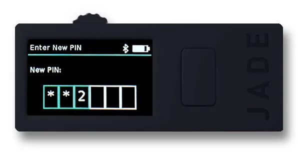

Sekarang, cukup pilih Go to Wallet di aplikasi desktop Green, dan kamu akan melihat dompetmu terbuka di Blockstream Green. Blockstream Jade juga akan menampilkan status Ready! Sekarang kamu sudah bisa menggunakan Jade untuk mengirim dan menerima transaksi Bitcoin.

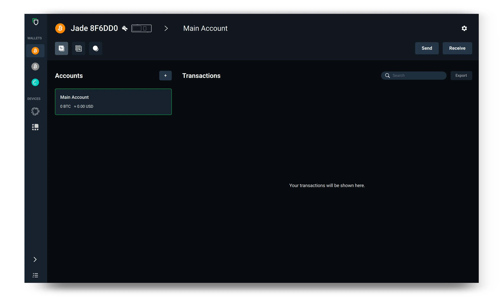

Setelah kamu selesai menggunakan dompetmu, lepaskan sambungan Blockstream Jade dari perangkat. Saat kamu ingin menggunakan dompet di Blockstream Jade lagi, cukup sambungkan kembali perangkatmu dan ikuti petunjuk yang muncul.

sumber: https://help.blockstream.com/hc/en-us/articles/17478506300825

### Lampiran A - Memverifikasi file unduhan Green Wallet

Memverifikasi unduhan berarti memastikan bahwa file yang kamu unduh belum diubah sejak dirilis oleh pengembang.

Kita melakukan ini dengan memeriksa apakah tanda tangan (yang dibuat menggunakan kunci privat pengembang), bersama dengan file yang diunduh dan kunci publik pengembang, menghasilkan hasil TRUE saat dijalankan melalui fungsi gpg --verify. Aku akan menunjukkan caranya sebentar lagi. Kalau kamu ingin mempelajari latar belakangnya, aku sudah menyiapkan dua panduan ini untukmu.

Pertama, kita mendapatkan kunci tanda tangan:
Untuk Linux, buka terminal, dan jalankan perintah ini (Anda hanya perlu menyalin dan menempelkan teks, serta menyertakan tanda kutip):
```bash
gpg --keyserver keyserver.ubuntu.com --recv-keys "04BE BF2E 35A2 AF2F FDF1 FA5D E7F0 54AA 2E76 E792"
```

Untuk Mac, lakukan hal yang sama, kecuali kamu perlu mengunduh dan menginstal GPG Suite terlebih dahulu.

Untuk Windows, lakukan hal yang sama, kecuali kamu perlu mengunduh dan menginstal GPG4Win terlebih dahulu.

Kamu akan mendapatkan output yang mengatakan kunci publik telah diimpor.


Gambar ini memiliki atribut alt yang kosong; nama filenya adalah image-3-1024x162.webp

Selanjutnya, kita perlu mendapatkan file yang berisi hash dari perangkat lunak tersebut. File ini disimpan di halaman GitHub Blockstream. Pertama, buka halaman informasinya di sini dan klik tautan desktop. Kamu akan diarahkan ke halaman rilis terbaru di GitHub, dan di sana kamu akan melihat tautan ke file `SHA256SUMS.asc`, yaitu dokumen teks yang berisi hash yang diterbitkan oleh Blockstream untuk program yang kita unduh.

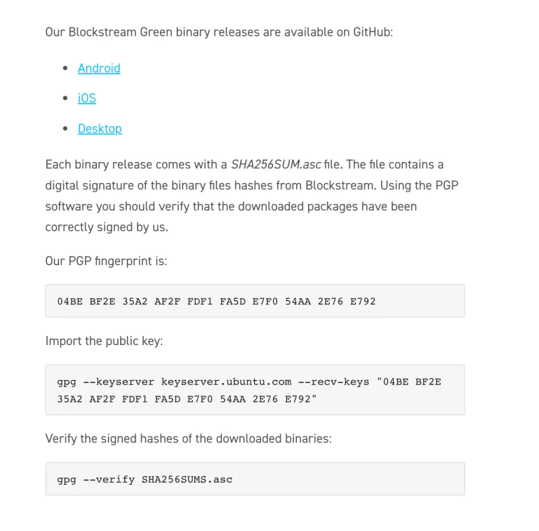

GitHub:


Ini tidak perlu, tetapi setelah menyimpan ke disk, aku mengganti nama "SHA256SUMS.asc" menjadi "SHA256.txt" untuk lebih mudah membuka file di Mac menggunakan editor teks. Ini adalah isi dari file tersebut:

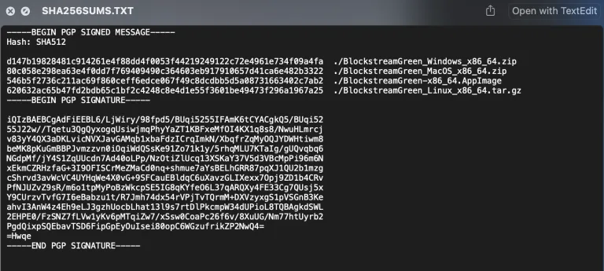

Teks yang kita cari ada di bagian atas. Tergantung pada file mana yang kita unduh, akan ada output hash yang sesuai yang nanti akan kita bandingkan.

Bagian bawah dokumen berisi tanda tangan yang dibuat untuk pesan di atas ini adalah satu file dengan dua fungsi.

Urutannya tidak masalah, tapi sebelum memeriksa hash, kita akan memastikan dulu bahwa pesan hash aslinya belum diubah.

Buka terminal, lalu pastikan kamu berada di direktori yang benar tempat file SHA256SUMS.asc diunduh. Jika kamu mengunduhnya ke direktori Downloads, untuk Linux dan Mac, ubah direktori dengan perintah seperti ini (huruf besar-kecil harus sesuai):

```bash
cd Downloads
```

Tentu saja, kamu harus menekan Enter setelah menjalankan perintah ini. Untuk Windows, buka **CMD (Command Prompt)** dan ketik perintah yang sama (meskipun tidak sensitif terhadap huruf besar dan kecil).

Untuk Windows dan Mac, pastikan kamu sudah mengunduh **GPG4Win** dan **GPG Suite** sesuai instruksi sebelumnya. Untuk Linux, gpg sudah tersedia secara bawaan di sistem operasi.

Dari Terminal (atau CMD untuk Windows), ketik perintah berikut:

```bash
gpg --verify SHA256SUMS.asc
```

Ejaan tepat dari nama file (yang ditandai merah) mungkin berbeda tergantung kapan kamu mengunduhnya, jadi pastikan perintah yang kamu ketik sesuai dengan nama file yang diunduh.

Kamu seharusnya akan melihat output seperti ini, dan abaikan saja peringatan tentang tanda tangan yang dipercaya. Itu hanya berarti kamu belum secara manual memberi tahu komputer bahwa kamu mempercayai kunci publik yang sudah kita impor sebelumnya.


Gambar ini memiliki atribut alt yang kosong; nama filenya image-4-1024x165.webp.

Output ini mengonfirmasi bahwa tanda tangannya valid, dan kita bisa yakin bahwa kunci privat dari **info@greenaddress.it** telah menandatangani data (laporan hash) tersebut.

Sekarang kita perlu melakukan hash pada file zip yang sudah diunduh dan membandingkan outputnya dengan yang diterbitkan. Perhatikan bahwa di dalam file `SHA256SUMS.asc`, ada sedikit teks bertuliskan "Hash: SHA512" yang agak membingungkan, karena file itu sebenarnya berisi output SHA256. Jadi, kita bisa abaikan bagian itu.

Untuk Mac dan Linux, buka terminal lalu arahkan ke lokasi tempat file zip diunduh (kamu mungkin perlu mengetik cd Downloads lagi, kecuali kamu belum menutup terminal sejak langkah sebelumnya).

Ngomong-ngomong, kamu selalu bisa memeriksa direktori aktif dengan mengetik pwd (singkatan dari print working directory). Kalau kamu masih asing dengan hal ini, akan sangat membantu untuk menonton video singkat di YouTube dengan kata kunci "cara menavigasi sistem file Linux/Mac/Windows".

Untuk meng-hash file, ketik ini:

```bash
shasum -a 256 BlockstreamGreen_MacOS_x86_64.zip
```

Kamu harus memeriksa apa nama file secara tepat, dan memodifikasi teks dalam biru di atas jika diperlukan.

Kamu akan mendapatkan output seperti ini (milikmu akan berbeda jika file berbeda dengan milikku):


Selanjutnya, bandingkan secara visual output hash dengan apa yang ada di file `SHA256SUMS.asc.` Jika mereka cocok, maka --> SUKSES! Selamat.

sumber: https://armantheparman.com/jade/

### Menggunakannya di Sparrow

Kalau kamu sudah tahu cara menggunakan Sparrow maka seperti biasa:

> Catatan: prosesnya sama dengan Specter misalnya

Unduh Sparrow menggunakan tautan yang disediakan di sini.

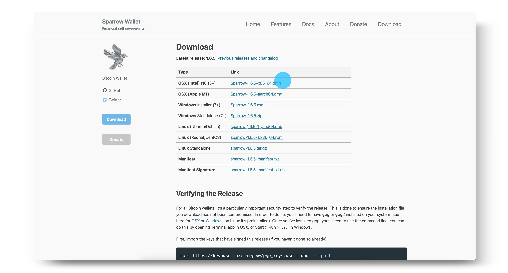

Klik Next untuk mengikuti panduan pengaturan untuk mempelajari tentang berbagai opsi koneksi.


Pilih server yang kamu inginkan kemudian pilih Create New Wallet.


Masukkan nama untuk dompet milikmu dan klik Create Wallet.

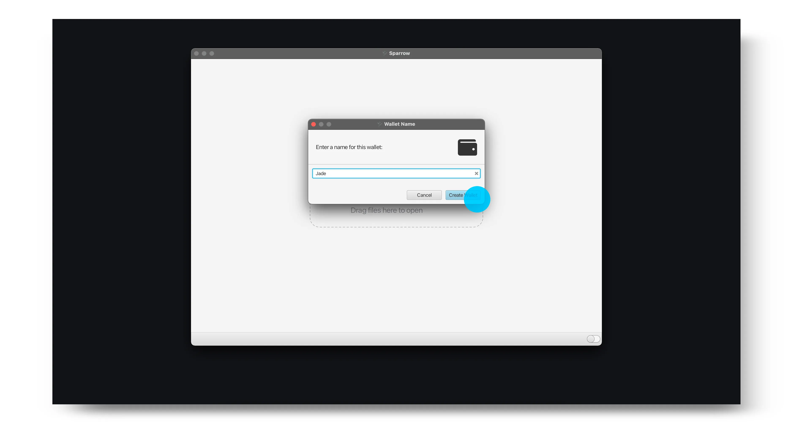

Pilih kebijakan dan jenis skrip yang kamu inginkan kemudian pilih Connected Hardware Wallet.

> Catatan: Kalau kamu sebelumnya sudah menggunakan Blockstream Jade sebagai dompet Singlesig dengan Blockstream Green dan ingin melihat transaksimu di Sparrow, pastikan jenis skripnya sama dengan tipe akun yang berisi danamu di Green. Kamu juga perlu memastikan jalur derivasinya cocok.


Colokkan Blockstream Jade dan klik Scan. Kamu kemudian akan diminta untuk memasukkan PIN di Jade.

> Tip: Sebelum menghubungkan Jade kamu, pastikan aplikasi Blockstream Green tidak sedang terbuka. Jika Green terbuka, hal ini bisa menyebabkan masalah saat Sparrow mendeteksi Jade kamu.

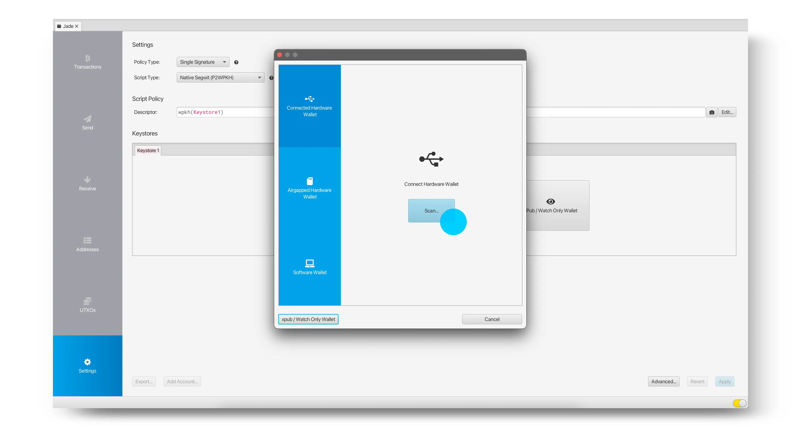

Pilih Import Keystore untuk mengimpor kunci publik dari akun default, atau pilih panah untuk memilih jalur derivasi yang ingin kamu gunakan secara manual.


Setelah kunci yang diinginkan telah diimpor, klik Apply.


Sekarang kamu sudah berhasil menyiapkan dompetmu dan bisa mulai menerima, menyimpan, serta membelanjakan bitcoin kamu menggunakan Sparrow dan Blockstream Jade.

> Catatan: Kalau kamu sebelumnya menggunakan Jade dengan Blockstream Green sebagai dompet Multisig Shield, jangan heran kalau dompet baru di Sparrow tidak menampilkan saldo yang sama, keduanya adalah dompet yang berbeda. Untuk mengakses kembali dompet Multisig Shield kamu, cukup sambungkan lagi Jade ke Blockstream Green.

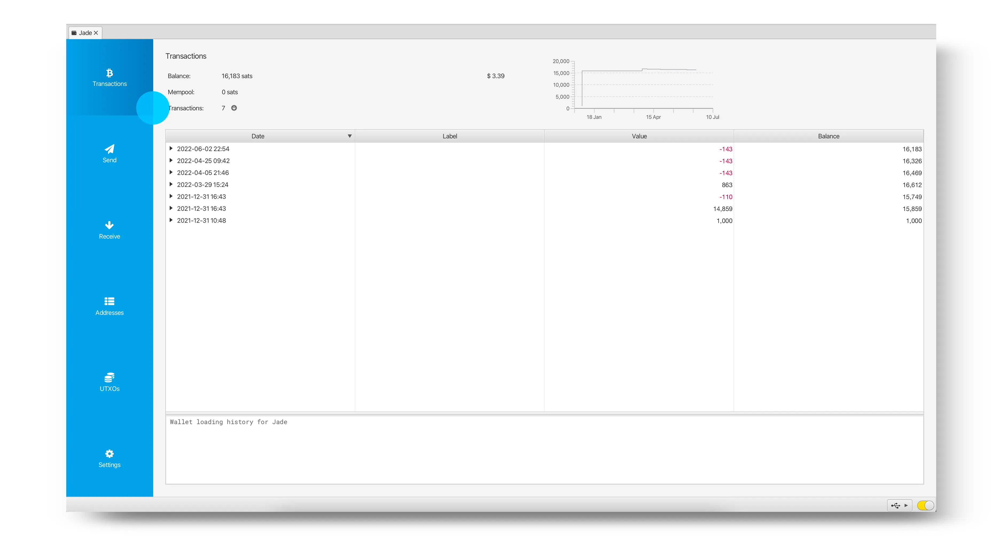

sumber: https://help.blockstream.com/hc/en-us/articles/7559912660761-How-do-I-use-Blockstream-Jade-with-Sparrow-

### aplikasi green
Kalau kamu lebih sering menggunakan panduan versi mobile, kamu bisa memakainya bersama Blockstream Green.
- Cara mengatur Blockstream Jade dengan Green | Blockstream Jade - https://youtu.be/7aacxnc6DHg

- Cara menerima bitcoin ke dompet Jade | Blockstream Jade - https://youtu.be/CVtcDdiPqLA
