Afrika terus maju, berinovasi, dan berkembang, tapi masih menghadapi banyak tantangan, terutama dalam hal konektivitas internet dan akses ke layanan keuangan dasar.

Menurut International Telecommunication Union, pada tahun 2024 tingkat penetrasi internet di Afrika (rasio jumlah pengguna internet terhadap total populasi di benua tersebut) baru mencapai 38%, sementara rata-rata global sudah 68%.

Dalam hal akses ke layanan keuangan, layanan transfer uang lewat ponsel (mobile money) telah mengalami perkembangan pesat di benua ini, karena banyak orang masih kesulitan mengakses layanan perbankan konvensional.

Menanggapi situasi ini, Kgothatso Ngako, seorang pengembang dari Afrika Selatan, menciptakan solusi revolusioner yang memungkinkan masyarakat Afrika tanpa rekening bank dan tanpa akses internet untuk tetap bisa memanfaatkan Bitcoin melalui proyeknya yang bernama **Machankura.**

## APA ITU MACHANKURA?

Machankura, bahasa gaul di Afrika Selatan yang berarti "uang", adalah proyek yang memiliki visi untuk menghubungkan wilayah pedesaan di Afrika dengan ekosistem Bitcoin.

Ini adalah wallet kustodian yang memungkinkan kamu mengirim dan menerima bitcoin di Lightning Network lewat teknologi USSD. Machankura bisa digunakan di semua jenis ponsel, bahkan yang paling sederhana sekalipun (termasuk ponsel Symbian), karena menggunakan jaringan GSM tradisional.

Tulisan **8333.mobi** yang biasanya muncul di bawah logo adalah bentuk penghormatan kecil. **8333** merupakan port default yang digunakan node Bitcoin untuk saling berkomunikasi. Machankura menegaskan bahwa Afrika tidak tertinggal dalam revolusi ini, justru menjadi tempat lahirnya inovasi di bidang tersebut.

Domain .mobi sendiri dibuat untuk layanan seluler yang berjalan di ponsel dasar melalui USSD. Jadi, 8333.mobi menggambarkan esensi dari solusi yang ditawarkan Machankura.

Sebelum masuk ke tutorialnya, yuk kita bahas dulu apa itu USSD — teknologi yang membuat Machankura bisa digunakan tanpa internet.

## USSD

Teknologi USSD (*Unstructured Supplementary Service Data*) umumnya digunakan oleh operator seluler GSM. Fitur ini memungkinkan kamu berkomunikasi dengan layanan jarak jauh tanpa perlu internet, cukup dengan mengetikkan kode tertentu dan memilih opsi yang disediakan oleh layanan tersebut.

Bayangkan kamu mengetik kode seperti `*123#` di ponselmu. Dengan menjalankan kode itu, kamu mengirimkan permintaan ke jaringan GSM untuk mengakses layanan yang terhubung dengan kode tersebut.

Melalui sistem komunikasi yang sama, kamu bisa melakukan hal-hal seperti mengecek paket internet, sisa pulsa, dan lainnya.

Teknologi inilah yang juga menjadi dasar bagi layanan mobile banking dan transfer uang lewat ponsel seperti M-PESA, MTN Mobile Money, dan lainnya yang berkembang pesat di benua Afrika.

Seperti yang sudah disebutkan sebelumnya, layanan ini dikembangkan khusus untuk Afrika dan bisa digunakan di semua jenis ponsel tanpa perlu pengaturan teknis rumit atau koneksi internet.

## Inovasi Machankura

Berbeda dari wallet konvensional, Machankura memanfaatkan teknologi USSD untuk mengatasi masalah nyata yang dihadapi banyak masyarakat Afrika: keterbatasan jangkauan internet.

Machankura adalah layanan yang dikembangkan dan dihubungkan langsung dengan kode GSM agar pengguna bisa mengirim dan menerima bitcoin tanpa perlu koneksi internet. Kamu bisa menggunakan layanan ini di beberapa negara Afrika dengan memasukkan kode USSD yang sesuai:

| PAYS           | CODE USSD              |
| -------------- | ---------------------- |
| Ghana          | `*920*8333#`           |
| Kenya          | `*483*8333#`           |
| Malawi         | `*384*8333#`           |
| Namibie        | `*142*8333#`           |
| Nigeria        | `*347*8333#`           |
| Afrique du Sud | `54052.co.za`          |
| Tanzanie       | `SMS +255 679 066 977` |
| Ouganda        | `SMS +256 744 830 624` |
| Zambie         | `*384*8333#`           |
| Côte d’Ivoire  | `*9141#`               |

Berdasarkan tabel ini, kita dapat melihat bahwa negara-negara seperti Tanzania, Uganda, dan Afrika Selatan tidak memiliki kode USSD khusus untuk layanan ini.

Namun, Machankura mengatasi masalah ini dengan memperluas fungsionalitasnya melalui situs web, pesan SMS, dan WhatsApp.

Untuk mendapatkan informasi mengenai negara-negara baru di mana layanan ini akan tersedia, silakan kunjungi [situs web] (https://8333.mobi) secara teratur.

Tutorial langkah demi langkah ini menjelaskan cara menggunakan Machankura, pertama pada ponsel biasa tanpa internet, kemudian pada smartphone.

## Pengoperasian tanpa ponsel cerdas (melalui USSD)

### Buat portofolio Anda

Untuk koneksi pertama kamu :

- Masukkan kode USSD yang sesuai dengan negara;
- Tekan tombol panggil untuk memulai.

Sistem akan memintamu untuk membuat kode PIN 5 digit

- Pilih kode PIN yang aman (5 digit).
- Konfirmasikan kode PIN.
- Portofolio Bitcoin Anda dibuat secara instan.

Bitcoin Wallet ini terkait dengan nomor telepon kamu. Kode PIN yang dipilih dengan cermat akan mengenkripsi Wallet kamu dan juga akan digunakan untuk mengonfirmasi semua transaksi kamu di masa depan di Machankura.

Setelah portofolio dibuat, kamy akan mengakses menu utama dengan opsi berikut:

1. Kirim bitcoin

2. Menerima bitcoin

3. Detail akun

4. Membeli barang/jasa

5. Mengubah/mengatur ulang kode PIN

6. Keluaran

Untuk mengakses opsi apa pun di menu utama, cukup tekan nomor urut yang terkait dengan opsi tersebut.

Untuk mengakses "rincian akun", pilih opsi **3** dan tekan tombol panggil untuk membuka.

### Keselamatan dan praktik terbaik

Machankura adalah kustodian Lightning Wallet, sehingga bitcoin milikmu dikelola melalui node Machankura. Akun dilindungi oleh kode PIN yang Anda pilih.

- Jangan mengatur kode PIN sehubungan dengan tanggal penting dalam hidup kamu.
- Jangan pernah membagikan kode PIN kepada siapa pun.
- Hafalkan kode PIN.
- Selalu periksa nomor telepon sebelum mengirim.
- Jaga keseimbangan yang wajar untuk penggunaan sehari-hari.

Wallet kamu terhubung ke nomor telepon Anda:

- Kalau kamu kehilangan ponsel, hubungi dukungan Machankura;
- Pantau transaksi penting.

### Menerima bitcoin

- Pilih nomor pesanan dari opsi "Terima Bitcoin" di menu utama.
- Nomor telepon kamu berfungsi sebagai Address publik Anda.
- Bagikan nomor kamu kepada orang yang ingin mengirimi Anda bitcoin.

#### Petir Khusus Address

Setiap akun Machankura diberi Lightning Address berdasarkan nomor Machankura

`votrenumero@8333.mobi`

Contoh: nomor +2371234567890 akan menjadi `+2371234567890@8333.mobi`

Namun, kamu bisa memilih nama pengguna khusus untuk menggantikan nomor tersebut (misalnya `Satoshi@8333.mobi`).

Siapa pun yang memiliki Lightning Address dapat mengirimi kamu bitcoin tanpa mengetahui nomor telepon.

#### Memuat ulang portofolio Machankura Anda

Selain menerima bitcoin dari Lightning Wallet lain, kamu bisa mengisi ulang Machankura Wallet dengan **Azteco** dan **1Voucher** dari **Flash Group**.

**Azteco** dan **Flash Group** adalah dua perusahaan yang menawarkan **voucher** Bitcoin, yaitu layanan voucher prabayar yang dapat kamu beli secara online atau dari pengecer untuk mendapatkan Bitcoin tanpa melalui platform Exchange. Voucher ini berfungsi seperti **kartu hadiah**. Ada voucher **On-Chain** dan **Lightning**.

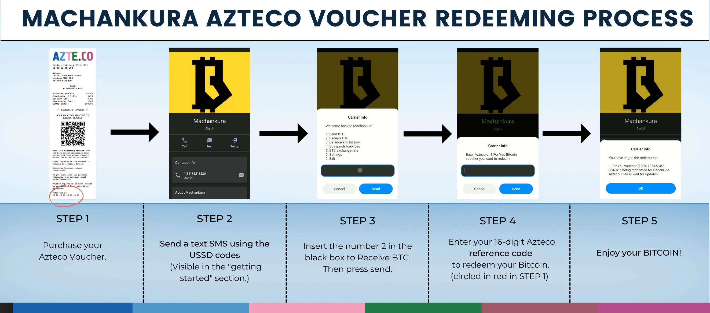

Prosesnya sederhana:

- Kamu membeli voucher dengan jumlah tertentu;
- Kamu menerima kode **16 digit** melalui email atau pada Invoice kecil.

- Masukkan kode USSD MACHANKURA negara pada ponselmu.
- Tunggu sampai menu utama muncul.
- Pilih nomor pesanan dari opsi ''Terima bitcoin''.
- Masukkan kode 16 digit (kode referensi voucher Azteco di bagian bawah voucher atau kode PIN 1Voucher pada Invoice).

Bitcoin yang setara dengan jumlah voucher yang dibeli akan ditambahkan langsung ke Machankura Wallet Anda.

### Kirim Bitcoin

- Buka menu utama.
- Pilih opsi "Kirim Bitcoin" dengan memasukkan nomor pesanan.
- Masukkan nomor telepon penerima, nama pengguna Lightning Address atau Machankura.
- Kemudian masukkan jumlah yang akan dikirim di Sats.
- Konfirmasikan dengan kode PIN kamu.

Machankura kemudian mengirimkan bitcoin melalui Lightning Network hanya dalam hitungan detik. Pengirim juga bisa mengirim bitcoin dalam berbagai mata uang, termasuk mata uang lokal.

Kalau nomor penerima belum terdaftar sebagai pengguna, Machankura akan otomatis membuat pra-pendaftaran dan mengkreditkan bitcoin ke akun penerima.

Pesan notifikasi kemudian dikirim ke nomor tersebut, dan pengguna akan menerima bitcoinnya begitu ia menyelesaikan proses konfirmasi pendaftaran di layanan Machankura.

Kamu bisa menonton [video demo pengiriman](https://www.linkedin.com/posts/activity-7351143606121820162-Ua3T?utm_source=share&utm_medium=member_android&rcm=ACoAAAeTubUB8GuaMia5yNBlBg4WhZpGOeVLY0w) bitcoin oleh PIO TARAS (Pimpinan Machankura Afrique Francophone) melalui Machankura di telepon biasa.

*Video dari Vladimir FOMENE, pengembang Bitcoin :*

### Periksa saldo milikmu

- Pilih nomor urut opsi "Saldo" di menu utama.
- Saldo ditampilkan dalam satoshi dan mata uang lokal yang setara.

### Riwayat transaksi

- Pilih nomor urut opsi ''Riwayat'' di menu utama.
- Melihat transaksi terbaru kamu (pengiriman dan penerimaan).
- Periksa detail setiap transaksi.

### Fitur tambahan

Machankura bukan cuma sekadar wallet. Kamu juga bisa menukar satoshimu dengan berbagai barang dan jasa (seperti kartu hadiah Bitrefill atau Lightning Watts) langsung dari aplikasinya

https://planb.academy/tutorials/exchange/centralized/bitrefill-8c588412-1bfc-465b-9bca-e647a647fbc1

Ada juga fitur "Klan", yang memungkinkan kamu membuat sistem multi-tanda tangan secara kooperatif: setiap anggota klan harus menyetujui setiap pengeluaran, dan kamu bisa mengatur agar dana didistribusikan otomatis di antara mereka.

## Gunakan dengan smartphone

Machankura memilih WhatsApp sebagai platform perantara untuk penggunaan di ponsel pintar.

Ada dua alasan utama di balik keputusan ini. Pertama, agar solusi ini bisa lebih mudah diakses oleh masyarakat Afrika tanpa perlu menginstal aplikasi tambahan, apalagi aplikasi yang bisa saja terhapus ketika memori ponsel penuh.

Kedua, sebagai langkah lanjutan dari alasan pertama, Machankura ingin menjadi solusi yang inklusif dan dekat dengan kehidupan sehari-hari, dengan memanfaatkan aplikasi yang sudah sangat umum digunakan oleh banyak orang Afrika: WhatsApp.

### Buat portofolio Anda

Untuk memulai, kamu perlu menulis pesan ke bot WhatsApp Machankura (kata "Hai" saja sudah lebih dari cukup). Nomor WhatsApp-nya adalah [+27 73 762 5720] (https://wa.me/+27737625720).

Kamu akan diminta untuk memilih bahasa yang kamu inginkan untuk mengobrol.

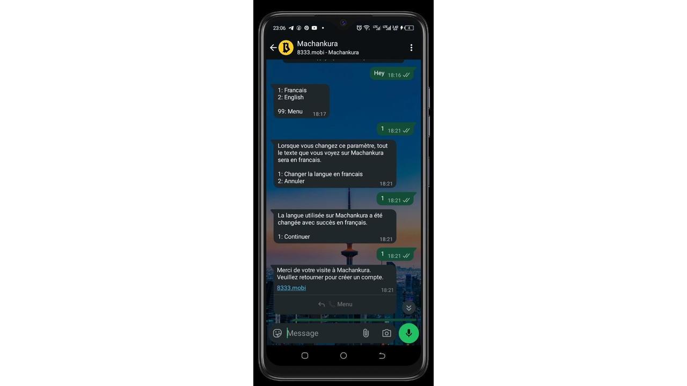

Setelah kamu memilih bahasa, kamu akan dibawa ke menu utama.

- Jawab **1** yang sesuai dengan pilihan "**Buat akun**".
- Masukkan email unik Address.

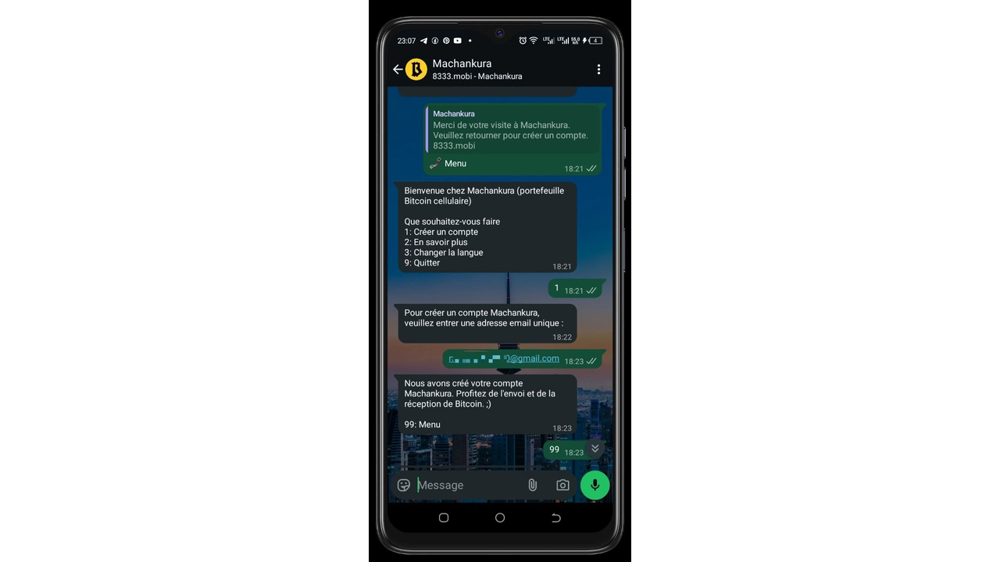

Akun Machankura kamu akan dibuat secara otomatis. Kembali ke menu untuk menentukan nama pengguna.

Untuk melakukannya:

- Jawab **0**, yang sesuai dengan opsi ''**Parameter**'';
- Kemudian jawab **1**, yang sesuai dengan pilihan ''**Nama pengguna**''.

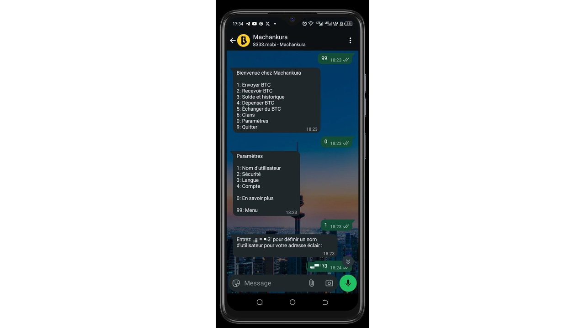

Bot kemudian akan mengirimkan kode **6 digit** yang perlu kamu masukkan, lalu kamu bisa memilih nama pengguna sendiri. Setelah nama pengguna diperbarui, kamu bisa kembali ke menu utama untuk mulai mengirim dan menerima bitcoin lewat Machankura.

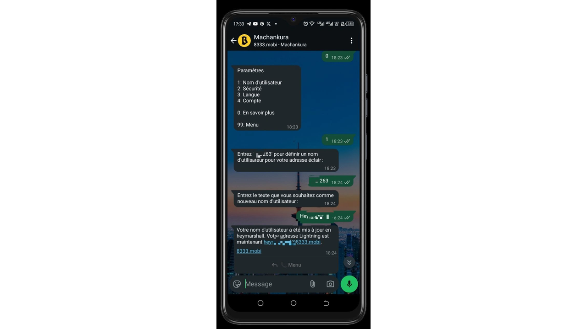

### Kirim bitcoin

Machankura memungkinkanmu untuk mengirim bitcoin melalui berbagai opsi:

- nomor telepon ;
- lightning Address, format Bitcoin Address yang dapat dibaca manusia ini jauh lebih banyak digunakan untuk menghindari kesalahan pengetikan saat melakukan pembayaran;
- nama pengguna penerima, untuk pembayaran ke akun Machankura;
- gW-15 Invoice, Lightning Invoice standar;
- gW-16 Address, melalui layanan Boltz.

https://planb.academy/tutorials/exchange/centralized/boltz-34ad778e-6dc7-41c2-8219-e11e3361a43d

Machankura juga mendukung interoperabilitas antar-wallet Lightning. Dalam contoh ini, kita mengirim bitcoin dari Machankura WhatsApp Wallet ke Wallet of Satoshi.

https://planb.academy/tutorials/wallet/mobile/wallet-of-satoshi-39149d86-e42b-4e8f-ae9f-7e061e7784f7

Untuk mengirim, ketik angka 1 sesuai dengan opsi "SEND BTC". Setelah itu, pilih metode pengiriman "Lightning Address", lalu masukkan alamat tujuan pengiriman bitcoin. Terakhir, pilih satuan nilai "Sats", tentukan jumlah satoshi yang ingin kamu kirim, dan konfirmasikan pengiriman.

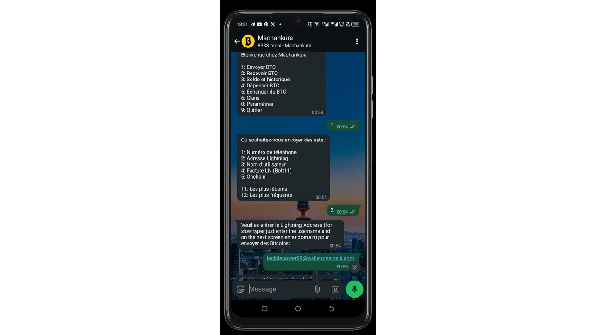

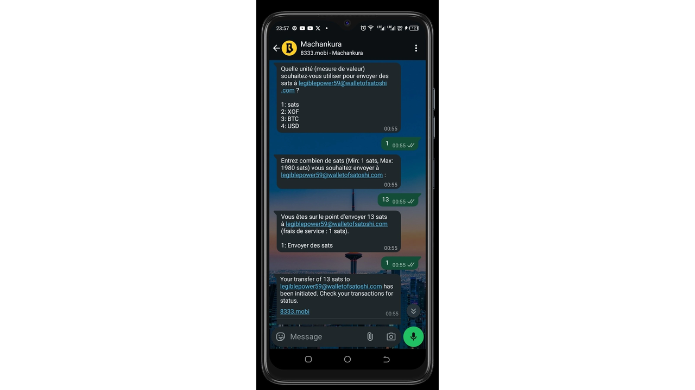

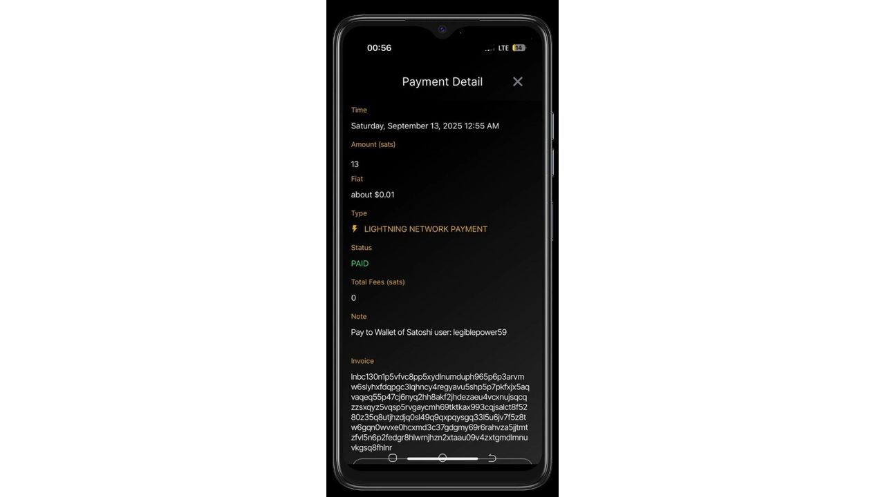

Selamat! Kamu baru saja mengirimkan satoshi kepada penerima.

### Menerima bitcoin

Setelah berada di menu, pilih **2**, yang sesuai dengan opsi ''**Terima BTC**''. Bot akan menampilkan Lightning Address.

Kamera ini juga menawarkan beragam opsi, termasuk :

- MENGGUNAKAN BTC;
- Bill LN (Bolt11);
- Kode QR;
- On-Chain Address.

Opsi 1 ''GUNAKAN BTC'' memungkinkan kamu untuk mengisi ulang akun milikmu dengan voucher Azteco.

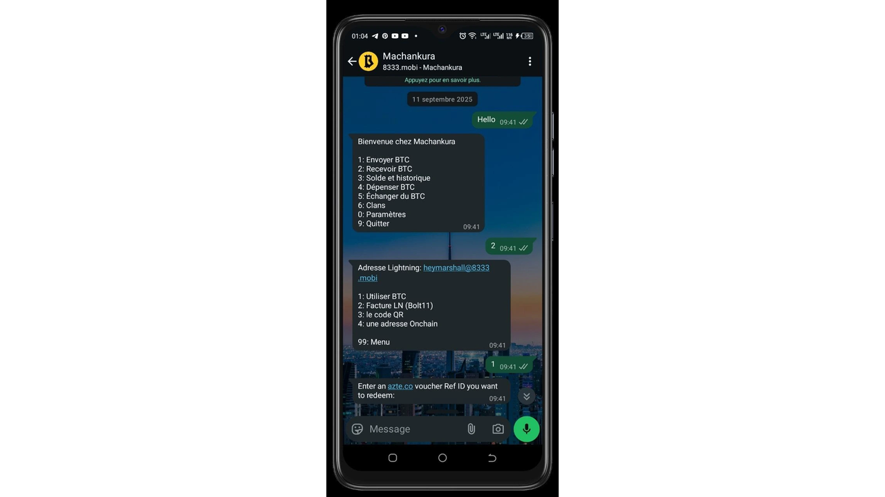

Opsi 4 ''A ONE-TIME Address'' memungkinkanmu untuk mendapatkan On-Chain Address baru sekali pakai untuk anonimitas yang lebih baik.

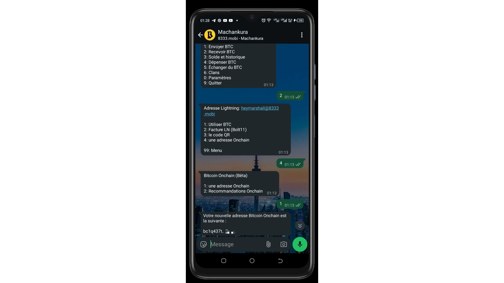

Opsi lainnya mengarahkan kamu ke halaman web yang terhubung ke Lightning Address milikmu.

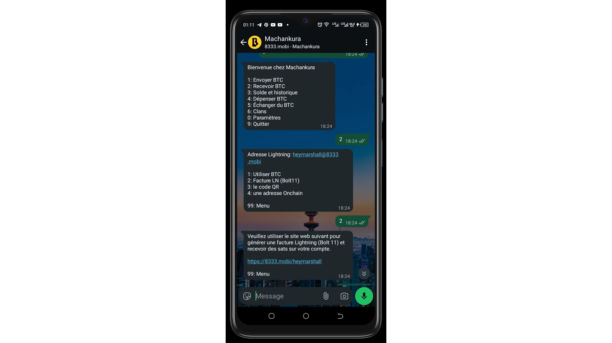

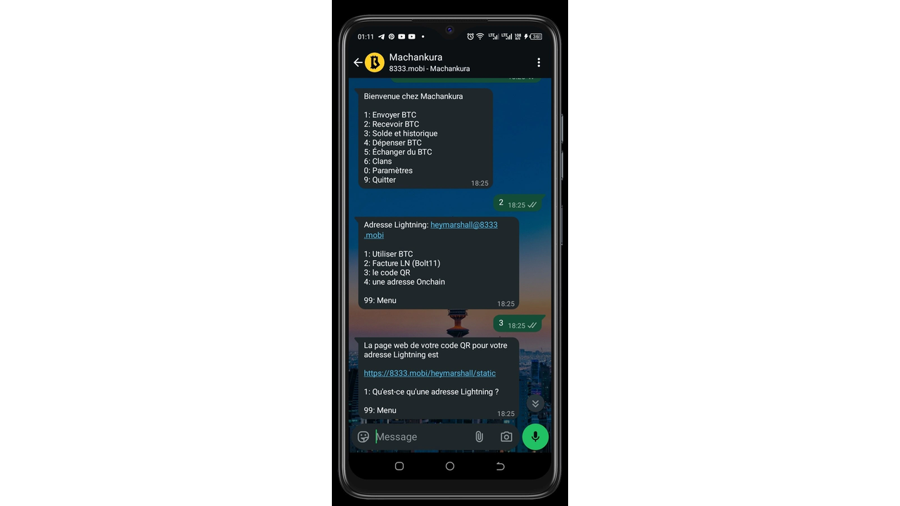

Kamu bisa membeli :

- atau kode QR dari Wallet kamu;

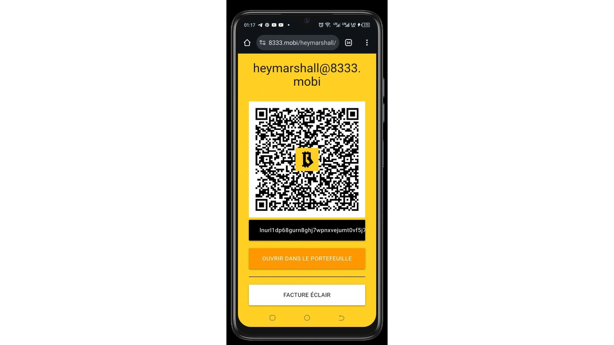

- atau generate atau Lightning Invoice di halaman web ini.
- 
Untuk mendapatkan Invoice yang akurat, mohon sebutkan unit akun dan jumlah bitcoin dalam unit akun yang ingin kamu terima.

Setelah memasukkan jumlah dalam unit akun ini, sistem akan mengonversi ekuivalennya ke dalam Bitcoin, dan sebaliknya.

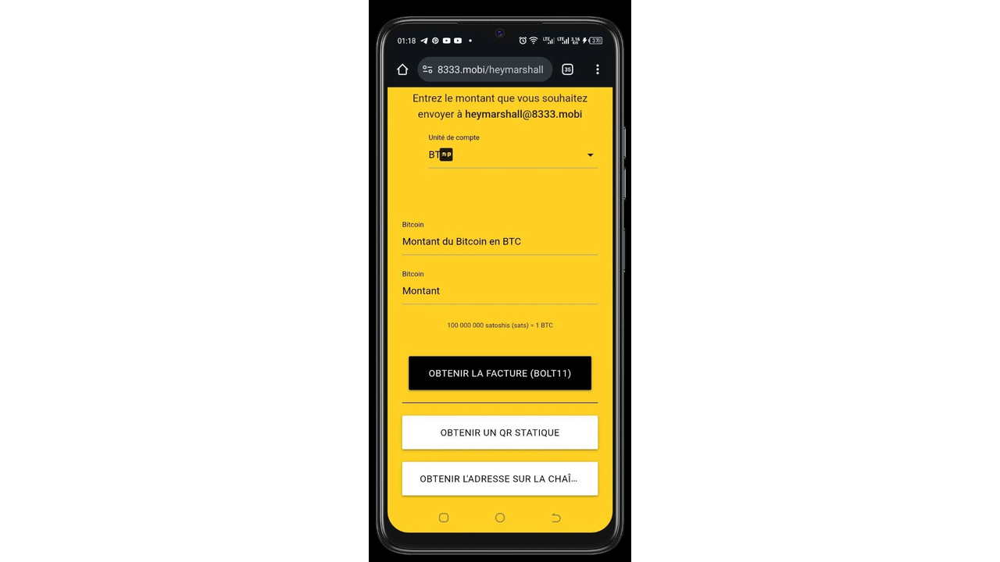

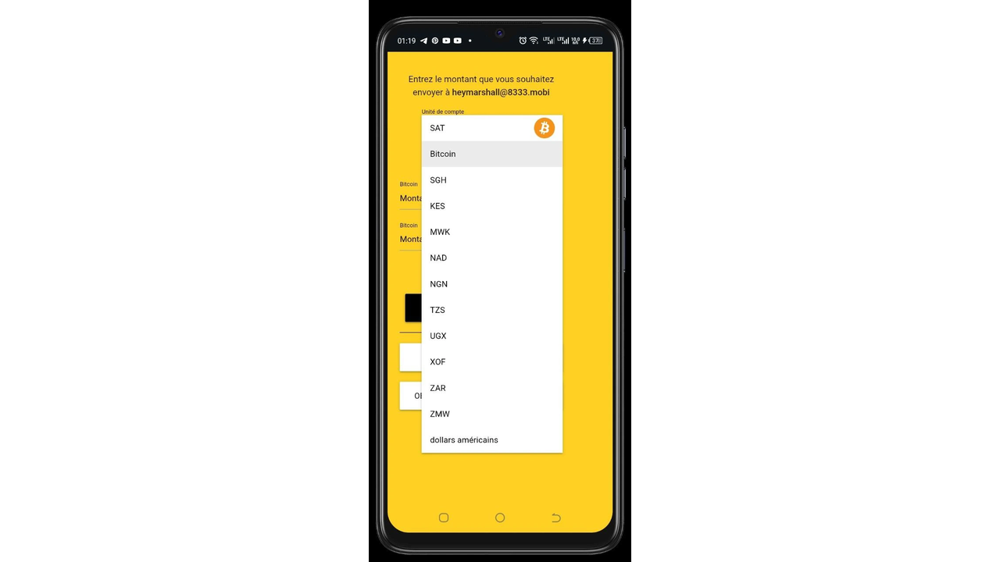

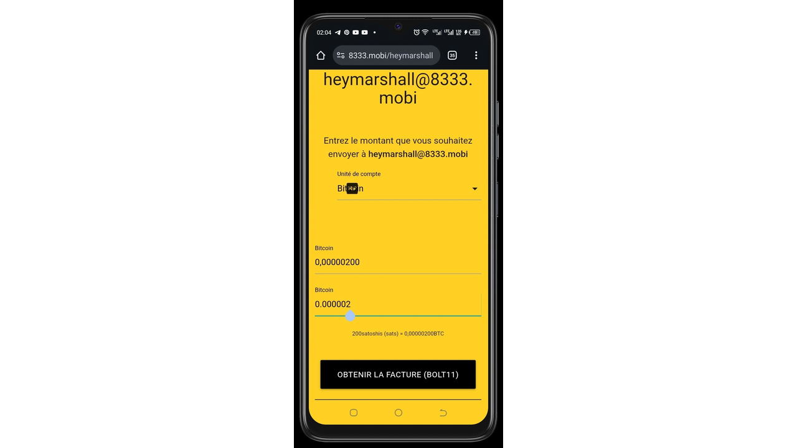

Perhatikan bahwa kamu juga dapat memperoleh On-Chain Address pada halaman web yang terhubung ke portofolio milikmu.

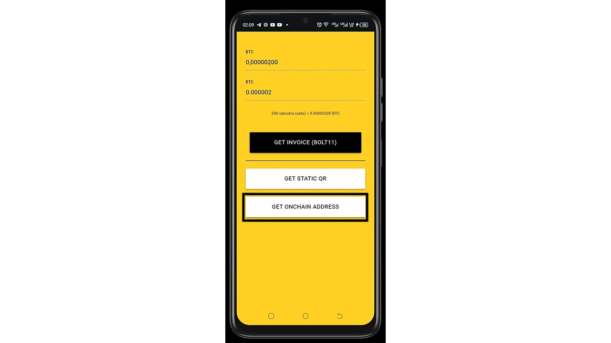

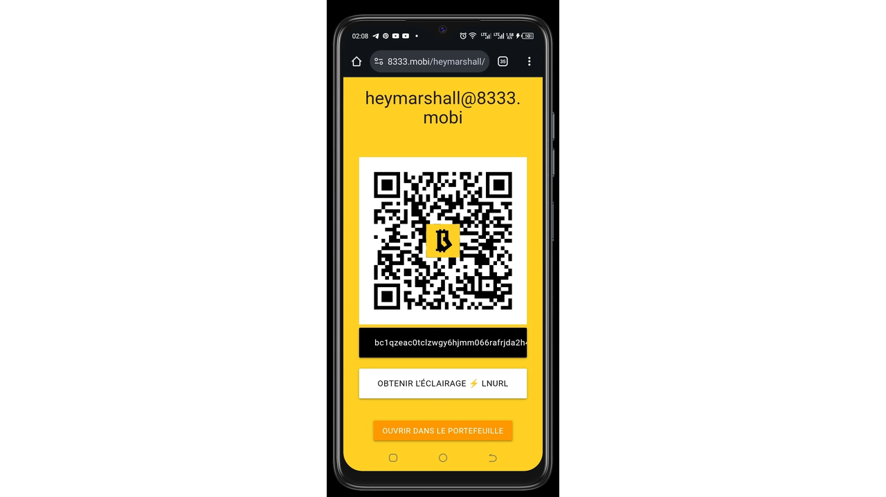

Selain itu, Machankura juga memungkinkan siapa pun mengirimkan bitcoin kepadamu langsung dari situs web pribadimu menggunakan wallet khusus. Kamu hanya perlu membagikan tautan ke halaman web yang terhubung dengan Lightning Address milikmu. Setelah mereka membuka halaman tersebut, mereka bisa langsung melihat kode QR atau invoice-mu dan membayarnya lewat wallet mereka.

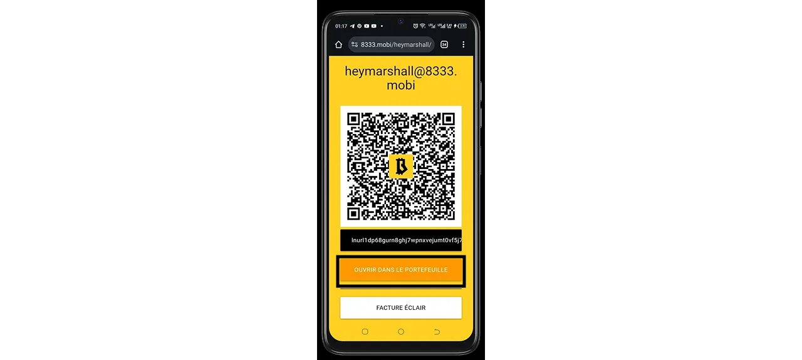

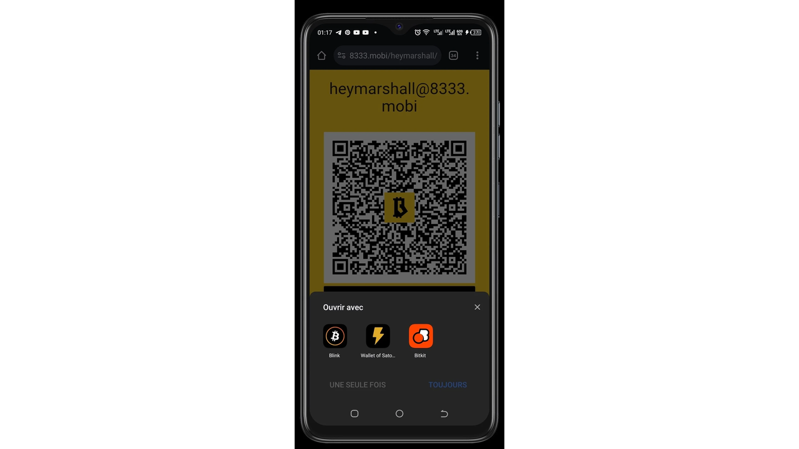

https://planb.academy/tutorials/wallet/mobile/blink-7ea5f5a4-e728-4ff9-b3f9-cf20aa6fc2bd

https://planb.academy/tutorials/wallet/mobile/bitkit-a7224674-85c4-4045-9baf-37018d89550c

### Pemeriksaan saldo

Kamu bisa melihat saldo wallet Machankura-mu dengan memilih opsi 3, yang sesuai dengan "Saldo dan riwayat".

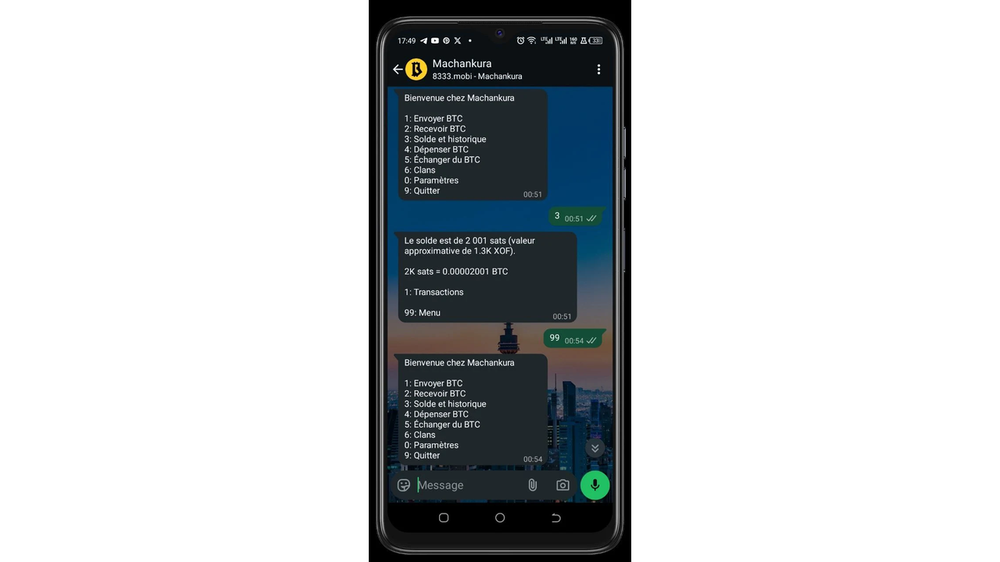

Selamat! Sekarang kamu sudah bisa menggunakan Machankura untuk menerima dan membelanjakan bitcoin.

Kalau kamu merasa tutorial ini bermanfaat, jangan lupa kasih jempol hijau di bawah, ya. Terima kasih banyak!
