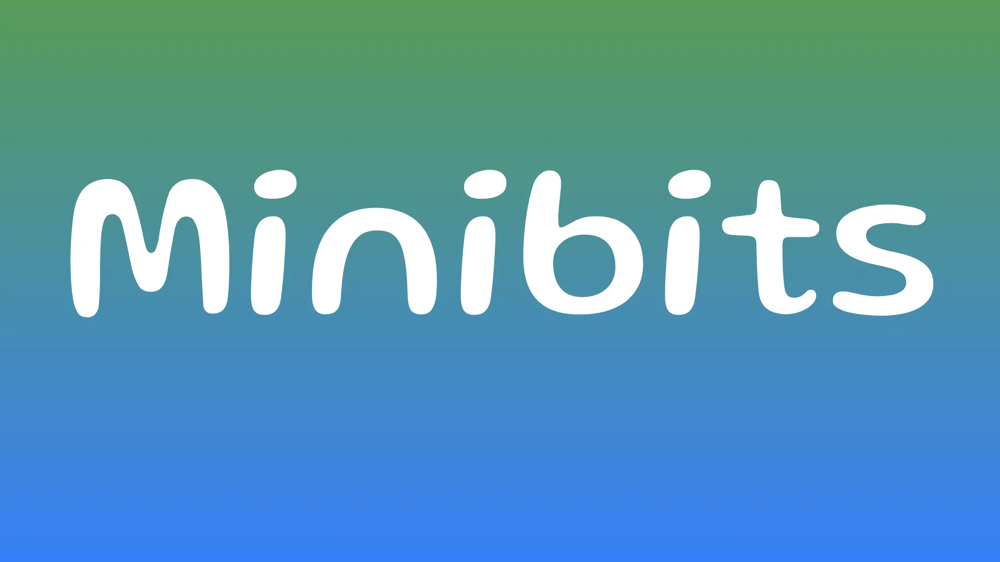
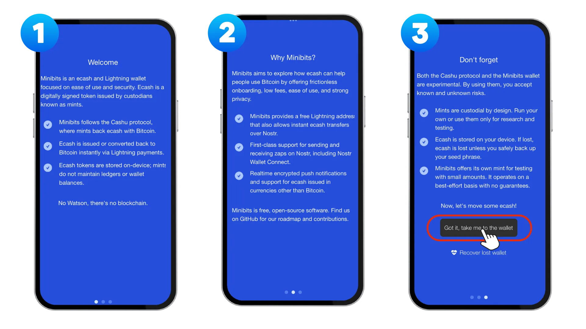
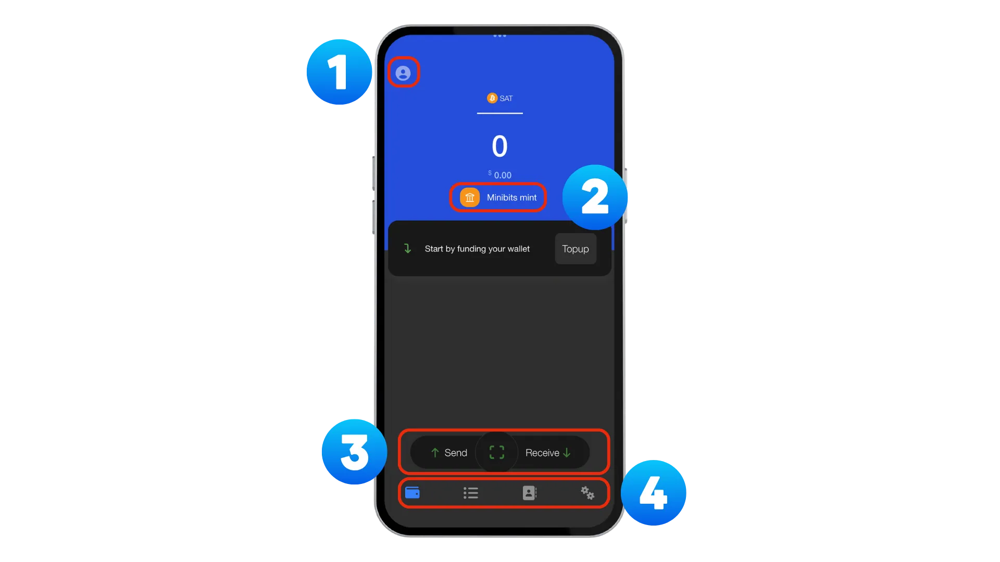
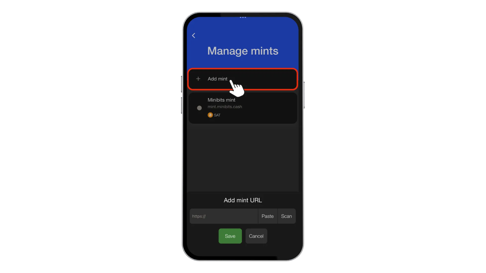
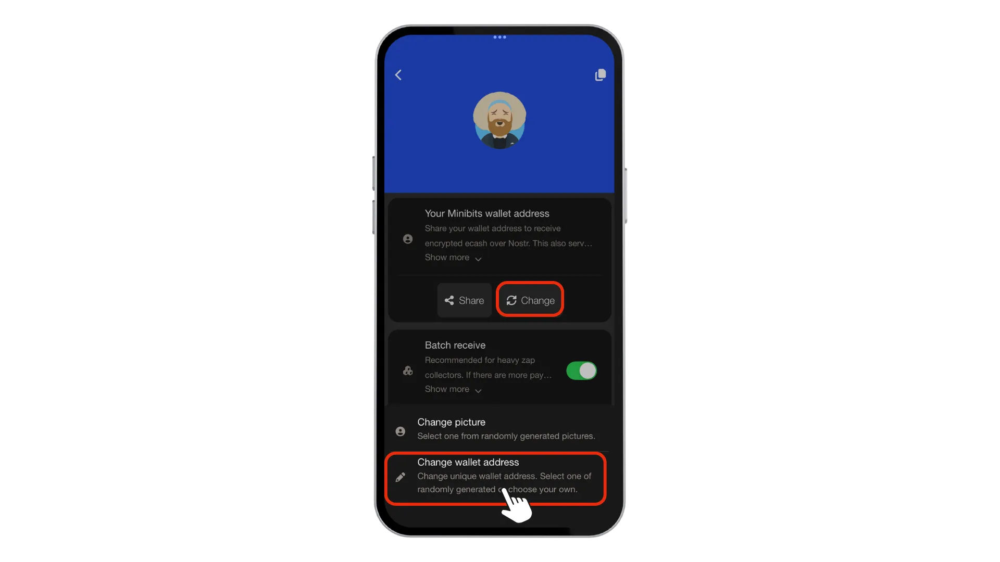
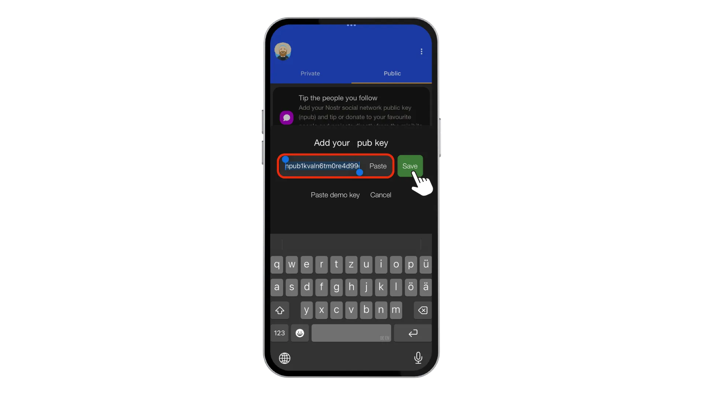
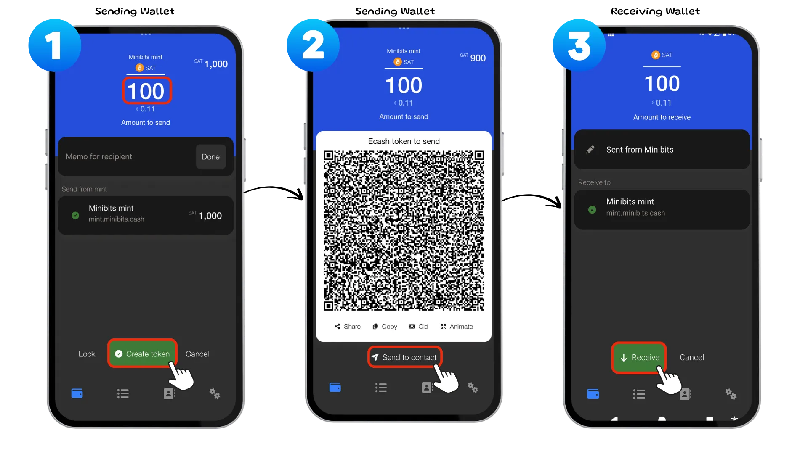

Di tutorial ini, aku bakal nuntun kamu menyiapkan Minibits Wallet buat pakai ecash, teknologi pembayaran yang berfokus pada privasi tinggi dan bisa bekerja bareng Bitcoin. Minibits adalah ecash dan Lightning Wallet yang memungkinkan transfer nilai secara instan, murah, dan privat, jadi cocok banget buat transaksi sehari-hari yang butuh privasi.

Sebelum kita bahas lebih jauh tentang Minibits, penting buat ngerti dulu apa itu ecash dan apa yang bukan. Banyak orang sering nyampuradukkan ecash dengan teknologi Bitcoin atau Blockchain, padahal keduanya sebenarnya konsep yang berbeda.

Ecash BUKAN Bitcoin. Ecash nggak menggantikan Bitcoin Wallet kamu yang self-custodial, tapi justru melengkapinya. Ecash juga BUKAN Blockchain dan TIDAK hidup di ledger publik mana pun. Menariknya, ecash bukan teknologi baru — ecash udah ada bahkan sebelum World Wide Web, dengan konsep yang dikembangkan sejak tahun 1980-an dan 1990-an.

Jadi, apa itu ecash? Ecash itu sangat privat (transaksi nggak ninggalin jejak yang bisa dilacak), peer-to-peer (transfer langsung tanpa perantara), dan berfungsi sebagai instrumen pembawa digital (kalau kamu punya, kamu yang ngendaliin). Kelebihan utamanya, ecash BISA dipakai secara offline, jadi pengirim dan penerima bisa aja lagi nggak terhubung ke internet saat transaksi berlangsung. Ecash bisa diterbitkan oleh satu pihak atau oleh federasi entitas tepercaya, dan jadi teknologi pelengkap yang pas banget buat Bitcoin, menangani transaksi kecil yang sering terjadi, sementara Bitcoin berfungsi sebagai lapisan penyelesaian (settlement layer).

Perlu kamu tahu, pengaturan Minibits ini adalah solusi kustodian, artinya kamu mempercayakan dana kamu ke operator Mint. Ini membawa risiko tertentu yang perlu kamu pahami sebelum lanjut.

Proyek menampilkan disclaimer penting ini:

- Wallet ini hanya boleh digunakan untuk tujuan penelitian.
- Wallet adalah versi beta dengan fungsionalitas yang belum lengkap dan bug yang diketahui dan tidak diketahui.
- Jangan menggunakannya dengan uang tunai dalam jumlah besar.
- Uang elektronik yang disimpan dalam Wallet dikeluarkan oleh mint
- anda mempercayai mint untuk mendukungnya dengan Bitcoin sampai kamu mentransfer kepemilikanmu ke Bitcoin lightning Wallet.
- Protokol Cashu yang diimplementasikan oleh Wallet belum mendapatkan tinjauan atau pengujian yang ekstensif.

Perlakukan Minibits seperti Wallet sehari-hari, bukan rekening tabungan, dan jangan pernah menyimpan nilai yang signifikan di sini.

## 1️⃣ Menyiapkan Wallet Anda

Untuk memulai, kunjungi [Situs Web Minibits](https://www.minibits.cash/) di mana Anda akan menemukan opsi pengunduhan untuk semua platform utama. Pengguna iOS dapat mengunduh dari [App Store](https://testflight.apple.com/join/defJQgTD), sementara pengguna iOS Uni Eropa memiliki opsi tambahan untuk menginstal dari [Freedom Store](https://freedomstore.io/). Pengguna Android bisa mendapatkan aplikasi ini dari [Google Play Store](https://play.google.com/store/apps/details?id=com.minibits_wallet) atau mengunduh file APK langsung dari halaman [GitHub Releases](https://github.com/minibits-cash/minibits_wallet/releases).

Waktu kamu instal Minibits, kamu bakal ngelihat layar pengantar yang ngejelasin konsep dasarnya. Kamu bisa baca semuanya atau langsung lewatin kalau udah familiar sama teknologinya. Setelah kamu beres di langkah awal ini, kamu bakal diminta buat memilih:

- `Mengerti, bawa saya ke Wallet` untuk pengguna baru atau
- `Pulihkan Wallet yang hilang` jika Anda memulihkan dari cadangan.

Setelah kamu selesai dengan penyiapan awal, kamu bakal masuk ke Layar Utama yang punya beberapa elemen penting buat diperhatiin.
① Ikon profil di pojok atas bakal bawa kamu ke halaman profil, tempat kamu bisa ngakses Alamat Wallet Minibits dan pilih opsi `batch receive`.
② Di tengah layar, kamu bakal lihat daftar Mint yang bisa kamu pakai, dengan Mint bawaan dari Minibits yang dipilih secara default.
③ Baris aksi di bawahnya nyediain opsi buat ngirim pembayaran tunai atau Lightning, memindai kode QR, dan menerima pembayaran.
④ Terakhir, bilah navigasi di bagian bawah punya pintasan ke layar Beranda, Riwayat Transaksi, Kontak, dan Pengaturan.

## 2️⃣ Mengelola permen

Secara default, mint bawaan dari Minibits bakal aktif begitu kamu mulai pakai aplikasi. Tapi salah satu kekuatan ecash adalah kemampuannya buat pakai beberapa mint sekaligus demi ningkatin desentralisasi dan keamanan. Buat nambah mint lain, buka Pengaturan, pilih Kelola mint, lalu ketuk `Tambahkan mint`.

(Bitcoinmints.com) menyediakan daftar lengkap mint yang tersedia dengan peringkat pengguna untuk membantu kamu memilih opsi yang memiliki reputasi baik. Menggunakan beberapa mint mengurangi risiko. Jika satu mint mengalami masalah, dana kamu di mint lain tetap dapat diakses.

## 3️⃣ Membuat Cadangan

Pencadangan bisa dibilang merupakan langkah yang paling penting dalam keseluruhan proses penyiapan. Untuk mengakses opsi Pencadangan, navigasikan ke `Pengaturan`-> `Pencadangan` Di sini kamu akan menemukan dua opsi penting:

1. Seedphrase kamu terdiri dari 12 kata yang memungkinkan kamu memulihkan saldo ecash kalau perangkat kamu hilang. Seedphrase ini adalah kunci utama buat semua ecash di semua koin yang udah kamu tambahkan. Tulis di media fisik (kayak kertas atau logam) dan simpan dengan aman di beberapa tempat berbeda. Jangan pernah menyimpan seedphrase kamu secara digital di tempat yang dapat membahayakan. Pertimbangkan untuk mengunjungi [tutorial] (https://planb.academy/en/tutorials/wallet/backup/backup-mnemonic-22c0ddfa-fb9f-4e3a-96f9-46e2a7954270) ini untuk mengetahui praktik terbaik dalam melindungi Wallet kamu.

2. `Backup Wallet` yang berisi string backup yang panjang.

**Perhatian**: Kamu masih memerlukan seedphrase saat menggunakan cadangan ini untuk memulihkan Wallet kamu.

## 4️⃣ Buat Minibits Wallet Address

Selanjutnya arahkan ke `Kontak` di bagian bawah dan sesuaikan `Minibits Wallet Address` khusus kamu dengan mengetuk `Ubah` -> `Ubah Wallet Address`. Masukkan Address yang kamu inginkan dan periksa ketersediaannya.

Setelah kamu ngatur Address, kamu bakal diminta buat ngasih sedikit `Donasi` untuk dukung proyek ini. Meskipun sifatnya opsional, aku sangat nyaranin kamu buat mempertimbangkannya kalau berencana pakai layanan ini secara rutin. Proyek open-source kayak Minibits bergantung pada dukungan komunitas buat terus berkembang dan dipelihara. Bahkan kontribusi kecil pun bisa bantu ngejamin keberlangsungan proyek ini.

## 5️⃣ Pengaturan Nostr

Kalau kamu mau ngasih tip ke orang yang kamu ikuti di Nostr, kamu bisa `Tambahkan kunci` npub kamu dengan pilih `Kontak`, lalu `Publik`. Ini bakal ngubungin Minibits Wallet kamu ke jaringan sosial Nostr, jadi kamu bisa kasih tip dengan lancar tanpa hambatan.

Kamu juga bisa pilih opsi `Gunakan profil kamu sendiri` lewat `Pengaturan`, terus buka `Privasi` buat impor Nostr Address dan kunci kamu sendiri. Tapi perlu diingat, kalau kamu ngelakuin ini, Wallet kamu bakal berhenti berkomunikasi dengan server Nostr dan LNURL dari minibits.cash, yang berarti fitur Lightning Address buat nerima zaps dan pembayaran bakal nonaktif.

## 6️⃣ Menerima dana

Buat menerima dana pertama kali, kamu perlu isi ulang Wallet kamu lewat invoice Lightning. Caranya gampang banget: ketuk Topup, masukin Jumlah yang mau kamu tambahin, tambahkan Memo, lalu ketuk Buat Invoice. Setelah itu, bayar invoice tersebut pakai Lightning Wallet lain, pembayaran Bitcoin Lightning itu bakal dikonversi jadi token ecash di dalam Minibits Wallet kamu.

## 7️⃣ Kirim dana

Setelah kamu ngisi saldo di Wallet, kamu bisa ngirim dana dengan dua cara berbeda.

### Kirim ecash

Opsi pertama adalah ngirim uang tunai secara langsung. Ketuk `Kirim`, lalu pilih `Kirim uang tunai`, masukin `Jumlah`, dan ketuk Buat `token`. Ini bakal ngasilin kode QR yang bisa kamu bagiin ke penerima atau mereka bisa langsung pindai pakai perangkat mereka. Penerima bakal lihat token muncul di Wallet mereka hampir seketika, tanpa biaya Blockchain atau waktu tunggu konfirmasi.

### Bayar dengan Lightning

Pilihan kedua adalah bayar lewat Lightning. Ketuk `Kirim`, lalu pilih `Bayar dengan Lightning`. Kamu bisa pilih dari daftar `kontak` Nostr kamu (kalau kamu udah ngubungin npub kamu), atau masukin/tempekin kode pembayaran Lightning Address, Invoice, atau LNURL pakai opsi Tempel atau Pindai. Setelah kamu Konfirmasi penerima, kamu bakal diminta masukin Jumlah yang Harus Dibayar, tambahin memo kalau mau, lalu ketuk Konfirmasi, terus Bayar sekarang buat nyelesain transaksi Lightning.

## 8️⃣ Membuat koneksi NWC

Fitur keren lainnya dari Minibits adalah kemampuan buat bikin koneksi Nostr Wallet Connect (NWC), yang memungkinkan aplikasi lain minta pembayaran dari Wallet kamu tanpa harus ngekspos kunci pribadi kamu.

Buat ngaturnya, buka Pengaturan, pilih Nostr Wallet Connect, lalu ketuk Tambah koneksi. Kasih nama koneksi kamu dengan deskripsi yang jelas biar gampang ngenalin aplikasi dan akun pengguna yang terhubung. Tentuin juga batas maksimal harian yang wajar buat ngontrol jumlah yang bisa dipakai lewat koneksi ini, lalu ketuk Simpan buat nyelesain pengaturannya.

Fitur ini sangat berguna buat layanan seperti Nostr Client, di mana kamu bisa ngaktifin pemberian tip otomatis tanpa perlu nyetujui tiap transaksi secara manual.

## 🎯 Kesimpulan

Minibits menyediakan pintu masuk yang gampang diakses ke dunia ecash, menawarkan pembayaran yang fokus pada privasi dan melengkapi kepemilikan Bitcoin kamu. Ingat selalu buat nyimpen cadangan dengan benar, pertimbangkan pakai beberapa mint buat redundansi, dan simpan cuma jumlah yang sesuai di solusi kustodian ini.

Buat sumber daya tambahan, cek repositori GitHub Minibits, situs web resmi, dan saluran Telegram mereka, di mana komunitas aktif diskusi soal perkembangan dan bantu pecahin masalah.

- [Github](https://github.com/minibits-cash/minibits_wallet)
- [Situs web](https://www.minibits.cash/)
- [Telegram](https://t.me/MinibitsWallet)

Ekosistem ecash masih terus berkembang, tetapi alat seperti Minibits membuat teknologi privasi yang kuat ini semakin mudah diakses oleh pengguna sehari-hari.
