Menyusul penangkapan para pendiri Samourai Wallet dan penyitaan server mereka pada 24 April, beberapa fungsi aplikasi kini tidak beroperasi, dan pengguna yang tidak memiliki Dojo mereka sendiri tidak lagi dapat melakukan transmisi transaksi.

Setelah membantu beberapa pengguna dalam memulihkan bitcoin mereka dalam beberapa hari terakhir, saya percaya saya telah menemui sebagian besar masalah yang mungkin muncul selama pemulihan Samourai Wallet. Oleh karena itu, tutorial ini akan dimulai dengan laporan situasi untuk mengidentifikasi fungsi yang masih beroperasi dan yang tidak lagi tersedia dalam ekosistem Samourai Wallet dan perangkat lunak yang terpengaruh oleh insiden ini. Selanjutnya, kita akan melanjutkan langkah demi langkah untuk memulihkan Samourai Wallet menggunakan perangkat lunak Sparrow Wallet. Kita akan memeriksa semua hambatan potensial yang ditemui selama proses ini dan melihat solusi untuk mengatasinya. Akhirnya, di bagian terakhir, kamu akan menemukan potensi risiko terhadap privasi kamu menyusul penyitaan server.

*Terima kasih banyak kepada [@Louferlou](https://twitter.com/Louferlou), yang telah membantu beberapa pengguna dalam pemulihan mereka dan berbagi pengalamannya dengan saya, dan yang juga telah berkontribusi dalam pengujian untuk menentukan apa yang masih berfungsi.*

## Apakah Samourai Wallet masih berfungsi?

Ya, **aplikasi Samourai Wallet masih berfungsi**, tetapi dengan beberapa kondisi.

Pertama, aplikasi tersebut harus telah terpasang sebelumnya di smartphone milikmu. Google Play Store telah menghapus aplikasi tersebut, dan APK di-hosting di situs web yang disita. Oleh karena itu, saat ini cukup rumit untuk menginstal Samourai. Kamu mungkin menemukan APK secara online, tetapi saya menyarankan agar tidak mengunduhnya kecuali kamu yakin dengan sumbernya.

Mengingat halaman Samourai Wallet tidak lagi tersedia di Google Play Store, tidak mungkin untuk menonaktifkan pembaruan otomatis. Jika aplikasi kembali ke platform unduhan, akan bijaksana untuk **menonaktifkan pembaruan otomatis** sampai informasi lebih lanjut tersedia mengenai pengembangan kasus tersebut.

Jika Samourai Wallet sudah terpasang di smartphone milikmu, kamu seharusnya masih bisa mengakses aplikasi tersebut. Untuk menggunakan fungsi dompet dari Samourai, sangat penting untuk menghubungkan Dojo. Sebelumnya, pengguna tanpa Dojo pribadi bergantung pada server Samourai untuk mengakses informasi blockchain Bitcoin dan untuk melakukan transmisi transaksi. Dengan penyitaan server ini, aplikasi tidak lagi dapat mengakses data ini.
Kalau kamu tidak memiliki Dojo yang terhubung sebelumnya tetapi memiliki satu sekarang, Kamu mengaturnya untuk menggunakan aplikasi Samourai lagi. Ini melibatkan pengecekan cadangan milikmu, menghapus dompet (dompet, bukan aplikasi), dan memulihkan dompet dengan menghubungkan Dojo milikmu ke aplikasi. Untuk lebih detail tentang langkah-langkah ini, kamu bisa berkonsultasi [tutorial ini, di bagian "_Menyiapkan Samourai Wallet Anda_": COINJOIN - DOJO](https://planb.network/tutorials/privacy/on-chain/coinjoin-dojo-c4b20263-5b30-4c74-ae59-dc8d0f8715c2).
Jika aplikasi Samourai sudah terhubung ke Dojo milikmu sendiri, maka bagian dompet bekerja dengan sempurna untukmu. Kamu masih dapat melihat saldo dan melakukan transmisi transaksi. Meskipun semua yang terjadi, saya pikir Samourai Wallet tetap menjadi perangkat lunak dompet mobile terbaik saat ini. Secara pribadi, saya berencana untuk terus menggunakannya.
Masalah utama yang mungkin kamu temui adalah ketidakmampuan untuk mengakses akun Whirlpool dari aplikasi. Biasanya, Samourai mencoba untuk membangun koneksi dengan Whirlpool CLI kamu dan memulai siklus coinjoin sebelum memberi kamu akses ke akun-akun ini. Namun, karena koneksi ini tidak lagi mungkin, aplikasi terus mencari tanpa pernah memberi kamu akses ke akun Whirlpool. Dalam kasus ini, kamu dapat memulihkan akun-akun ini di perangkat lunak dompet lain sambil hanya menyimpan akun deposit di Samourai.

### Apa saja alat yang masih tersedia di Samourai?

Di sisi lain, beberapa alat terpengaruh oleh penutupan server atau sepenuhnya tidak tersedia.

Mengenai alat pengeluaran individu, semuanya berfungsi normal asalkan, tentu saja, kamu memiliki Dojo milikmu sendiri. Transaksi Stonewall normal (dan bukan Stonewall x2) berfungsi tanpa masalah.

Komentar di Twitter telah menyoroti bahwa privasi yang ditawarkan oleh transaksi Stonewall sekarang mungkin berkurang. Nilai tambah dari transaksi Stonewall terletak pada fakta bahwa strukturnya tidak dapat dibedakan dari transaksi Stonewall x2. Ketika seorang analis menemukan pola spesifik ini, mereka tidak dapat menentukan apakah itu Stonewall standar dengan satu pengguna atau Stonewall x2 yang melibatkan dua pengguna. Namun, seperti yang akan kita lihat dalam paragraf berikutnya, melakukan transaksi Stonewall x2 menjadi lebih kompleks karena ketidaktersediaan Soroban. Beberapa oleh karena itu berpikir bahwa seorang analis sekarang mungkin mengasumsikan bahwa setiap transaksi dengan struktur ini adalah Stonewall normal. Secara pribadi, saya tidak berbagi asumsi ini. Meskipun transaksi Stonewall x2 mungkin kurang sering terjadi (dan saya pikir mereka sudah sebelum insiden ini), fakta bahwa mereka masih mungkin dapat membatalkan seluruh analisis berdasarkan asumsi bahwa mereka tidak.

**[-> Pelajari lebih lanjut tentang transaksi Stonewall.](https://planb.network/tutorials/privacy/on-chain/stonewall-033daa45-d42c-40e1-9511-cea89751c3d4)**

Mengenai Ricochet, saya belum dapat memverifikasi apakah layanan ini masih beroperasi, karena tidak memiliki Dojo di Testnet, dan saya lebih memilih untuk tidak mengambil risiko menghabiskan `100 000 sats` ke dompet yang mungkin dikendalikan oleh otoritas. Kalau kamu telah memiliki kesempatan untuk menguji alat ini baru-baru ini, saya mengundang Anda untuk menghubungi saya agar kami dapat memperbarui artikel ini.

Jika perlu menggunakan Ricochet, perlu diketahui bahwa kamu selalu dapat melakukan operasi ini secara manual dengan perangkat lunak dompet apa pun. Untuk mempelajari cara melakukan berbagai lompatan secara manual dengan benar, saya merekomendasikan untuk berkonsultasi dengan artikel lain ini: [**RICOCHET**](https://planb.network/tutorials/privacy/on-chain/ricochet-e0bb1afe-becd-44a6-a940-88a463756589).

Alat JoinBot tidak lagi beroperasi, karena sepenuhnya bergantung pada partisipasi dompet yang dikelola oleh Samourai.

Mengenai jenis transaksi kolaboratif lainnya, sering disebut sebagai "cahoots," mereka tetap mungkin, tetapi hanya secara manual. Sebelum penutupan server, kamu punya dua opsi untuk melakukan transaksi Stonewall x2 atau Stowaway (PayJoin):
- Gunakan jaringan Soroban untuk secara otomatis dan jarak jauh bertukar PSBTs;
- Atau lakukan pertukaran ini secara manual dengan memindai beberapa kode QR.

Setelah beberapa pengujian, tampaknya Soroban tidak lagi berfungsi. Untuk melakukan transaksi kolaboratif ini, pertukaran data harus dilakukan secara manual. Berikut adalah dua opsi untuk melakukan pertukaran ini:
- Jika kamu secara fisik dekat dengan kolaborator kamu, kamu dapat memindai kode QR secara berurutan;
Jika berjarak jauh dari rekan kerja kamu, kamu dapat bertukar PSBT melalui saluran komunikasi eksternal ke aplikasi. Namun, berhati-hatilah, karena data yang terkandung dalam PSBT ini sensitif dalam hal privasi. Saya merekomendasikan menggunakan layanan pesan terenkripsi untuk memastikan kerahasiaan pertukaran.
**[-> Pelajari lebih lanjut tentang transaksi Stonewall x2.](https://planb.network/tutorials/privacy/on-chain/stonewall-x2-05120280-f6f9-4e14-9fb8-c9e603f73e5b)**

**[-> Pelajari lebih lanjut tentang transaksi Stowaway.](https://planb.network/tutorials/privacy/on-chain/payjoin-samourai-wallet-48a5c711-ee3d-44db-b812-c55913080eab)**

Mengenai Whirlpool, protokol ini tampaknya tidak lagi berfungsi, bahkan untuk pengguna yang memiliki Dojo mereka sendiri. Saya telah memantau RoninDojo saya beberapa hari ini dan mencoba beberapa manipulasi dasar, tetapi CLI Whirlpool tidak dapat terhubung sejak server dimatikan.

Namun, saya tetap berharap bahwa protokol ini dapat diaktifkan kembali atau mungkin dibayangkan secara berbeda dalam beberapa minggu mendatang, tergantung pada bagaimana situasi berkembang. Jeda ini bisa menjadi kesempatan untuk menjelajahi pendekatan baru atau potensi peningkatan pada sistem ini.
### Alat eksternal apa yang masih tersedia?
Mengenai alat lain yang terkait dengan lingkungan Samourai, beberapa masih tersedia sementara yang lain tidak.

Situs analisis rantai gratis OXT.me sayangnya tidak lagi tersedia untuk saat ini.

Alat Statistik Whirlpool tidak lagi tersedia untuk diunduh, karena dihosting di GitLab Samourai. Bahkan jika kamu sebelumnya telah mengunduh alat Python ini secara lokal di mesin kamu, atau jika itu diinstal di node RoninDojo, WST tidak akan berfungsi untuk saat ini. Memang, itu bergantung pada data yang disediakan oleh OXT.me untuk operasinya, dan situs ini tidak lagi dapat diakses. Saat ini, WST tidak terlalu berguna karena protokol Whirlpool tidak aktif.

Situs KYCP.org saat ini tidak lagi dapat diakses.

GitLab yang menghosting kode untuk alat Kalkulator Boltzmann Python juga telah disita. Saat ini, oleh karena itu tidak lagi mungkin untuk mengunduh alat ini. Tetapi kalau kamu memiliki RoninDojo, kamu dapat terus menggunakan Kalkulator Boltzmann dengan cara yang sama seperti sebelumnya.

Mengenai RoninDojo, perangkat lunak node-in-box ini terus berfungsi dengan benar meskipun ketersediaan beberapa alat spesifik seperti CLI Whirlpool dan WST tidak ada. Ini masih dapat digunakan untuk perangkat lunak dompet lain berkat Fulcrum atau Electrs. Kalau kamu ingin mendapatkan informasi lebih lanjut tentang RoninDojo atau jika kamu memiliki pertanyaan spesifik, saya mendorong kamu untuk bergabung dengan [grup Telegram mereka](https://t.me/RoninDojoNode).

Namun, kode sumber untuk RoninDojo saat ini tidak lagi dapat diakses, karena dihosting di GitLab Samourai. Oleh karena itu, tidak mungkin untuk menginstalnya secara manual di Raspberry Pi saat ini.

Mengenai perangkat lunak dompet hanya-baca Sentinel, situasinya mirip dengan aplikasi Samourai. Jika kamu punya Dojo sendiri, kamu bisa terus memakai Sentinel tanpa masalah. Tapi kalau kamu tidak punya Dojo, kamu tidak akan bisa membuat koneksi lagi. Berbeda dengan Samourai, situs web Sentinel masih bisa diakses secara online. Namun tetap hati-hati dengan situs ini dan APK yang disediakan di sana, karena tidak jelas siapa yang sekarang mengelola sumber daya tersebut.

### Apakah Sparrow Wallet terpengaruh?
Sparrow Wallet tetap berfungsi seperti biasa, kecuali alat dari Samourai yang sekarang sudah tidak tersedia. Saat ini, kamu tidak bisa lagi melakukan coinjoin lewat Sparrow. Begitu juga dengan alat pengeluaran kolaboratif yang sudah tidak bisa diakses, karena Sparrow tidak menyediakan opsi pertukaran manual PSBT, berbeda dengan Samourai. Untuk semua fungsionalitas lainnya, Sparrow berjalan tanpa masalah. Kamu juga bisa memakai perangkat lunak ini untuk memulihkan dompet Samourai kalau dibutuhkan.

## Bagaimana Cara Memulihkan Dompet Samourai?
Seperti yang sudah kita lihat di bagian sebelumnya, kalau kamu punya Dojo sendiri, kamu sebenarnya tidak selalu perlu mengganti perangkat lunak. **Samourai tetap jadi pilihan yang sangat baik untuk hot wallet buat pengeluaran harian kamu.** Tapi kalau kamu tidak punya Dojo, atau kamu lebih memilih menggunakan perangkat lunak lain, aku akan jelasin proses pemulihannya secara lengkap dengan merinci setiap hambatan yang mungkin kamu temui.

Di setiap kasus, penting untuk meluangkan waktu dan memastikan kamu tidak melakukan kesalahan. Ingat, tidak ada yang perlu terburu-buru, karena kamu memegang private key kamu sendiri, dan kalau server Samourai disita, itu sama sekali tidak mempengaruhi hal ini. Apa pun yang terjadi, mereka jelas tidak bisa mengakses private key kamu.

### Verifikasi frasa sandi

Untuk memulihkan wallet kamu, kamu harus punya passphrase kamu, bahkan kalau kamu memilih pemulihan lewat file backup. Mulailah dengan memverifikasi apakah passphrase ini benar. Buka aplikasi Samourai Wallet kamu, klik ikon Paynym di kiri atas, lalu pilih `Settings.`

Selanjutnya, klik pada `Troubleshooting` dan kemudian pada `Passphrase/backup test`.

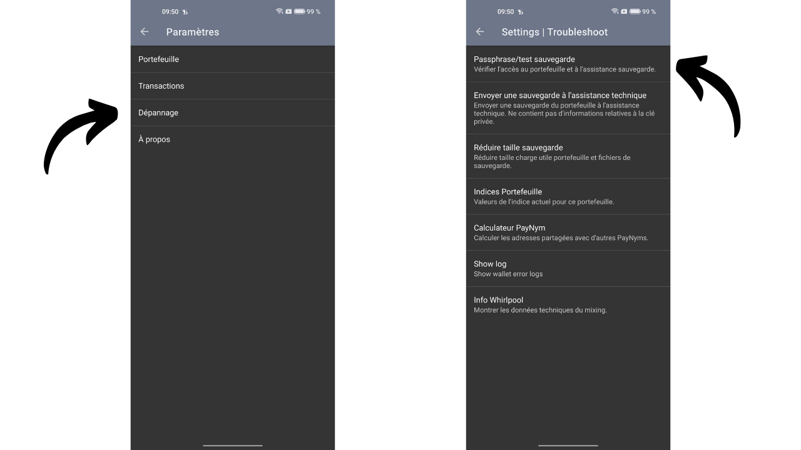

Masukkan passphrase kamu lalu klik Ok. Kalau benar, Samourai akan mengonfirmasinya. Kamu juga punya opsi untuk memverifikasi file backup kalau kamu berencana menggunakannya nanti.

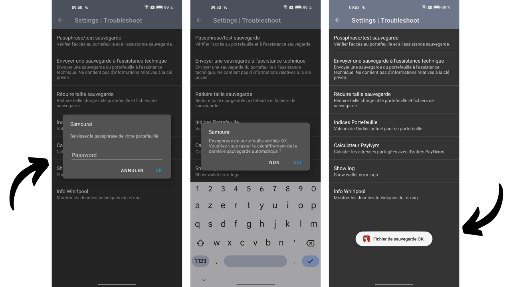

Langkah ini sifatnya opsional, tapi sebaiknya dilakukan. Ini memastikan passphrase kamu benar dan menghilangkan potensi masalah di tahap selanjutnya. Kalau Samourai menunjukkan bahwa passphrase salah pada tahap ini, pemulihan tidak akan bisa dilakukan. Pastikan kamu sudah memasukkan passphrase dengan benar dan periksa lagi kalau perlu.

### Opsi 1: Memulihkan dompet di Sparrow dengan file cadangan

Sejak versi 1.8.6 Sparrow Wallet, kamu bisa langsung mengimpor wallet Samourai kamu menggunakan file teks backup bernama `samourai.txt` yang otomatis dibuat oleh aplikasinya. File ini berisi semua informasi yang diperlukan untuk memulihkan wallet kamu dan terenkripsi dengan passphrase kamu untuk keamanan.

Kalau kamu memilih cara ini, kamu akan membutuhkan file `samourai.txt` yang terbaru dan passphrase kamu. Untuk membuat file ini di Samourai Wallet, klik tiga titik kecil di kanan atas, lalu pilih `Export wallet backup`.

Selanjutnya, pilih `Export to Clipboard.` Setelah itu, kamu perlu memindahkan file ini ke PC kamu dengan cara yang aman. Karena file ini memang terenkripsi, tapi hanya dengan passphrase saja sudah cukup untuk mendekripsinya, jadi penting untuk tetap berhati-hati saat mentransfernya. Kalau kamu memilih untuk mentransfernya langsung dalam bentuk teks biasa, buat file `samourai.txt` di PC kamu lalu tempel isi clipboard ke dalamnya. Atau, kamu juga bisa langsung mengambil file `samourai.txt` dari penyimpanan ponsel kamu.

Setelah kamu punya file tersebut di PC, buka Sparrow Wallet, klik tab File, lalu pilih Import Wallet untuk mulai proses impor wallet kamu.

Gulir ke bawah ke `Samourai Backup`, klik pada `Import File`, dan kemudian pilih file `samourai.txt` kamu.
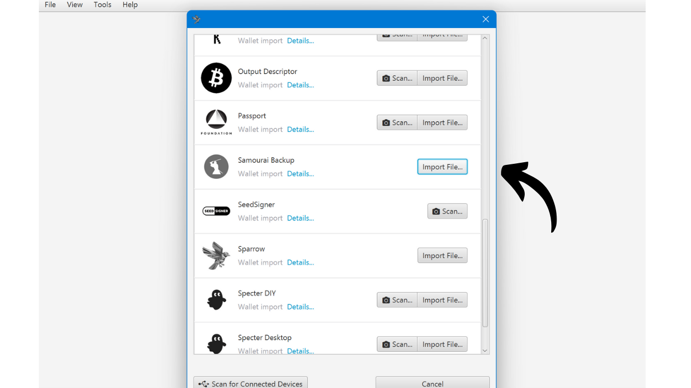

Sparrow kemudian akan memintamu memasukkan kata sandi untuk mendekripsi file tersebut. Kata sandi ini sebenarnya adalah seedphrase kamu. Masukkan di kolom yang sesuai dan klik pada `Import`.

Jika pada tahap ini, dompet kamu tidak muncul, mungkin kamu membuat kesalahan saat menyalin file `samourai.txt` atau saat memasukkan frasa sandi. Kamu dapat mengunjungi bagian pemecahan masalah untuk mendapatkan bantuan lebih lanjut.

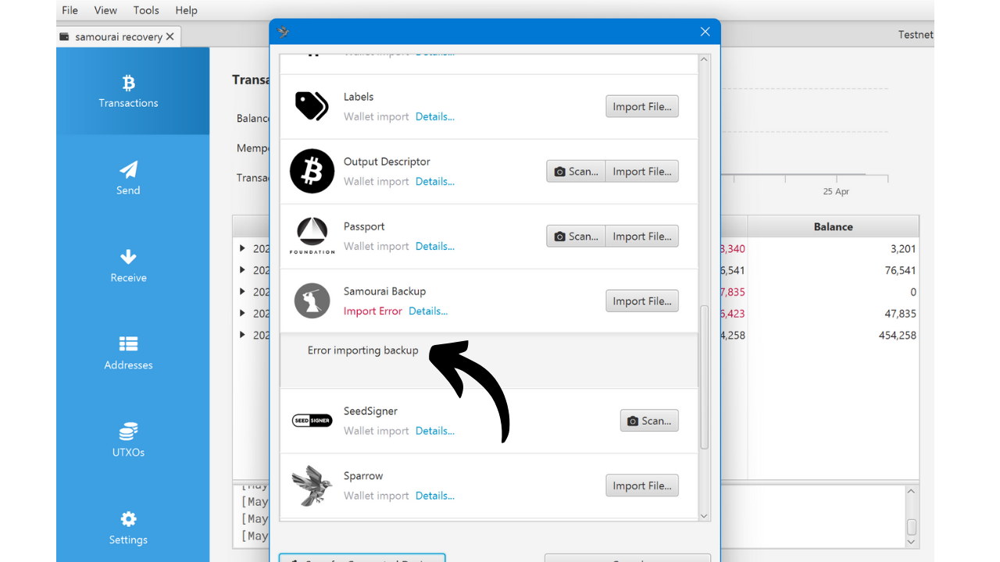

Untuk tipe skrip, jika kamu belum mengonfigurasi skrip lain di Samourai, kamu seharusnya hanya menggunakan SegWit V0 (Native SegWit / P2WPKH). Pertahankan skrip default ini dan klik pada `Import`.

Namai dompet milikmu, misalnya, "Samourai Recovery", dan kemudian klik pada `Create Wallet`.

Sparrow kemudian akan meminta kamu memilih kata sandi. Kata sandi ini hanya melindungi akses ke dompet Anda di PC ini dan tidak berkaitan dengan derivasi kunci dompet milikmu. Pastikan untuk memilih kata sandi yang kuat, catat untuk mengingatnya, dan klik pada `Set Password`.

Sparrow kemudian akan mendapatkan kunci dompet dan mencari transaksi yang sesuai.

Untuk saat ini, hanya akun deposit kamu yang bisa diakses. Kalau kamu hanya memakai Samourai untuk akun ini, semua dana kamu seharusnya sudah terlihat. Tapi kalau kamu juga menggunakan Whirlpool, kamu perlu menambahkan akun `premix`, `postmix`, dan `badbank`. Di Sparrow, cukup klik tab `Settings`, lalu pilih Add Accounts....

Di jendela yang terbuka, pilih `Whirlpool Accounts` dari menu dropdown, kemudian klik pada `OK`.

Kamu kemudian akan melihat berbagai akun Whirlpool muncul, dan Sparrow akan mengambil kunci yang diperlukan untuk menggunakan bitcoin terkait.

Jika kamu menggunakan perangkat lunak lain selain Sparrow, seperti Electrum, untuk memulihkan dompet Samourai kamu, berikut adalah indeks akun Whirlpool untuk pemulihan manual:
- Deposit: `m/84'/0'/0'`
- Bad Bank: `m/84'/0'/2147483644'`
- Premix: `m/84'/0'/2147483645'`
- Postmix: `m/84'/0'/2147483646'`

Sekarang kamu memiliki akses ke bitcoin kamu di Sparrow. Jika kamu memerlukan bantuan menggunakan Sparrow Wallet, kamu juga dapat melihat [tutorial khusus kami](https://planb.network/tutorials/wallet/desktop/sparrow-c674e2ac-d46f-4c82-92a7-7d1b0e262f5d).

Aku juga menyarankan untuk mengimpor secara manual label yang kamu kaitkan dengan UTXO kamu di Samourai. Ini akan memudahkan kamu melakukan coin control dengan baik di Sparrow nanti.

### Opsi 2: Memulihkan dompet di Sparrow dengan frasa pemulihan mnemonik

Kalau kamu tidak ingin melakukan pemulihan dengan file backup, kamu bisa memilih cara yang lebih tradisional dengan hanya menggunakan seedphrase 12 kata dan passphrase kamu. Cara kedua ini biasanya lebih sederhana.

Untuk memulai, pastikan kamu sudah menyiapkan seedphrase dan passphrase kamu. Setelah itu, buka Sparrow Wallet, klik tab `File`, lalu pilih `Import Wallet` untuk mulai proses impor wallet kamu.

Pilih `Mnemonic Words (BIP39)` dan, di menu dropdown, klik pada `Use 12 Words`.

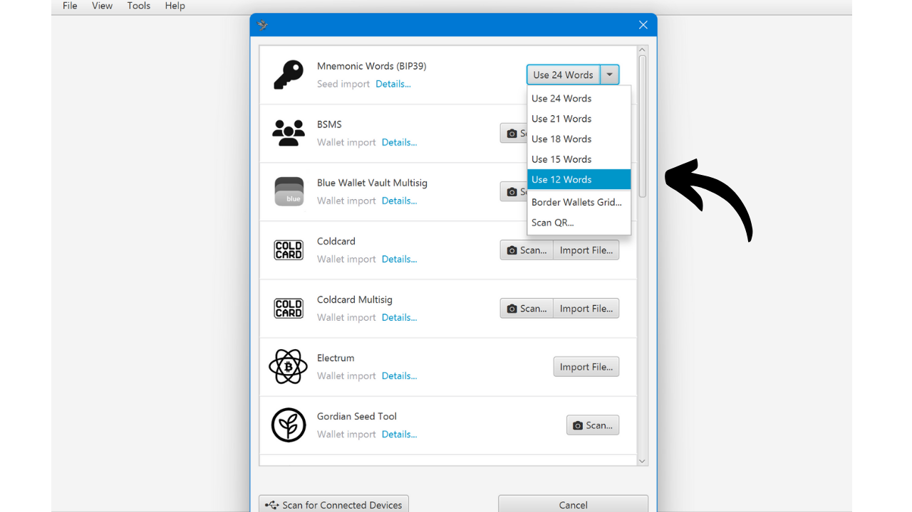

Masukkan 12 kata dari frasa pemulihan kamu dalam urutan yang benar.

Jika Sparrow menampilkan pesan `Invalid Checksum`, ini menunjukkan bahwa checksum dari frasa pemulihan tidak valid, yang kemungkinan berarti kamu membuat kesalahan saat memasukkan kata-katanya.

Jika frasa kamu benar, centang kotak `Use Passphrase?` dan masukkan kata sandi kamu di kolom yang disediakan. Akhirnya, jika semuanya tampak benar, klik pada tombol `Discover Wallet`.

Namai dompet kamu, misalnya, "Samourai Recovery", kemudian klik pada `Create Wallet`.

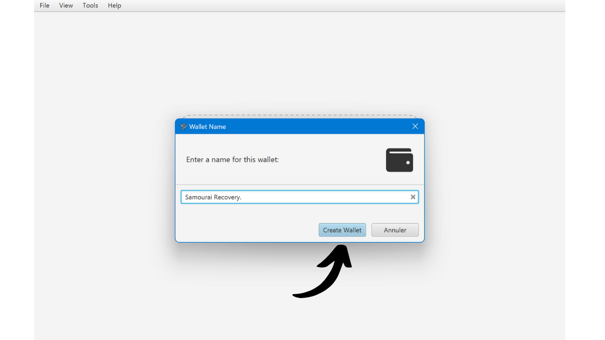
Sparrow kemudian akan meminta kamu untuk memilih password. Password ini hanya melindungi akses ke wallet kamu di PC ini dan tidak terkait dengan derivasi kunci wallet kamu. Pastikan memilih password yang kuat, catat supaya tidak lupa, lalu klik `Set Password`.
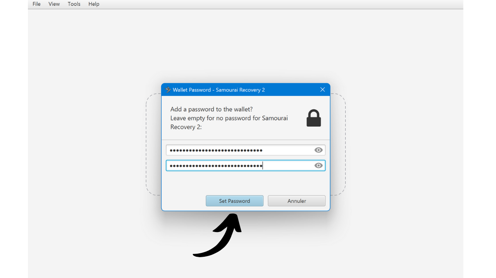

Sparrow kemudian akan mendapatkan kunci untuk dompet Anda dan mencari transaksi yang sesuai.

Kalau pada tahap ini wallet kamu belum muncul, kemungkinan ada kesalahan saat memasukkan passphrase atau seedphrase. Kamu bisa lihat bagian troubleshooting untuk bantuan lebih lanjut.

Untuk saat ini, hanya akun deposit kamu yang bisa diakses. Kalau kamu hanya memakai Samourai untuk akun ini, seharusnya semua dana kamu sudah terlihat. Tapi kalau kamu juga menggunakan Whirlpool, kamu perlu menambahkan akun `premix`, `postmix`, dan `badbank`. Di Sparrow, cukup klik tab `Settings`, lalu `Add Accounts....`

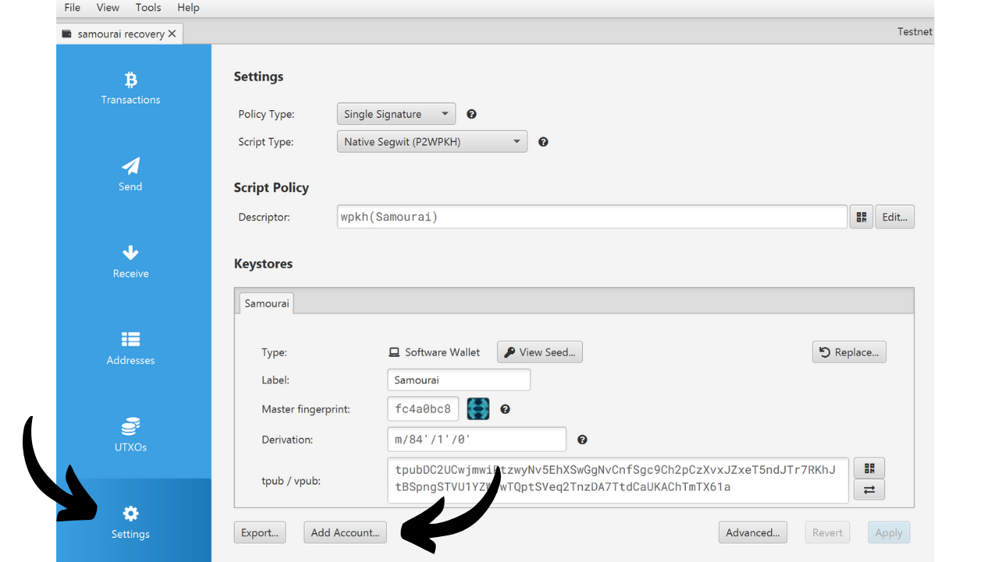

Di jendela yang terbuka, pilih `Whirlpool Accounts` dari daftar dropdown, kemudian klik pada `OK`.

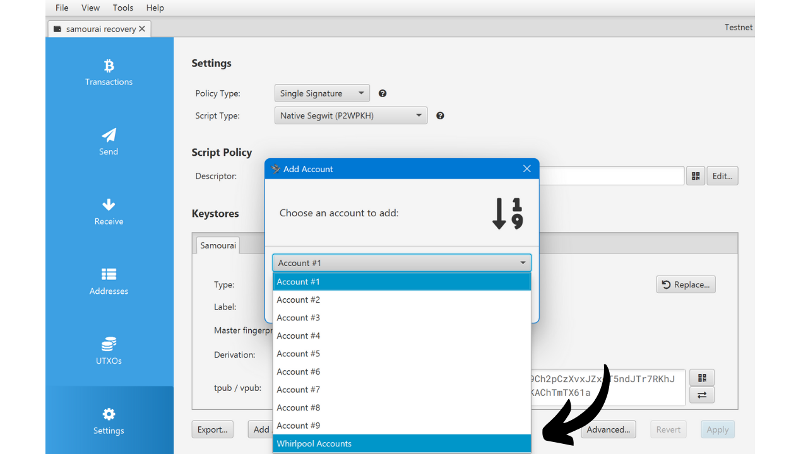

Kamu kemudian akan melihat berbagai akun Whirlpool kamu muncul, dan Sparrow akan mendapatkan kunci yang diperlukan untuk menggunakan bitcoin yang terkait.

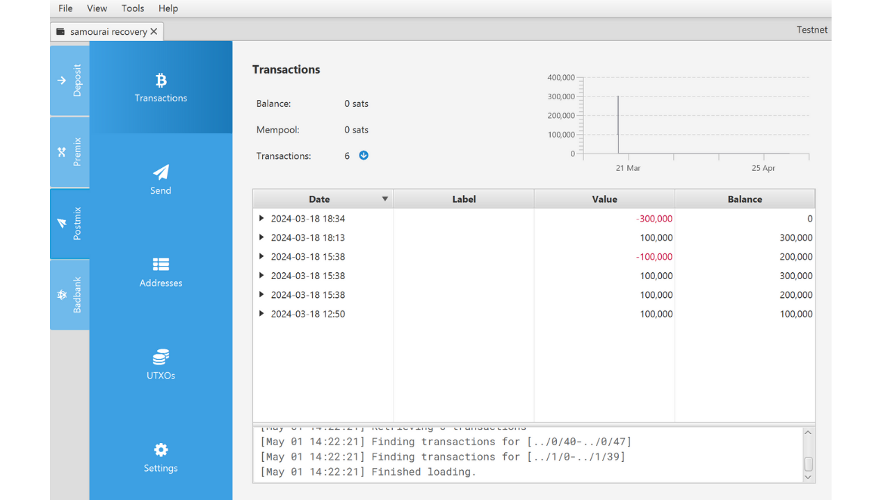

Kalau kamu menggunakan perangkat lunak lain seperti Electrum untuk memulihkan dompet Samourai milikmu, berikut adalah indeks akun Whirlpool untuk pemulihan manual:
- Deposit: `m/84'/0'/0'`
- Bad Bank: `m/84'/0'/2147483644'`
- Premix: `m/84'/0'/2147483645'`
- Postmix: `m/84'/0'/2147483646'`

Sekarang kamu memiliki akses ke bitcoin di Sparrow. Jika kamu memerlukan bantuan menggunakan Sparrow Wallet, kamu juga dapat mengonsultasikan [tutorial khusus kami](https://planb.network/tutorials/wallet/desktop/sparrow-c674e2ac-d46f-4c82-92a7-7d1b0e262f5d).

Aku juga menyarankan kamu untuk mengimpor secara manual label yang kamu kaitkan dengan UTXO kamu di Samourai. Ini akan memudahkan kamu melakukan coin control dengan efektif di Sparrow nanti.

### Apa masalah umum yang dihadapi?
Setelah membantu beberapa orang dalam beberapa hari terakhir, aku rasa aku sudah menemui sebagian besar masalah yang bisa menghalangi proses pemulihan wallet kamu. Kalau kamu masih belum bisa mengakses wallet kamu meskipun sudah mengikuti langkah-langkah sebelumnya, berikut beberapa saran tambahan.

Pertama, untuk bisa memulihkan wallet, seedphrase harus benar. Kalau kamu tidak menemukan seedphrase 12 kata kamu, kamu bisa menggunakan opsi 1 untuk memulihkan dari file backup Samourai. Kamu juga bisa melihat seedphrase kamu langsung di Samourai Wallet dengan pergi ke `Settings`, lalu `Wallet`, kemudian pilih `Show 12-word recovery phrase`.

Selanjutnya, kesalahan ketik pada passphrase saat pemulihan akan menghasilkan turunan kunci yang salah, yang akan membuat wallet kamu tidak bisa dipulihkan di Sparrow. **Passphrase harus benar-benar akurat!**

Untuk mengatasi masalah ini, aku sarankan kamu memeriksa validitas passphrase kamu di aplikasi Samourai seperti yang dijelaskan pada bagian "Verify the passphrase" di artikel ini:

**1. Validasi di Samourai:** Jika Samourai mengonfirmasi bahwa passphrase kamu benar, coba ulang proses pemulihan dari awal dan pastikan kamu memasukkan passphrase di Sparrow dengan tepat, tanpa kesalahan.

**2. Kesalahan Passphrase:** Jika Samourai menunjukkan bahwa passphrase salah, tidak ada gunanya melanjutkan percobaan di Sparrow. Selama passphrase yang benar belum ditemukan, pemulihan wallet kamu tidak mungkin dilakukan. Jika kamu benar-benar kehilangan passphrase, biarkan aplikasi Samourai tetap aman. Yang bisa kamu lakukan hanyalah menunggu server dihidupkan kembali supaya kamu bisa melakukan pengeluaran langsung dari aplikasi tanpa perlu pemulihan. Jangan mencoba menghubungkan Dojo dalam kondisi ini, karena itu akan memicu pengaturan ulang wallet di Samourai yang memerlukan passphrase.

Kesalahan umum lainnya berkaitan dengan konfigurasi jaringan di Sparrow.

Pertama, pastikan Sparrow dikonfigurasi di mode `mainnet`, bukan `testnet`. Jika Sparrow mencari transaksi kamu di Testnet, dia tidak akan menemukan apa pun karena wallet kamu berada di Mainnet. Testnet adalah jaringan Bitcoin alternatif untuk pengujian, terpisah dari jaringan utama dan memiliki blok serta transaksinya sendiri.

Untuk memeriksa jaringan yang sedang digunakan, klik tab Tools, lalu Restart In. Jika kamu melihat opsi Mainnet tersedia, berarti kamu saat ini tidak berada di jaringan utama. Pilih Mainnet untuk memulai ulang Sparrow di jaringan utama, lalu ulangi proses pemulihan.

Beberapa orang juga mengalami kesulitan saat menghubungkan Sparrow ke node mereka. Di bagian kanan bawah Sparrow, ada indikator berwarna yang menunjukkan apakah perangkat lunak terhubung dengan node Bitcoin dengan benar. Untuk bisa mengambil transaksi yang dibuat di Samourai, koneksi ini harus berfungsi dengan baik. Pastikan indikator tersebut aktif, seperti pada gambar yang aku tunjukkan (kuning untuk node publik, hijau untuk Bitcoin Core, dan biru untuk server Electrum).

Jika sakelar tidak diaktifkan, klik padanya untuk mengaktifkan kembali koneksi.

Jika masalah berlanjut, berikut adalah beberapa solusi yang mungkin:
- Kalau kamu mencoba untuk terhubung ke server Electrum milikmu sendiri (biru) atau Bitcoin Core (hijau) dan Sparrow tidak dapat terhubung, periksa informasi koneksi di bawah `File > Preferences... > Server`;

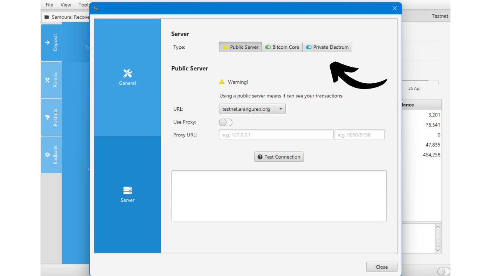
- Kalau masalah koneksi masih berlanjut, kemungkinan node kamu belum selesai sinkronisasi. Pastikan node dan indexer kamu sudah tersinkronisasi 100%. Jika diperlukan sebagai langkah terakhir, putuskan dulu koneksi node kamu dari Sparrow lalu sambungkan ke node publik. Jika kamu sudah terhubung ke node publik dan koneksinya tetap gagal, coba ganti node dengan memilih yang lain dari daftar dropdown.

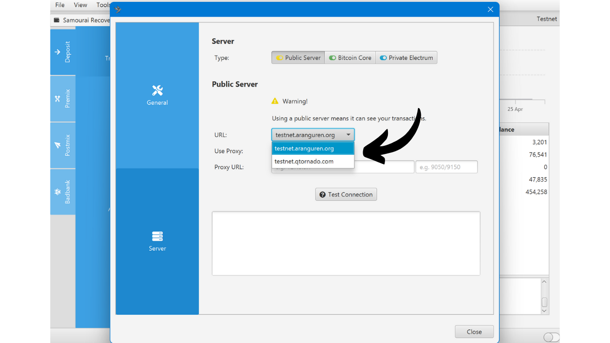

Kalau kamu sudah berhasil memulihkan wallet kamu tapi hasilnya terasa tidak lengkap, kemungkinan ada masalah pada bagian derivasi.

Masalah ini bisa muncul kalau kamu pernah menggunakan akun deposit Samourai dengan tipe script yang berbeda dari `P2WPKH`. Secara default, Samourai memang memakai tipe script ini, tapi kalau kamu pernah mengubahnya secara manual, kamu juga perlu menyesuaikan pengaturan ini saat memulihkan di Sparrow.

Untuk mendapatkan cabang dari tipe script lain, kamu harus mengulangi proses pemulihan untuk setiap tipe script yang digunakan. Caranya, pergi ke `File > New Wallet` di Sparrow, pilih tipe script lain dari menu dropdown, klik `New` or `Imported Software Wallet`, lalu ikuti langkah-langkah yang sama seperti pada tutorial pemulihan sebelumnya.

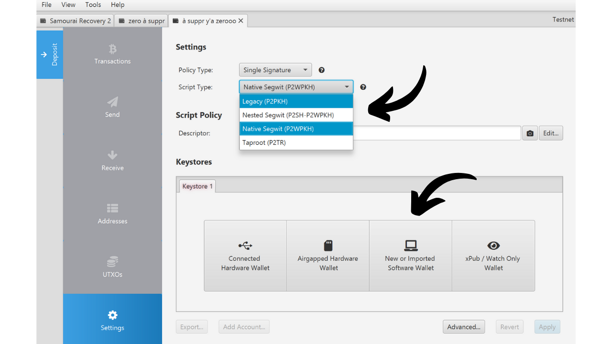

Masalah derivasi lain yang kadang muncul berkaitan dengan nilai Gap Limit. Nilai ini memberi tahu Sparrow setelah berapa banyak alamat kosong ia harus berhenti menghasilkan alamat baru. Kalau setelah pemulihan kamu melihat beberapa transaksi tidak muncul, bisa jadi Gap Limit kamu terlalu rendah. Untuk mengatasinya, buka akun yang bermasalah, misalnya akun postmix (kalau ada beberapa akun yang terdampak, ulangi langkah ini untuk masing-masing).

Klik pada tab `Settings` kemudian pada tombol `Advanced...`.
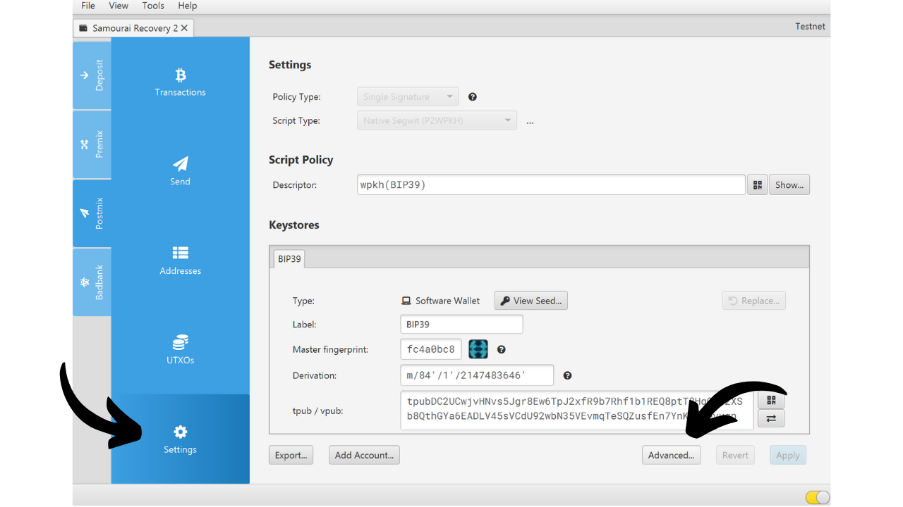
Secara bertahap tingkatkan nilai Gap Limit, misalnya, saya menetapkannya menjadi `400` di sini. Kemudian, klik tombol `Close`.

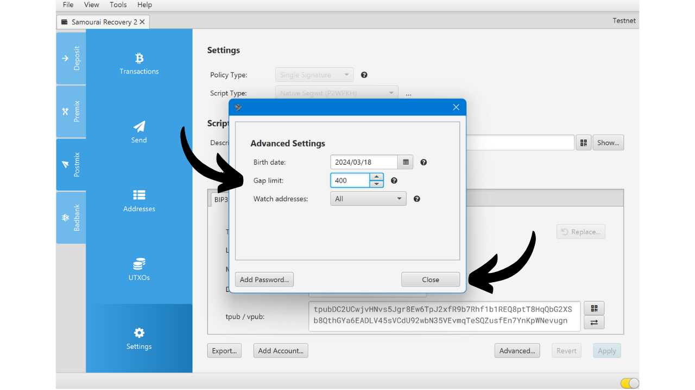

Klik pada `Apply` untuk menyelesaikan. Sparrow kemudian akan mendapatkan sejumlah alamat yang lebih besar dan mencari dana di dalamnya, yang seharusnya membantu memulihkan semua transaksi.

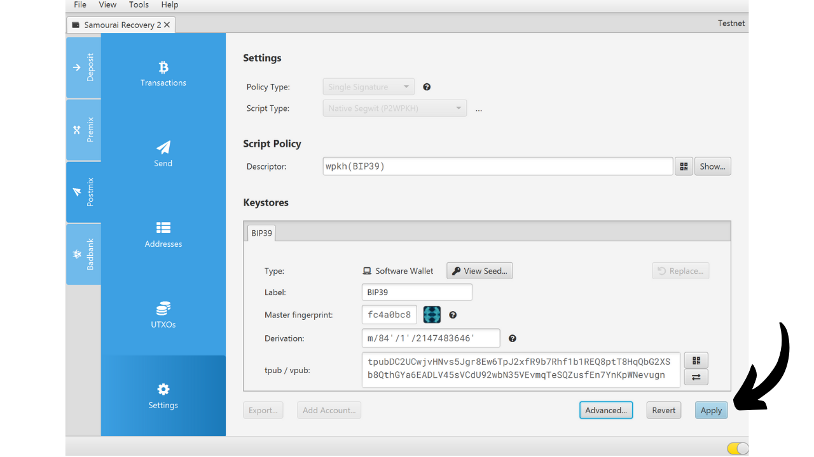

Itu mencakup berbagai masalah pemulihan yang saya temui selama beberapa hari terakhir. Jika, setelah mencoba semua solusi ini, kamu masih mengalami masalah, aku mengundangmu untuk bergabung dengan [Discover Bitcoin Discord](https://discord.gg/xKKm29XGBb) untuk meminta bantuan. Aku secara rutin mengunjungi Discord ini dan akan senang membantu kalau kamu memiliki solusinya. Pengguna bitcoin lainnya juga akan dapat berbagi pengalaman mereka dan menawarkan bantuan. **Dalam hal apapun, sangat penting untuk menjaga kerahasiaan frasa pemulihan, file cadangan, dan passphrase kamu**. Jangan berbagi dengan siapapun, karena ini bisa memungkinkan mereka untuk mencuri bitcoin kamu.

Setelah pemulihan selesai, kamu sekarang sudah bisa mengakses bitcoin kamu. Itu hal yang baik, tapi mungkin belum cukup. Penyitaan server berpotensi menciptakan risiko baru terhadap privasi kamu. Di bagian berikutnya, kita akan membahas risiko tersebut secara lebih detail dan menjelaskan langkah pencegahan yang perlu dilakukan untuk menjaga privasi kamu.

## Apa konsekuensi untuk privasi transaksi Anda?

### Sebagai pengguna Samourai tanpa Dojo

Jika kamu memakai Samourai Wallet tanpa menghubungkan Dojo milikmu sendiri, xpub kamu akan dikirim ke server Samourai supaya aplikasi bisa berfungsi. Dengan penyitaan server ini, ada kemungkinan pihak otoritas sekarang punya akses ke xpub tersebut.
Skenario ini tetap bersifat hipotetis. Kita tidak tahu apakah xpub itu pernah direkam, apakah penyimpanannya sudah dihancurkan, apakah otoritas berhasil memulihkannya, atau apakah mereka berniat menggunakannya untuk analisis on-chain. Tapi dalam situasi seperti ini, bijak untuk mempertimbangkan skenario terburuk, yaitu otoritas memiliki xpub dari pengguna yang tidak menghubungkan Dojo mereka sendiri.

Sebagai pengingat, xpub adalah rangkaian karakter yang memuat semua elemen yang diperlukan untuk menghasilkan turunan kunci publik (kunci publik + chain code). xpub dipakai dalam dompet deterministik hierarkis untuk menghasilkan alamat penerimaan dan memantau transaksi tanpa mengungkap kunci privat. Ini memungkinkan, misalnya, pembuatan dompet hanya-pantau. Namun, jika xpub terekspos, privasi pengguna bisa terancam, karena pihak ketiga dapat melacak transaksi dan melihat saldo terkait.

Siapa pun yang mengetahui xpub kamu dapat melihat semua alamat yang telah digunakan dompetmu di masa lalu dan juga yang akan dihasilkan di masa depan.

Untuk pengguna tanpa Dojo, kebocoran xpub memiliki dua dampak utama:

- Coinjoin yang pernah kamu lakukan menjadi tidak efektif dari sisi privasi bagi pihak yang mengetahui xpub tersebut, sehingga koinmu kehilangan anonset.

- Pihak tersebut juga bisa melacak semua alamat penerimaan di Samourai Wallet kamu.

Karena itu, penting untuk mempertimbangkan skenario terburuk dan beralih dari dompet ini, yang kemungkinan sudah terkompromi dalam hal privasi. Caranya adalah membuat dompet baru dari nol dengan perangkat lunak lain, misalnya Sparrow Wallet. Setelah kamu memverifikasi cadanganmu masih valid, pindahkan semua dana dengan melakukan transaksi. Meskipun langkah ini tidak memutus riwayat koinmu, ini akan mencegah otoritas mengetahui dengan pasti alamat dompet barumu.

Saat melakukan transfer, aku menyarankan untuk menghindari konsolidasi koin. Jika kita mengasumsikan xpub kamu sudah bocor, konsolidasi tidak mengubah apa pun bagi pihak yang sudah memiliki xpub tersebut, karena privasimu memang sudah terekspos bagi mereka. Namun, kamu tetap perlu menghindari konsolidasi berlebihan agar privasimu tetap terlindungi dari pihak lain. Dalam skenario terburuk, hanya otoritas yang memiliki akses ke xpub kamu, sedangkan dunia luar tidak. Jadi dari sudut pandang pihak lain, konsolidasi dapat membahayakan privasi karena heuristik Kepemilikan Input Bersama (CIOH).

Terakhir, untuk benar-benar memutus pelacakan, pertimbangkan juga melakukan coinjoin dari dompet barumu ini.

**Peringatan:** Mengambil kembali seedphrase dompet Samourai kamu di Sparrow Wallet tidak cukup. Kamu harus membuat dompet baru sepenuhnya dengan seedphrase baru jika ingin menghindari penggunaan xpub yang sudah mungkin bocor. Jika kamu mengimpor seed yang sama ke Sparrow, kamu hanya mengganti perangkat lunaknya, tapi dompetnya tetap sama.

### Sebagai pengguna Sparrow atau Samourai dengan Dojo

Jika dompetmu hanya dikelola di Sparrow Wallet, xpub kamu tidak mungkin bocor, baik kamu memakai node publik maupun node Bitcoin milikmu sendiri. Begitu juga, jika kamu menggunakan aplikasi Samourai dan sejak awal selalu menghubungkannya ke Dojo milikmu sendiri, xpub kamu juga aman.

Namun, jika kamu pernah menggunakan dompet yang sama tanpa **Dojo milikmu sendiri** lalu kemudian beralih menggunakan Dojo milikmu, ada kemungkinan server Samourai pernah memiliki akses ke xpub kamu, dan berarti otoritas juga bisa mengetahuinya. Jika kamu berada dalam situasi ini, aku menyarankan kamu mengikuti rekomendasi sebelumnya dan menganggap xpub kamu sudah terkompromi.

Untuk kamu yang selalu menggunakan Sparrow atau Samourai dengan Dojo sendiri sejak awal, risiko utamanya adalah anonset koinmu bisa berkurang. Bayangkan skenario terburuk di mana semua pengguna tanpa Dojo memiliki xpub mereka di tangan otoritas. Dalam kasus itu, jalur koin mereka melalui siklus coinjoin bisa dilacak oleh otoritas tersebut.

Untuk menggambarkan ini, ambil contoh konkret. Misalnya kamu ikut dalam satu siklus coinjoin awal, lalu dua siklus coinjoin tambahan setelahnya. Jika xpub dari pengguna tanpa Dojo tidak bocor, anonset prospektif koinmu akan bernilai 13.

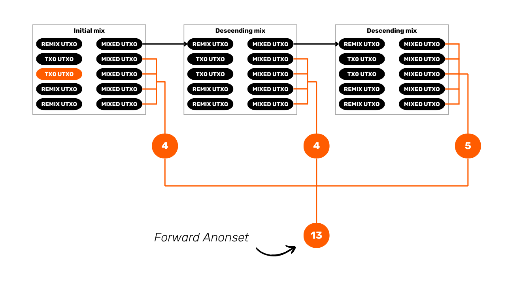

Namun, jika kita menganggap xpub sudah bocor dan kamu bertemu satu pengguna tanpa Dojo pada coinjoin awal, lalu dua pengguna tanpa Dojo pada coinjoin di tahap berikutnya, anonset prospektif koinmu hanya akan menjadi 10, bukan 13, dari sudut pandang otoritas.

Penurunan potensi dalam anonset ini memang rumit untuk diukur, karena tergantung banyak faktor, dan setiap koin bisa terpengaruh secara berbeda. Misalnya, pengguna tanpa Dojo yang kamu temui pada siklus awal akan memengaruhi anonset prospektif jauh lebih besar dibanding pengguna tanpa Dojo yang kamu temui di siklus yang lebih lanjut. Untuk memberi gambaran situasinya, yang tetap bersifat hipotetis, statistik terbaru dari Samourai menunjukkan bahwa sekitar 85% hingga 90% koin yang terlibat dalam coinjoin berasal dari pengguna dengan Dojo, Sparrow, atau Bitcoin Keeper. Artinya, bahkan dalam skenario terburuk, xpub mereka tidak bocor.

Meskipun angka ini sulit diverifikasi secara independen, menurutku angka tersebut masuk akal karena dua hal:

- Sparrow Wallet punya banyak pengguna

- Banyak perangkat node-in-box sudah menyediakan implementasi Dojo, dan perangkat lunak populer seperti Umbrel sekarang banyak digunakan

Dengan demikian, ada beberapa hal yang perlu kamu pertimbangkan. Jika privasi koin kamu terhadap otoritas dianggap sangat penting, maka kamu sebaiknya mempersiapkan skenario terburuk, karena memang sulit menjamin 100 persen bahwa siklus coinjoin Whirlpool kamu tidak bisa dilacak akibat kebocoran xpub dari pengguna tanpa Dojo. Meskipun kemungkinan ini kecil, bukan berarti mustahil.

Di sisi lain, jika privasi koin kamu terhadap otoritas yang mungkin memiliki akses ke xpub tersebut tidak terlalu penting, maka situasinya bisa dilihat secara lebih tenang.

Aku menyebut otoritas karena hanya otoritas yang menyita server yang berpotensi memiliki xpub ini. Jika tujuan kamu melakukan coinjoin adalah agar orang biasa seperti pedagang, teman, atau orang lain di sekitar kamu tidak bisa mengikuti aliran koin kamu, maka situasinya tidak berubah. Mereka tetap tidak tahu apa pun seperti sebelumnya.

Hal lain yang penting adalah anonset awal koin kamu sebelum penyitaan server. Misalnya, jika sebuah koin sudah mencapai anonset prospektif 40.000, penurunan anonset potensial ini kemungkinan kecil berpengaruh nyata. Dengan anonset dasar yang sangat tinggi, kehadiran beberapa pengguna tanpa Dojo tidak cukup untuk mengubah situasi secara signifikan. Namun, jika koin kamu hanya memiliki anonset sekitar 40, maka kebocoran seperti ini bisa memengaruhi anonset kamu secara nyata dan membuka peluang pelacakan.

Dengan WST yang sekarang tidak berfungsi setelah penutupan OXT.me, kamu hanya bisa memperkirakan anonset tersebut. Untuk anonset retrospektif, biasanya tidak terlalu perlu dikhawatirkan karena model Whirlpool memastikan anonset tersebut sangat tinggi sejak coinjoin pertama berkat warisan dari rekan dalam pool. Satu-satunya pengecualian adalah jika koin kamu tidak diremix selama beberapa tahun dan coinjoin tersebut terjadi pada masa-masa awal pool berdiri.

Untuk anonset prospektif, kamu dapat mengeceknya berdasarkan berapa lama koin kamu berada di dalam pool. Jika sudah berbulan-bulan, kemungkinan anonset prospektifnya sangat tinggi. Sebaliknya, jika koin baru masuk pool beberapa jam sebelum server disita, maka anonset prospektifnya kemungkinan sangat rendah.
[**-> Pelajari lebih lanjut tentang anonset dan metode perhitungannya.**](https://planb.network/tutorials/privacy/analysis/wst-anonsets-0354b793-c301-48af-af75-f87569756375)

Aspek lain yang perlu dipertimbangkan adalah dampak konsolidasi pada anonset koin yang telah dicampur. Mengingat akun Whirlpool tidak lagi dapat diakses melalui aplikasi Samourai, kemungkinan banyak pengguna telah mentransfer dompet mereka ke perangkat lunak lain dan mencoba menarik dana mereka dari Whirlpool. Khususnya, akhir pekan lalu, ketika biaya transaksi di jaringan Bitcoin relatif tinggi, ada insentif teknis dan ekonomi yang kuat untuk mengkonsolidasikan koin pasca-campuran. Ini berarti kemungkinan banyak pengguna telah melakukan konsolidasi yang signifikan.

Masalah dengan konsolidasi pasca-campuran ini adalah mereka selalu mengurangi anonset, tidak hanya untuk pengguna yang melakukan konsolidasi tetapi juga untuk pengguna yang mereka temui selama siklus coinjoin mereka. Meskipun saya belum dapat memverifikasi atau mengkuantifikasi fenomena ini secara tepat, insentif ekonomi terkait biaya transaksi pada saat itu dapat membuat kita berasumsi bahwa anonset berpotensi lebih rendah.

### Sebagai Pengguna Sentinel

Operasi jaringan aplikasi dompet hanya-pantau Sentinel mirip dengan Samourai. Untuk mendapatkan informasi dompet, aplikasi harus mengirim xpub, kunci publik, atau alamat yang kamu berikan ke Dojo. Jika kamu selalu menggunakan Dojo milikmu sendiri di Sentinel, tidak ada masalah, dan kamu bisa terus menggunakannya dengan tenang. Namun, jika kamu mengandalkan server Samourai untuk Sentinel, ada kemungkinan xpub kamu telah terekspos. Dalam kasus ini, disarankan untuk mengikuti proses penggantian dompet yang sama seperti yang dianjurkan untuk Samourai Wallet ketika terhubung ke server Samourai.

Jika terjadi skenario kecil kemungkinan di mana kamu memakai Dojo dengan Samourai tetapi tidak dengan Sentinel, lebih baik anggap xpub kamu sudah terkompromi.

## Kesimpulan
Terima kasih telah membaca artikel ini sampai selesai. Kalau kamu merasa ada informasi yang hilang atau kamu memiliki saran, jangan ragu untuk menghubungi saya untuk berbagi pikiran kamu. Selain itu, jika kamu memerlukan bantuan lebih lanjut dalam memulihkan Samourai Wallet kamu meskipun telah mengikuti tutorial ini, aku mengundang kamu untuk bergabung dengan [Discover Bitcoin Discord](https://discord.gg/xKKm29XGBb) untuk meminta bantuan. Aku secara rutin mengunjungi Discord ini dan akan sangat senang membantu kamu jika saya memiliki solusinya. Bitcoiner lainnya juga akan dapat berbagi pengalaman mereka dan menawarkan dukungan mereka. **Dalam setiap kasus, sangat penting untuk menjaga kerahasiaan frasa pemulihan, file cadangan, dan passphrase kamu**. Jangan berbagi dengan siapapun, karena ini dapat memungkinkan mereka untuk mencuri bitcoin kamu.

