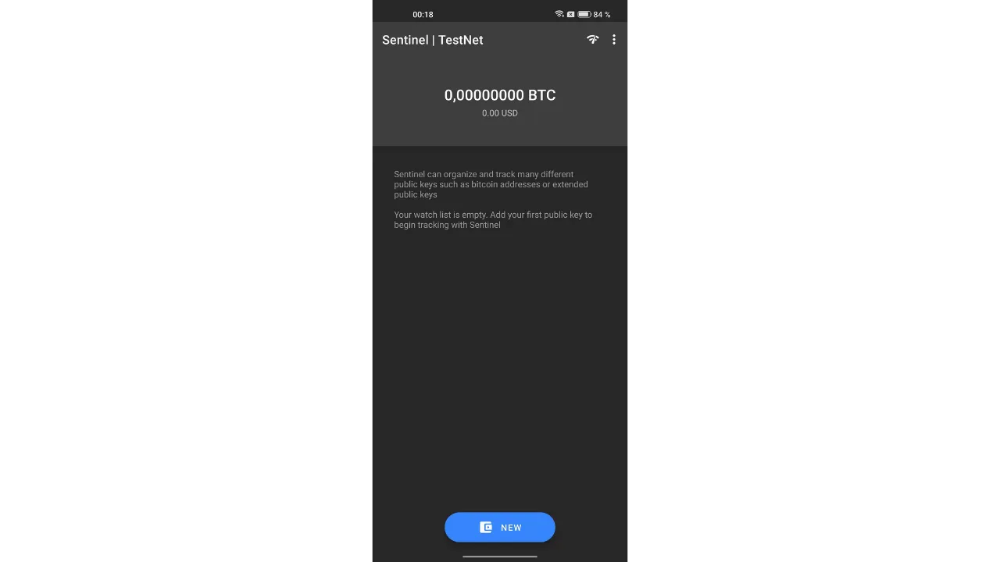
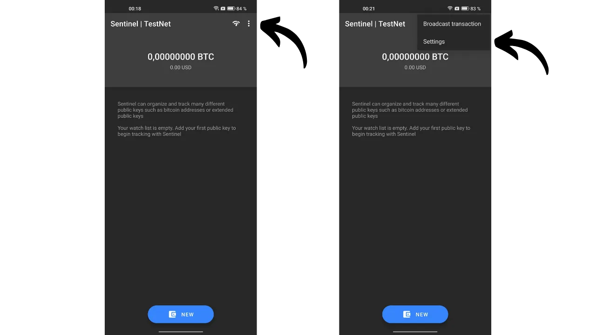
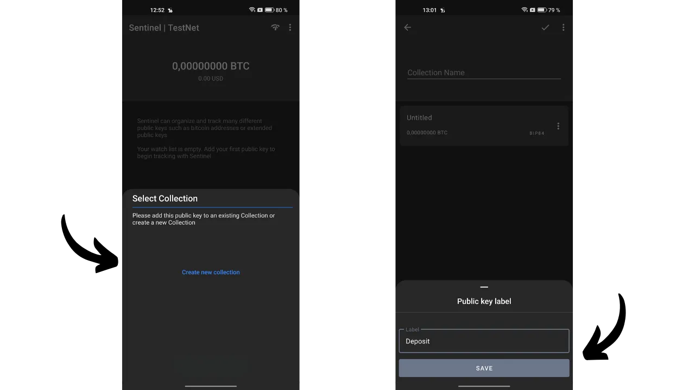
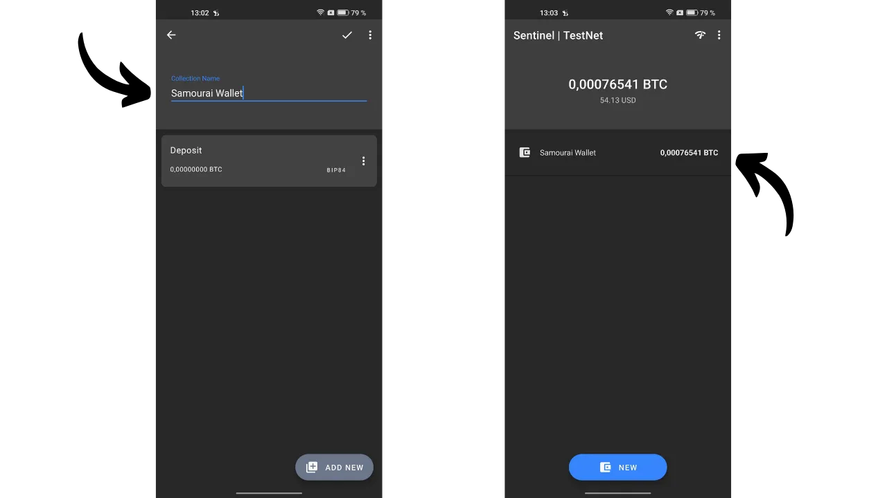
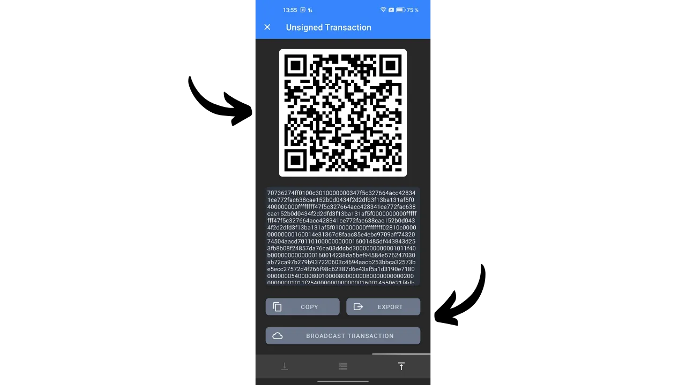
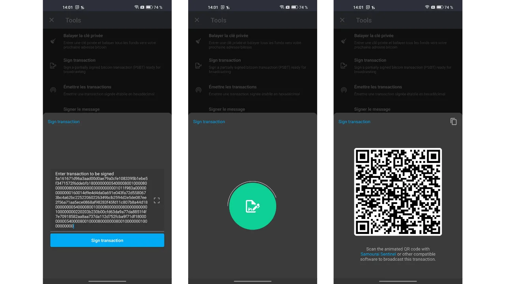
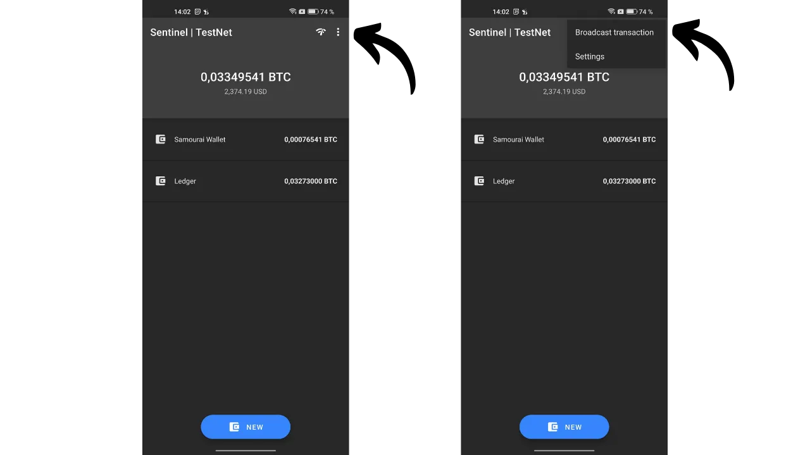
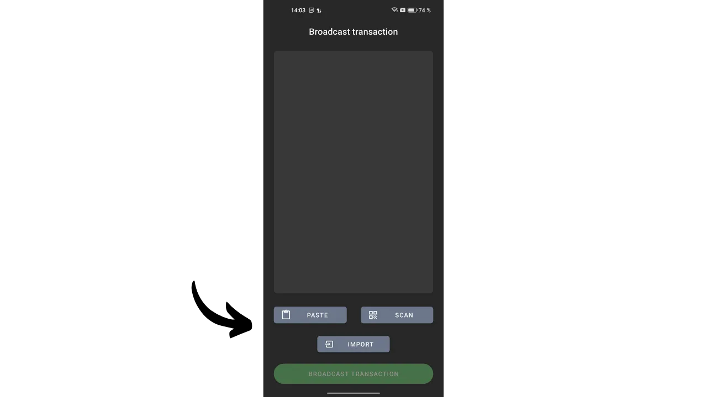

---

***PERINGATAN:** Menyusul penangkapan pendiri Samourai Wallet dan penyitaan server mereka pada 24 April, aplikasi Sentinel terus berfungsi, namun **wajib menggunakan Dojo milik sendiri** untuk mengakses informasi blockchain dan menyiarkan transaksi.*

_Kami terus mengikuti perkembangan kasus ini serta perkembangan terkait alat-alat yang berhubungan. Yakinlah bahwa kami akan memperbarui tutorial ini seiring dengan tersedianya informasi baru._

_Tutorial ini disediakan hanya untuk tujuan pendidikan dan informasi. Kami tidak mendukung atau mendorong penggunaan alat-alat ini untuk tujuan kriminal. Tanggung jawab setiap pengguna adalah untuk mematuhi hukum di yurisdiksi mereka._

---

*"Jaga kunci privat, tetap privat."*

Dalam artikel ini, kami menjelajahi segala hal yang perlu kamu ketahui tentang dompet watch-only. Kami membahas cara kerjanya dan mengkaji berbagai aplikasi yang tersedia di pasar. Di bagian akhir, kami menawarkan tutorial terperinci tentang salah satu aplikasi dompet watch-only paling populer, yaitu Sentinel.

## Apa itu Dompet Watch-Only?
Dompet watch-only, atau dompet hanya-baca, adalah jenis perangkat lunak yang dirancang untuk memungkinkan kamu mengamati transaksi yang terkait dengan satu atau lebih kunci publik Bitcoin tertentu, tanpa memiliki akses ke kunci privat yang bersesuaian.

Jenis aplikasi ini hanya menyimpan data yang diperlukan untuk memantau dompet Bitcoin, termasuk melihat saldo dan riwayat transaksi, tetapi tidak memiliki akses ke kunci privat. Oleh karena itu, mustahil untuk membelanjakan bitcoin yang ada di dompet melalui aplikasi watch-only.

Dompet watch-only umumnya digunakan bersama dengan dompet perangkat keras. Ini memungkinkan penyimpanan kunci privat dompet secara *cold*, pada perangkat yang air-gapped dan tidak terhubung ke internet, sehingga memiliki permukaan serangan yang minimal dan mengisolasi kunci privat dari lingkungan yang berpotensi rentan. Aplikasi watch-only, di sisi lain, secara eksklusif menyimpan kunci publik yang diperluas (`xpub`, `zpub`, dll.) dari dompet Bitcoin. Kunci induk ini tidak memungkinkan untuk menemukan kunci privat yang terkait dan, akibatnya, tidak memungkinkan pengeluaran bitcoin. Namun, kunci ini tetap memungkinkan derivasi kunci publik turunan dan alamat penerima.

Dengan mengetahui alamat dompet yang diamankan oleh dompet perangkat keras, aplikasi watch-only dapat melacak transaksi ini di jaringan Bitcoin, sehingga memberi kamu kemampuan untuk memantau saldo dan menghasilkan alamat penerima baru, tanpa harus menghubungkan dompet perangkat keras setiap waktu.

## Dompet Watch-Only Mana yang Harus Digunakan?
Saat ini, aplikasi watch-only yang paling komprehensif adalah [Sentinel](https://sentinel.watch/), yang dikembangkan oleh tim di Samourai Wallet. Ini mencakup semua fitur penting untuk dompet watch-only yang baik:
- Dukungan untuk kunci yang diperluas, kunci publik, dan alamat;
- Kemampuan untuk mengorganisir beberapa akun atau dompet ke dalam koleksi;
- Pembuatan alamat untuk menerima bitcoin pada dompet perangkat keras milikmu tanpa perlu menggunakannya secara langsung;
- Kemampuan untuk membangun dan menyiarkan transaksi secara offline;
- Opsi untuk terhubung ke node Bitcoin sendiri;
- Integrasi Tor untuk privasi yang lebih baik.

Kelemahan unik dari Sentinel terletak pada fakta bahwa aplikasi ini hanya tersedia untuk Android dan tidak mendukung dompet multisignature. Oleh karena itu, jika kamu menggunakan perangkat Android dan dompetmu adalah dompet tanda tangan tunggal klasik, aku merekomendasikan Sentinel.

Bagi kamu yang ingin melacak dompet multisignature, Blue Wallet adalah satu-satunya aplikasi yang aku ketahui yang menawarkan mode watch-only untuk jenis dompet ini, dan dapat diakses di Android maupun iOS.

Untuk pengguna iOS yang mencari alternatif untuk Sentinel, [Green Wallet](https://blockstream.com/green/) atau [Blue Wallet](https://bluewallet.io/watch-only/) mungkin menjadi pilihan, meskipun fungsionalitas watch-only mereka tidak sekomprehensif Sentinel. 

## Bagaimana Cara Menggunakan Dompet Watch-Only Sentinel?
### Instalasi dan Pengaturan
Mulailah dengan menginstal aplikasi Sentinel. Anda dapat melakukan ini baik dari Google Play Store atau dengan menggunakan [APK yang tersedia untuk diunduh di situs web resmi](https://sentinel.watch/download/).

Saat pertama kali membuka aplikasi, kamu diberi pilihan antara:
- `Connect to Dojo`;
- `Connect to Samourai's server`.

Dojo, dikembangkan oleh tim Samourai, adalah versi node Bitcoin penuh yang dapat diinstal secara mandiri atau ditambahkan dalam satu klik ke solusi node-in-box seperti [Umbrel](https://umbrel.com/) dan [RoninDojo](https://ronindojo.io/).

[**-> Temukan cara menginstal RoninDojo v2 di Raspberry Pi.**](https://planb.academy/tutorials/node/bitcoin/ronin-dojo-v2-0ddb3854-6f38-4466-b4e2-f66c028e0dd8)

Jika kamu memiliki Dojo sendiri, kamu dapat menghubungkannya pada tahap ini. Dengan melakukan ini, kamu akan mendapatkan tingkat privasi tertinggi saat memeriksa informasi transaksi di jaringan Bitcoin.

Jika tidak, Anda dapat memilih server default Samourai. Anda juga dapat memilih apakah akan terhubung melalui Tor atau tidak.

Kamu kemudian akan tiba di halaman utama Sentinel.

Untuk memulai, kamu dapat mengatur aplikasi. Klik pada tiga titik kecil di sudut kanan atas, kemudian pada `Settings`.

Dengan memilih `User PIN code`, kamu memiliki opsi untuk menetapkan kata sandi guna mengamankan akses ke dompet watch-only kamu. Kamu juga dapat mengubah mata uang referensi untuk mengonversi saldo ke mata uang fiat, atau bahkan menyembunyikan nilai fiat dengan mengaktifkan opsi `Hide fiat values`. Untuk tingkat keamanan yang lebih tinggi, kamu dapat mengaktifkan `Disable Screenshots`, yang mencegah pengambilan tangkapan layar pada aplikasi Sentinel dan dengan demikian menghindari pengungkapan informasi ke layar eksternal.

Di menu pengaturan ini, Anda juga memiliki opsi untuk membackup Sentinel Anda.

### Menggunakan Dompet Watch-Only
Dari halaman utama, tekan tombol biru `NEW` untuk menambahkan kunci publik ekstensi baru untuk dilacak. Kemudian kamu memiliki opsi untuk memindai kode QR dari kunci kamu, atau langsung menempelkan kunci (`xpub`, `zpub`...) dengan memilih `Paste Pubkey`.

Umumnya, `xpub` dari dompet Anda dapat diakses langsung melalui perangkat lunak manajemen dompet yang Anda gunakan. Misalnya, jika kamu mengelola dompet perangkat keras kamu dengan Sparrow, informasi ini ditemukan di tab `Settings`, di bawah bagian `Keystore`.

Setelah memasukkan kunci publik yang diperluas (extended public key) ke Sentinel, aplikasi ini akan menawarkan kamu untuk membuat koleksi baru. Sebuah koleksi merepresentasikan sekumpulan kunci publik yang diperluas yang disusun bersama. Opsi ini memungkinkan kamu tidak hanya untuk mencantumkan semua `xpub` yang kamu miliki, tetapi juga untuk mengelompokkannya secara rapi. Sebagai contoh, jika kamu memiliki Samourai Wallet dengan beberapa akun (deposit, premix, postmix...), kamu dapat mengumpulkan semua akun tersebut di bawah koleksi `Samourai`. Untuk dompet yang kamu kelola bagi keluarga, kamu mungkin ingin membuat koleksi bernama `Family`.

Pilih `Create new collection`. Kemudian masukkan nama untuk kunci yang diperluas yang baru saja kamu integrasikan. Misalnya, jika aku memindai akun deposit dari dompet Samourai milikku, aku akan menamai kunci tersebut `Deposit`. Klik `SAVE` untuk menyelesaikan.

Selanjutnya, beri nama pada koleksi ini dan tekan ikon validasi yang terletak di pojok kanan atas layar untuk menyimpan koleksi. Koleksi kamu sekarang terlihat di layar utama Sentinel.

Jika kamu ingin menambahkan kunci publik terperluas lainnya, klik pada `NEW` lagi dan masukkan kunci.

Kamu kemudian akan diminta untuk memilih koleksi tempat kamu ingin mengintegrasikan kunci ini, atau untuk membuat koleksi baru. Misalnya, dalam kasus aku, aku telah menyiapkan koleksi khusus untuk dompet Ledger milikku.

Untuk melihat kunci terperluas dari sebuah koleksi secara detail, cukup klik pada koleksi tersebut. kamu dapat menavigasi melalui tab yang berbeda untuk melihat riwayat transaksi.

Dari sebuah koleksi, dengan mengetuk tiga titik kecil di pojok kanan atas, kemudian pada `View Unspent Outputs`, kamu dapat mengakses daftar UTXOs yang dipegang oleh dompet yang dilacak.

### Mengirim dan Menerima Bitcoin dari Sentinel
Seperti halnya dompet watch-only yang baik, Sentinel memungkinkan kamu untuk menghasilkan alamat penerimaan guna menerima bitcoin pada dompet yang sedang dipantau. Namun, Sentinel juga menawarkan fitur lanjutan lainnya, yaitu pembuatan dan penyiaran transaksi Bitcoin yang ditandatangani sebagian atau *Partially Signed Bitcoin Transaction* (PSBT). Dengan mekanisme ini, dompet yang memegang kunci privat dapat menandatangani transaksi tersebut, lalu setelah ditandatangani, transaksi dapat disiarkan ke jaringan Bitcoin oleh Sentinel. Mari kita lihat bagaimana cara melakukan semua ini.

**Perhatian, tidak disarankan untuk menerima bitcoin pada alamat penerimaan yang tidak diverifikasi langsung oleh dompet itu sendiri.** Jika dompet yang memegang kunci privat, seperti dompet perangkat keras, tidak secara eksplisit mengonfirmasi bahwa suatu alamat memang berafiliasi dengannya, maka mengirim bitcoin ke alamat tersebut merupakan praktik yang berisiko. Tanpa konfirmasi ini, tidak ada jaminan bahwa alamat tersebut benar-benar milik dompet kamu. Oleh karena itu, fitur penerimaan dari dompet watch-only harus digunakan dengan sangat hati-hati, karena dana yang dikirim berpotensi hilang.

Untuk menerima bitcoin melalui Sentinel, pilih koleksi yang diinginkan, lalu klik tab yang sesuai dengan kunci publik yang diperluas tempat kamu ingin mentransfer dana.

Terakhir, klik ikon panah di pojok kiri bawah layar. Sentinel kemudian akan menghasilkan alamat penerimaan yang belum digunakan. Kamu dapat menyalinnya atau memindainya menggunakan kode QR.

Untuk menghasilkan PSBT dari Sentinel, dan dengan demikian memulai transaksi pengeluaran, masuklah ke kunci yang diperluas dari dompet tempat kamu ingin melakukan pembayaran. Sebagai contoh, mari kita gunakan akun deposit milikku di dompet Samourai. Setelah itu, klik ikon panah yang terletak di bagian bawah kanan layar.

Masukkan semua parameter yang terkait dengan transaksi Anda:
- Masukkan alamat penerima (dengan mengklik ikon kode QR, Anda memiliki opsi untuk memindai alamat ini);
- Tentukan jumlah yang akan dikirim ke alamat ini;
- Tentukan biaya transaksi.

Setelah Anda mengisi semua bidang yang diperlukan untuk transaksi Anda, tekan tombol `COMPOSE UNSIGNED TRANSACTION`.

Kamu kemudian akan mengakses PSBT, yaitu transaksi Bitcoin yang telah dibangun tetapi belum ditandatangani, karena Sentinel tidak memiliki akses ke kunci privat kamu. Kamu memiliki opsi untuk menyalin transaksi ini, mengekspornya sebagai file `.psbt`, atau memindainya melalui kode QR animasi.

Kemudian, pergilah ke dompet milikmu yang memiliki kunci pribadi untuk menandatangani transaksi (Samourai, dompet perangkat keras...).

Setelah transaksi ditandatangani, kamu dapat kembali ke Sentinel untuk menyiarkannya. Untuk melakukannya, dari menu utama, klik ikon tiga titik kecil di pojok kanan atas, lalu pilih `Broadcast transaction`.

Kamu memiliki opsi untuk memasukkan PSBT yang telah ditandatangani dengan tiga cara berbeda:
- Dengan menempelkannya langsung dari clipboard;
- Dengan mengimpor dari file `.psbt`;
- Dengan memindainya melalui kode QR.

Setelah transaksi yang ditandatangani dimasukkan dalam bingkai abu-abu, kamu dapat mengklik tombol hijau `BROADCAST TRANSACTION` untuk menyiarkannya di jaringan Bitcoin. Sentinel akan memberimu TXID-nya.

