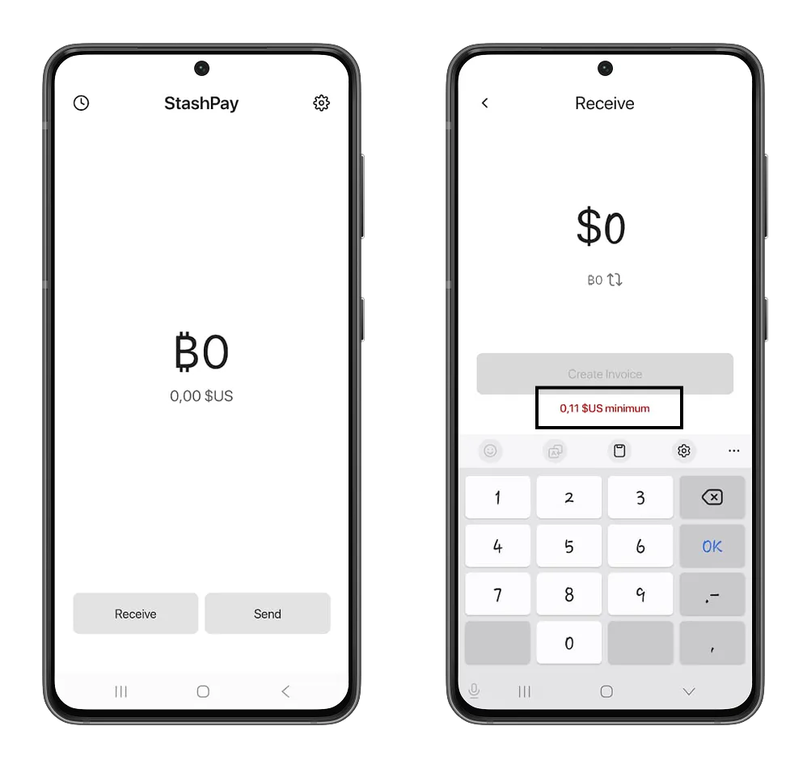
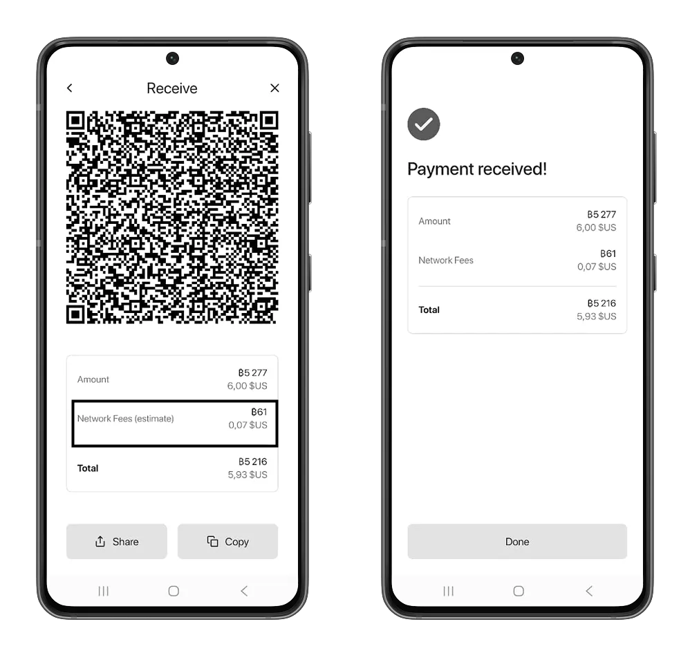
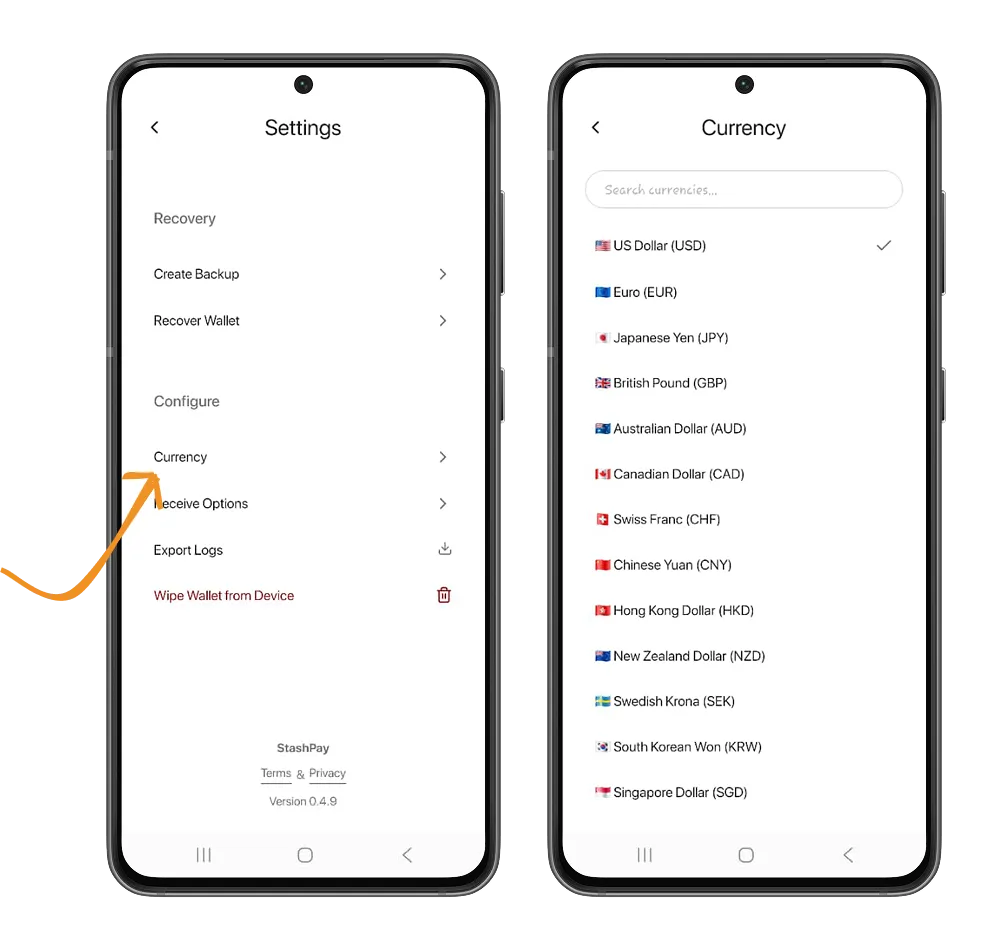
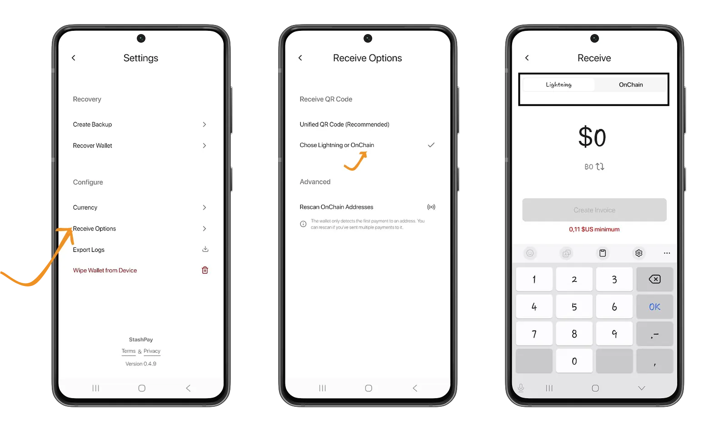
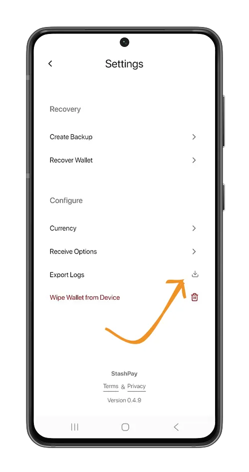

Pengalaman pengguna jadi faktor utama dalam adopsi solusi Bitcoin di seluruh dunia. Memberikan pengalaman yang mulus, sederhana, dan nggak bikin ribet secara teknis adalah prioritas bagi banyak dompet dan platform exchange. Dalam hal ini, StashPay menonjol lewat pendekatan minimalisnya, sambil tetap menunjukkan kekuatan Lightning Network.

Di tutorial ini, kita bakal lihat dompet ini buat tahu cara kerjanya dan kenapa StashPay cocok banget buat bisnis kecil atau solopreneur.

## Memulai dengan StashPay

StashPay adalah wallet Lightning self-custodial yang dikenal karena tampilannya yang minimalis dan fokus pada pengalaman pengguna. Dengan wallet ini, kamu nggak perlu pengetahuan teknis apa pun untuk mulai menerima dan mengirim satoshi pertamamu.

StashPay adalah proyek open-source yang dikembangkan dengan React Native dan bertujuan buat mengatasi masalah biaya transaksi tinggi, bahkan saat transaksi dilakukan di mainchain protokol Bitcoin. Ini tersedia sebagai aplikasi seluler di platform Android dan iOS melalui tautan unduhan yang ada di [situs web] (https://stashpay.me/).

Penting untuk mengunduh aplikasi Android langsung dari situs resminya, karena aplikasi ini belum tersedia di Google Play Store.

Setelah selesai diunduh, berikan izin yang dibutuhkan supaya kamu bisa menginstal aplikasi di ponsel Android kamu.

Begitu aplikasi terpasang, StashPay bakal otomatis membuat wallet Bitcoin pertamamu saat kamu membukanya. Sebelum melakukan transaksi apa pun, disarankan untuk membuat cadangan wallet ini terlebih dulu. Di bawah ini, kamu bisa lihat panduan lengkap untuk memastikan seedphrase kamu dicadangkan dengan benar.

https://planb.academy/tutorials/wallet/backup/backup-mnemonic-22c0ddfa-fb9f-4e3a-96f9-46e2a7954270

Masuk ke pengaturan StashPay dengan mengetuk ikon “Pengaturan”, lalu pilih opsi “Buat cadangan”. Setelah itu, izinkan tampilan seedphrase kamu. Jangan pernah menyalin seedphrase ke papan klip ponsel, karena bisa diakses oleh aplikasi berbahaya lain yang mungkin terpasang di perangkat kamu.

Kamu juga dapat mengambil Bitcoin Wallet yang sudah kamu gunakan dengan mengeklik opsi **Pulihkan Wallet** dan memasukkan 12 atau 24 kata pemulihan kamu.

### Dapatkan satoshi pertama Anda di StashPay

Pada layar beranda, klik tombol **Terima** dan tentukan jumlah yang lebih besar dari jumlah yang ditentukan dalam warna merah. Dalam kasus kami, kami tidak dapat menerima kurang dari 0,11 USD dengan StashPay Wallet.

Setelah kamu menentukan jumlahnya, Anda bisa mengklik tombol **Buat Invoice**, kemudian memindai atau menyalin Invoice untuk mengirimkannya ke pengirim satoshi kamu.

Kamu dapat melihat riwayat transaksi kamu dengan mengeklik ikon "jam" di halaman beranda.

Kamu pasti tahu kalau untuk menerima satoshi, kamu perlu membayar biaya jaringan. Biaya ini akan dipotong dari jumlah satoshi yang kamu terima. Hal ini karena StashPay dibangun di atas Breez Development Kit. Untuk menerima satoshi lewat implementasi Lightning node-less, Breez mengenakan biaya kepada kliennya (dalam hal ini StashPay) sebesar `0,25% + 40 satoshi`. Kamu bisa pelajari lebih lanjut di tutorial Misty Breez kami.

https://planb.academy/tutorials/wallet/mobile/misty-breez-738ced2a-0764-4d7f-a150-ec0ce84a9d25

### Kirim bitcoin dengan StashPay

Mengirim bitcoin dengan StashPay terasa intuitif berkat tampilan antarmuka yang minimalis. Di layar utama, ketuk tombol Kirim, lalu pindai kode QR atau tempelkan address tujuan yang mau kamu kirimi satoshi. StashPay bakal otomatis mendeteksi jaringan Bitcoin yang digunakan untuk pengiriman tersebut.

Karena StashPay dibangun di atas Breez Development Kit, wallet ini punya keunggulan menarik: bisa mengirim bitcoin di mainchain dengan biaya rendah. Breez menggunakan layanan Boltz untuk melakukan transaksi antar-rantai di protokol Bitcoin, sehingga pengguna yang mengimplementasikan Development Kit bisa langsung menikmati layanan ini dari dalam aplikasinya.

https://planb.academy/tutorials/exchange/centralized/boltz-34ad778e-6dc7-41c2-8219-e11e3361a43d

Akan tetapi, Breez SDK memberlakukan jumlah minimum di mana kamu dapat mengirim bitcoin ke Address di rantai utama.

Kamu juga bisa mengirim bitcoin menggunakan Lightning Address milik penerima. Tinjau detail transaksi kamu, lalu konfirmasikan dengan mengeklik tombol **Kirim**.

## Konfigurasi lainnya

Dalam pengaturan StashPay, kamu dapat menyesuaikan konfigurasi untuk mempersonalisasi penggunaan Wallet.

StashPay memungkinkan kamu membeli satoshi Exchange berdasarkan mata uang lokal pilihan kamu. Klik opsi **Mata Uang**, lalu cari mata uang kamu dalam daftar +113 mata uang yang ditawarkan oleh StashPay.

Pada menu **Receive options**, kamu akan menemukan semua pengaturan untuk menerima bitcoin dengan StashPay. Misalnya, dengan memilih **Pilih Lightning atau Onchain**, aktifkan Wallet kamu untuk menerima bitcoin dari rantai utama.

Opsi **Pindai alamat OnChain** memungkinkan kamu menyegarkan saldo Wallet kamu dengan memeriksa semua UTXO (bitcoin yang belum kamu belanjakan) yang ditautkan ke berbagai alamat kamu.

Menu **Export log** mencantumkan semua tindakan infrastruktur Breez dan Boltz yang berkaitan dengan transaksi kamu dan pertukaran atom di antara berbagai rantai protokol Bitcoin.

Kamu baru saja mengenal wallet Bitcoin minimalis dari StashPay. Kalau kamu merasa tutorial ini bermanfaat, coba juga panduan kami tentang cara memulai dengan Bitcoin dan mendapatkan bitcoin pertamamu.

https://planb.academy/courses/f3e3843d-1a1d-450c-96d6-d7232158b81f
